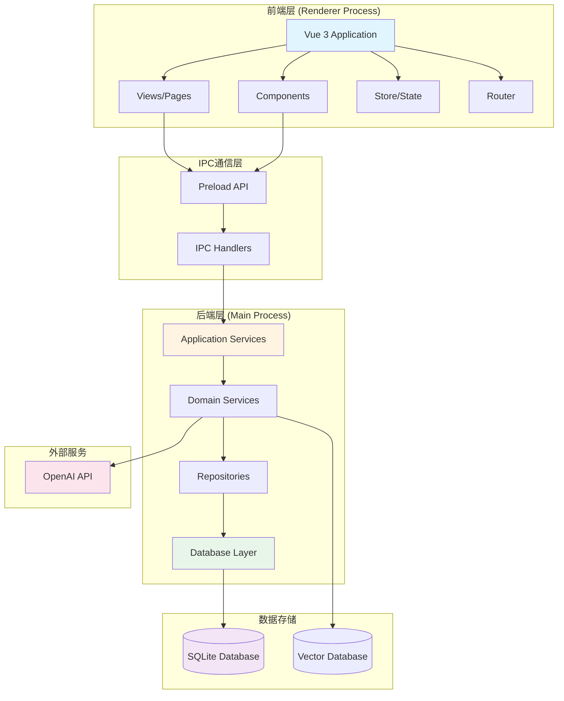
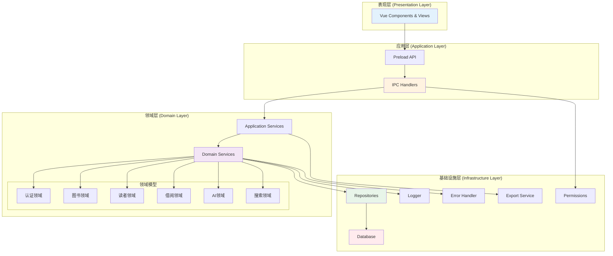
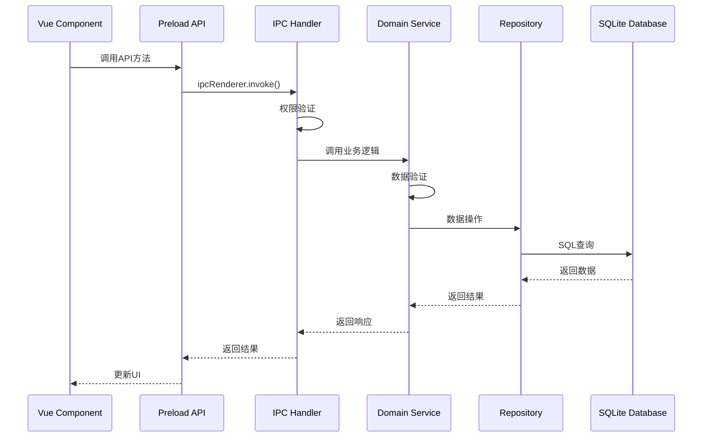
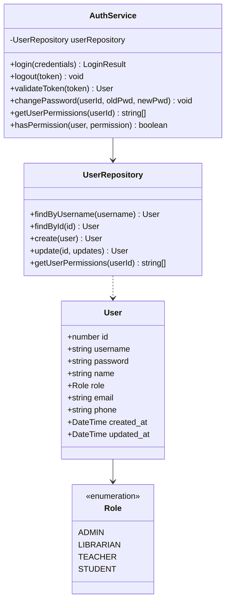
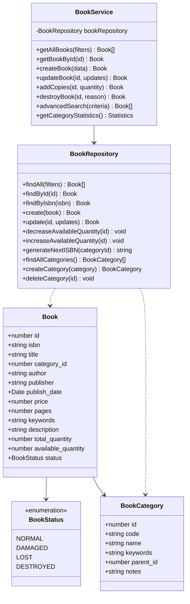
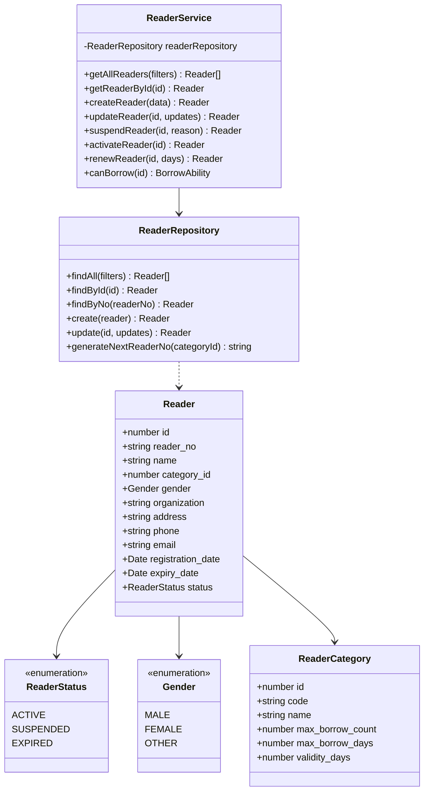
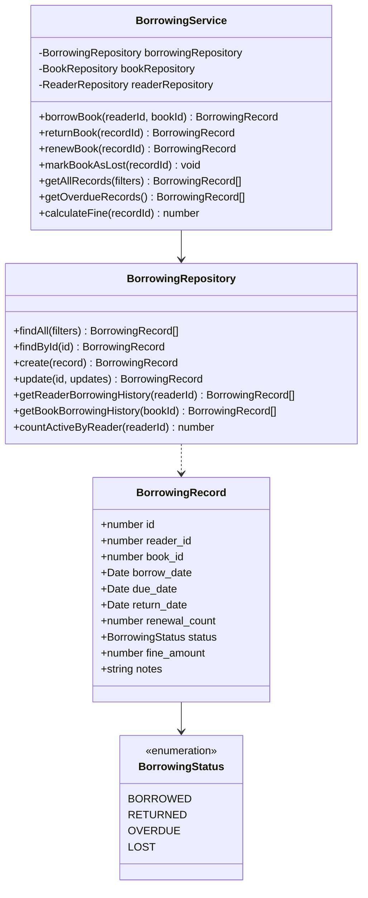
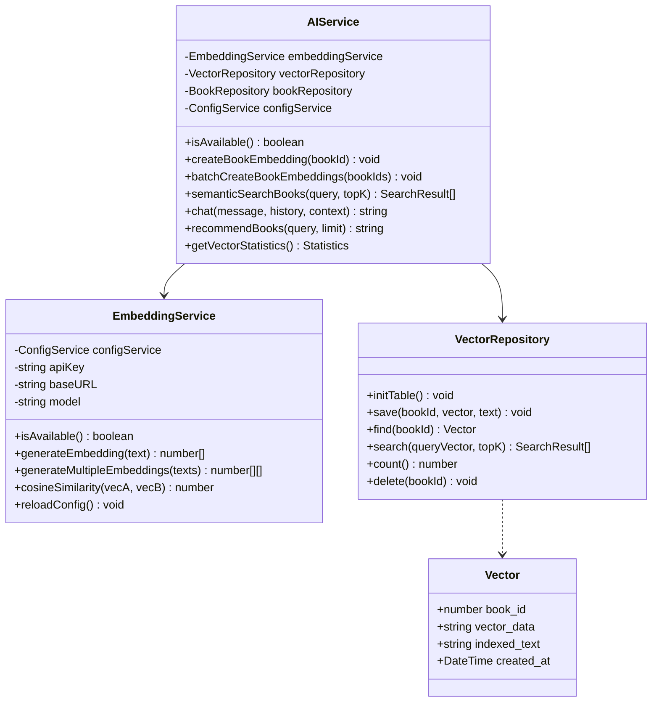
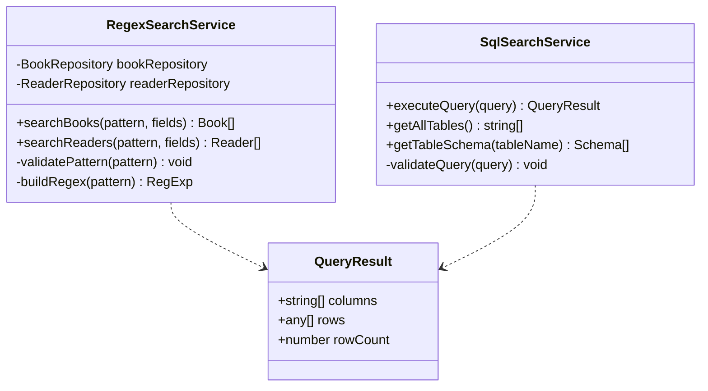
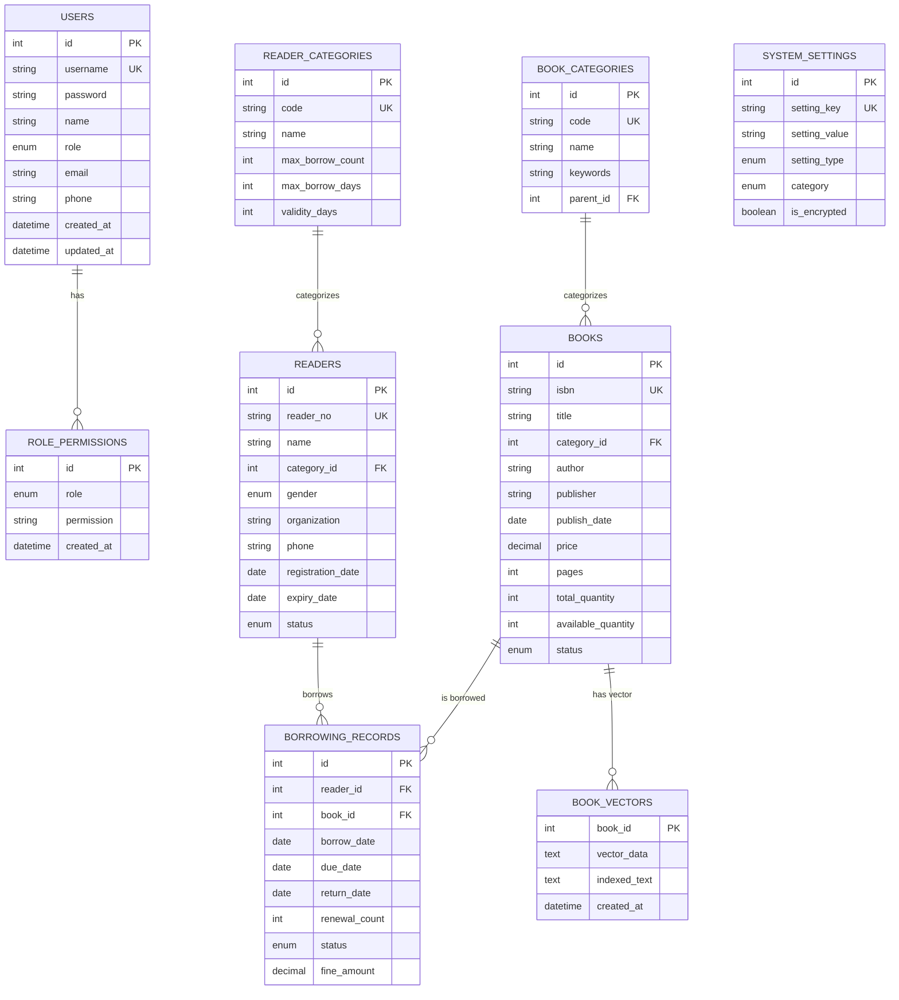

# 智能图书管理系统 - 项目结构文档

## 📋 目录

- [1. 项目概述](#1-项目概述)
- [2. 技术架构](#2-技术架构)
- [3. 目录结构](#3-目录结构)
- [4. 架构设计图](#4-架构设计图)
- [5. 领域模型类图](#5-领域模型类图)
- [6. 数据库设计](#6-数据库设计)
- [7. 模块详细说明](#7-模块详细说明)
- [8. API接口文档](#8-api接口文档)

---

## 1. 项目概述

智能图书管理系统是一个基于Electron + Vue3的桌面应用程序，采用领域驱动设计(DDD)架构，实现了完整的图书馆管理功能，包括图书管理、读者管理、借阅管理、统计分析以及AI智能助手等功能。

### 核心特性

- 🏗️ **DDD架构**: 清晰的领域分层，高内聚低耦合
- 🤖 **AI功能**: 语义搜索、智能推荐、对话助手
- 👥 **多角色权限**: 支持管理员、图书管理员、教师、学生四种角色
- 🔍 **高级搜索**: 条件搜索、正则搜索、SQL搜索、向量搜索
- 📊 **数据可视化**: 完整的统计报表和图表展示
- 📤 **数据导出**: 支持CSV、JSON、HTML多种格式导出

---

## 2. 技术架构

### 技术栈

**前端:**
- Vue 3 (Composition API)
- TypeScript
- Element Plus (UI组件库)
- Pinia (状态管理)
- Vue Router (路由管理)
- Chart.js (图表)
- Markdown-it (Markdown渲染)

**后端:**
- Electron 28 (桌面应用框架)
- Node.js 20
- Better-SQLite3 (数据库)
- TypeScript

**AI集成:**
- OpenAI API (Embeddings + Chat)
- 向量数据库 (SQLite存储)

### 架构模式

采用 **领域驱动设计(DDD)** + **分层架构** + **CQRS模式**

---

## 3. 目录结构

```
DataBased_Management_System/
├── src/
│   ├── main/                      # Electron主进程 (后端)
│   │   ├── config/                # 配置文件
│   │   │   └── index.ts           # 环境配置
│   │   ├── database/              # 数据库层
│   │   │   └── index.ts           # 数据库初始化和迁移
│   │   ├── domains/               # 领域层 (DDD核心)
│   │   │   ├── auth/              # 认证领域
│   │   │   │   ├── user.repository.ts
│   │   │   │   └── auth.service.ts
│   │   │   ├── book/              # 图书领域
│   │   │   │   ├── book.repository.ts
│   │   │   │   └── book.service.ts
│   │   │   ├── reader/            # 读者领域
│   │   │   │   ├── reader.repository.ts
│   │   │   │   └── reader.service.ts
│   │   │   ├── borrowing/         # 借阅领域
│   │   │   │   ├── borrowing.repository.ts
│   │   │   │   └── borrowing.service.ts
│   │   │   ├── ai/                # AI领域
│   │   │   │   ├── vector.repository.ts
│   │   │   │   ├── embedding.service.ts
│   │   │   │   └── ai.service.ts
│   │   │   ├── search/            # 搜索领域
│   │   │   │   ├── regex-search.service.ts
│   │   │   │   └── sql-search.service.ts
│   │   │   └── config/            # 配置领域
│   │   │       ├── config.repository.ts
│   │   │       └── config.service.ts
│   │   ├── lib/                   # 基础设施层
│   │   │   ├── ipcHandlers.ts     # IPC通信处理器
│   │   │   ├── errorHandler.ts    # 错误处理
│   │   │   ├── logger.ts          # 日志系统
│   │   │   ├── permissions.ts     # 权限中间件
│   │   │   └── exportService.ts   # 导出服务
│   │   └── index.ts               # 主进程入口
│   ├── preload/                   # Preload脚本
│   │   └── index.ts               # 预加载API定义
│   └── renderer/                  # 渲染进程 (前端)
│       └── src/
│           ├── components/        # 公共组件
│           │   └── Layout.vue     # 布局组件
│           ├── views/             # 页面视图
│           │   ├── Login.vue      # 登录页
│           │   ├── Dashboard.vue  # 仪表盘
│           │   ├── Books.vue      # 图书管理
│           │   ├── Readers.vue    # 读者管理
│           │   ├── Borrowing.vue  # 借阅管理
│           │   ├── Statistics.vue # 统计分析
│           │   ├── AIAssistant.vue# AI助手
│           │   └── Settings.vue   # 系统设置
│           ├── store/             # 状态管理
│           │   └── user.ts        # 用户状态
│           ├── router/            # 路由配置
│           │   └── index.ts
│           ├── main.ts            # 前端入口
│           └── App.vue            # 根组件
├── ARCHITECTURE.md                # 架构设计文档
├── USER_GUIDE.md                  # 用户使用指南
├── README.md                      # 项目说明
└── package.json                   # 项目配置
```

---

## 4. 架构设计图

### 4.1 总体架构



### 4.2 DDD分层架构



### 4.3 IPC通信流程



---

## 5. 领域模型类图

### 5.1 认证领域 (Auth Domain)



### 5.2 图书领域 (Book Domain)



### 5.3 读者领域 (Reader Domain)



### 5.4 借阅领域 (Borrowing Domain)



### 5.5 AI领域 (AI Domain)



### 5.6 搜索领域 (Search Domain)



---

## 6. 数据库设计

### 6.1 ER图



### 6.2 数据库表说明

| 表名 | 说明 | 关键字段 |
|------|------|----------|
| `users` | 用户表 | username, password, role |
| `role_permissions` | 角色权限表 | role, permission |
| `reader_categories` | 读者种类表 | code, max_borrow_count |
| `readers` | 读者表 | reader_no, category_id, status |
| `book_categories` | 图书类别表 | code, name, parent_id |
| `books` | 图书表 | isbn, title, category_id |
| `borrowing_records` | 借阅记录表 | reader_id, book_id, status |
| `book_vectors` | 图书向量表 | book_id, vector_data |
| `system_settings` | 系统设置表 | setting_key, setting_value |

---

## 7. 模块详细说明

### 7.1 主进程模块 (src/main)

#### 7.1.1 配置模块 (config/)

**职责**: 管理应用程序配置

```typescript
// config/index.ts
- 环境变量读取
- 默认配置定义
- AI API配置
```

#### 7.1.2 数据库模块 (database/)

**职责**: 数据库初始化和迁移

```typescript
// database/index.ts
- initDatabase(): 初始化表结构
- seedDatabase(): 初始化默认数据
- setupDatabase(): 完整数据库设置
- 数据库迁移逻辑
```

**关键功能**:
- SQLite数据库连接
- 表结构创建和迁移
- 外键约束启用
- 索引创建优化
- 默认数据填充

#### 7.1.3 领域层 (domains/)

##### Auth Domain (认证领域)

**文件**: `auth/auth.service.ts`, `auth/user.repository.ts`

**职责**:
- 用户登录/登出
- Token验证
- 密码管理
- 权限检查

**核心方法**:
```typescript
login(credentials): { token, user }
validateToken(token): User
changePassword(userId, oldPwd, newPwd): void
hasPermission(user, permission): boolean
```

##### Book Domain (图书领域)

**文件**: `book/book.service.ts`, `book/book.repository.ts`

**职责**:
- 图书CRUD操作
- 图书分类管理
- 库存管理
- ISBN自动生成
- 高级搜索

**核心方法**:
```typescript
createBook(data): Book
updateBook(id, updates): Book
addCopies(id, quantity): Book
advancedSearch(criteria): Book[]
generateNextISBN(categoryId): string
```

##### Reader Domain (读者领域)

**文件**: `reader/reader.service.ts`, `reader/reader.repository.ts`

**职责**:
- 读者CRUD操作
- 读者分类管理
- 借阅能力检查
- 证件续期
- 编号自动生成

**核心方法**:
```typescript
createReader(data): Reader
suspendReader(id, reason): Reader
activateReader(id): Reader
renewReader(id, days): Reader
canBorrow(id): { canBorrow, reason, maxBooks }
```

##### Borrowing Domain (借阅领域)

**文件**: `borrowing/borrowing.service.ts`, `borrowing/borrowing.repository.ts`

**职责**:
- 借书/还书操作
- 续借管理
- 逾期计算
- 罚金计算
- 借阅统计

**核心方法**:
```typescript
borrowBook(readerId, bookId): BorrowingRecord
returnBook(recordId): BorrowingRecord
renewBook(recordId): BorrowingRecord
calculateFine(recordId): number
getOverdueRecords(): BorrowingRecord[]
```

##### AI Domain (AI领域)

**文件**: `ai/ai.service.ts`, `ai/embedding.service.ts`, `ai/vector.repository.ts`

**职责**:
- 文本向量化
- 语义搜索
- 智能推荐
- AI对话助手
- 向量数据库管理

**核心方法**:
```typescript
// AIService
createBookEmbedding(bookId): void
semanticSearchBooks(query, topK): SearchResult[]
chat(message, history, context): string
recommendBooks(query, limit): string

// EmbeddingService
generateEmbedding(text): number[]
cosineSimilarity(vecA, vecB): number

// VectorRepository
save(bookId, vector, text): void
search(queryVector, topK): SearchResult[]
```

##### Search Domain (搜索领域)

**文件**: `search/regex-search.service.ts`, `search/sql-search.service.ts`

**职责**:
- 正则表达式搜索
- SQL查询执行
- 安全验证

**核心方法**:
```typescript
// RegexSearchService
searchBooks(pattern, fields): Book[]
searchReaders(pattern, fields): Reader[]

// SqlSearchService
executeQuery(query): QueryResult
getAllTables(): string[]
getTableSchema(tableName): Schema[]
```

##### Config Domain (配置领域)

**文件**: `config/config.service.ts`, `config/config.repository.ts`

**职责**:
- AI配置管理
- 系统设置管理
- 配置持久化
- 连接测试

**核心方法**:
```typescript
getAISettings(): AISettings
updateAISettings(settings): void
testAIConnection(settings?): TestResult
```

#### 7.1.4 基础设施层 (lib/)

##### IPC通信 (ipcHandlers.ts)

**职责**: 处理前后端IPC通信

**注册的Handler**:
- `auth:*` - 认证相关
- `reader:*` - 读者相关
- `book:*` - 图书相关
- `borrowing:*` - 借阅相关
- `ai:*` - AI功能相关
- `search:*` - 搜索相关
- `config:*` - 配置相关
- `export:*` - 导出相关

##### 错误处理 (errorHandler.ts)

**职责**: 统一错误处理和响应

**错误类型**:
```typescript
class ValidationError extends Error
class BusinessError extends Error
class NotFoundError extends Error
class UnauthorizedError extends Error
```

**响应格式**:
```typescript
interface SuccessResponse {
  success: true
  data: any
}

interface ErrorResponse {
  success: false
  error: {
    message: string
    code: string
  }
}
```

##### 日志系统 (logger.ts)

**职责**: 应用日志记录

**日志级别**:
- INFO
- WARN
- ERROR

##### 权限中间件 (permissions.ts)

**职责**: 权限验证

**核心方法**:
```typescript
requirePermission(permission): Middleware
checkWildcard(userPerms, required): boolean
```

##### 导出服务 (exportService.ts)

**职责**: 数据导出功能

**支持格式**:
- CSV (UTF-8 with BOM)
- JSON
- HTML Report

**核心方法**:
```typescript
exportToCSV(options): Promise<string>
exportToJSON(options): Promise<string>
exportReport(options): Promise<string>
```

### 7.2 预加载模块 (src/preload)

**文件**: `preload/index.ts`

**职责**: 定义前后端通信API

**API分类**:
```typescript
interface ElectronAPI {
  auth: AuthAPI
  reader: ReaderAPI
  readerCategory: ReaderCategoryAPI
  book: BookAPI
  bookCategory: BookCategoryAPI
  borrowing: BorrowingAPI
  ai: AIAPI
  config: ConfigAPI
  search: SearchAPI
  export: ExportAPI
}
```

### 7.3 渲染进程模块 (src/renderer)

#### 7.3.1 视图组件 (views/)

##### Login.vue - 登录页

**职责**: 用户登录

**核心功能**:
- 用户名密码登录
- Token存储
- 登录状态管理

##### Dashboard.vue - 仪表盘

**职责**: 根据角色展示不同的首页

**角色视图**:
- **管理员/图书管理员**: 完整统计数据、图表、热门图书
- **教师**: 简化界面、个人借阅、推荐图书
- **学生**: 个性化界面、借阅时间轴、图书推荐

##### Books.vue - 图书管理

**职责**: 图书和类别管理

**核心功能**:
- 图书列表展示
- 新增/编辑/删除图书
- 类别管理
- 多种搜索方式:
  - 基础搜索
  - 条件搜索
  - 正则搜索
  - SQL搜索
  - 向量/语义搜索
- ISBN自动生成
- 库存管理
- 数据导出

##### Readers.vue - 读者管理

**职责**: 读者和种类管理

**核心功能**:
- 读者列表展示
- 新增/编辑读者
- 种类管理
- 证件续期
- 状态管理（激活/停用）
- 编号自动生成
- 正则搜索

##### Borrowing.vue - 借阅管理

**职责**: 借阅流程管理

**核心功能**:
- 借书操作
- 还书操作
- 续借管理
- 借阅记录查询
- 逾期管理
- 罚金计算
- 根据角色过滤记录

##### Statistics.vue - 统计分析

**职责**: 数据统计和可视化

**统计维度**:
- 图书统计
- 读者统计
- 借阅统计
- 类别分布
- 趋势分析

**图表类型**:
- 柱状图
- 饼图
- 折线图
- 数据表格

##### AIAssistant.vue - AI助手

**职责**: AI智能功能

**核心功能**:
- AI对话助手
- 图书智能推荐
- 语义搜索
- 向量管理
- Markdown渲染

##### Settings.vue - 系统设置

**职责**: 系统配置管理

**配置项**:
- 用户信息
- 密码修改
- AI配置（仅管理员）:
  - API URL
  - API Key
  - 模型选择
  - 连接测试

#### 7.3.2 状态管理 (store/)

**文件**: `store/user.ts`

**职责**: 用户状态管理

**State**:
```typescript
{
  user: User | null
  token: string | null
  permissions: string[]
}
```

**Actions**:
```typescript
login(credentials): Promise<void>
logout(): void
loadUser(): Promise<void>
```

#### 7.3.3 路由管理 (router/)

**文件**: `router/index.ts`

**路由配置**:
```typescript
{
  path: '/login',
  path: '/dashboard',
  path: '/books',
  path: '/readers',
  path: '/borrowing',
  path: '/statistics',
  path: '/ai-assistant',
  path: '/settings'
}
```

**路由守卫**:
- 登录验证
- 权限检查
- 角色过滤

---

## 8. API接口文档

### 8.1 认证API

```typescript
// 登录
auth.login(credentials: { username: string, password: string })
  -> { success: boolean, data: { token: string, user: User } }

// 登出
auth.logout(token: string)
  -> { success: boolean }

// 验证Token
auth.validate(token: string)
  -> { success: boolean, data: User }

// 修改密码
auth.changePassword(userId: number, oldPassword: string, newPassword: string)
  -> { success: boolean }

// 获取用户权限
auth.getUserPermissions(userId: number)
  -> { success: boolean, data: string[] }

// 检查权限
auth.checkPermission(userId: number, permission: string)
  -> { success: boolean, data: boolean }
```

### 8.2 图书API

```typescript
// 获取所有图书
book.getAll(filters?: { category_id?, status?, keyword? })
  -> { success: boolean, data: Book[] }

// 获取图书详情
book.getById(id: number)
  -> { success: boolean, data: Book }

// 创建图书
book.create(data: BookCreateDTO)
  -> { success: boolean, data: Book }

// 更新图书
book.update(id: number, updates: Partial<Book>)
  -> { success: boolean, data: Book }

// 增加馆藏
book.addCopies(id: number, quantity: number)
  -> { success: boolean, data: Book }

// 高级搜索
book.advancedSearch(criteria: SearchCriteria)
  -> { success: boolean, data: Book[] }

// 正则搜索
book.regexSearch(pattern: string, fields?: string[])
  -> { success: boolean, data: Book[] }

// 获取借阅状态
book.getBorrowingStatus(id: number)
  -> { success: boolean, data: BorrowingStatus }

// 类别管理
bookCategory.getAll()
bookCategory.create(data: CategoryDTO)
bookCategory.update(id: number, updates: Partial<Category>)
bookCategory.delete(id: number)
```

### 8.3 读者API

```typescript
// 获取所有读者
reader.getAll(filters?: any)
  -> { success: boolean, data: Reader[] }

// 获取读者详情
reader.getById(id: number)
  -> { success: boolean, data: Reader }

// 根据编号获取
reader.getByNo(readerNo: string)
  -> { success: boolean, data: Reader }

// 创建读者
reader.create(data: ReaderCreateDTO)
  -> { success: boolean, data: Reader }

// 更新读者
reader.update(id: number, updates: Partial<Reader>)
  -> { success: boolean, data: Reader }

// 停用读者
reader.suspend(id: number, reason?: string)
  -> { success: boolean, data: Reader }

// 激活读者
reader.activate(id: number)
  -> { success: boolean, data: Reader }

// 证件续期
reader.renew(id: number, days: number)
  -> { success: boolean, data: Reader }

// 检查借阅能力
reader.canBorrow(id: number)
  -> { success: boolean, data: { canBorrow: boolean, reason?: string, maxBooks: number } }

// 读者统计
reader.getStatistics(id: number)
  -> { success: boolean, data: ReaderStatistics }
```

### 8.4 借阅API

```typescript
// 借书
borrowing.borrow(readerId: number, bookId: number)
  -> { success: boolean, data: BorrowingRecord }

// 还书
borrowing.return(recordId: number)
  -> { success: boolean, data: BorrowingRecord }

// 续借
borrowing.renew(recordId: number)
  -> { success: boolean, data: BorrowingRecord }

// 标记丢失
borrowing.markAsLost(recordId: number)
  -> { success: boolean }

// 获取所有记录
borrowing.getAll(filters?: any)
  -> { success: boolean, data: BorrowingRecord[] }

// 获取逾期记录
borrowing.getOverdue()
  -> { success: boolean, data: BorrowingRecord[] }

// 获取统计数据
borrowing.getStatistics()
  -> { success: boolean, data: BorrowingStatistics }

// 获取读者借阅历史
borrowing.getReaderHistory(readerId: number)
  -> { success: boolean, data: BorrowingRecord[] }

// 获取图书借阅历史
borrowing.getBookHistory(bookId: number)
  -> { success: boolean, data: BorrowingRecord[] }
```

### 8.5 AI功能API

```typescript
// 检查AI可用性
ai.isAvailable()
  -> { success: boolean, data: boolean }

// 创建图书向量
ai.createBookEmbedding(bookId: number)
  -> { success: boolean }

// 批量创建向量
ai.batchCreateEmbeddings(bookIds: number[])
  -> { success: boolean }

// 语义搜索
ai.semanticSearch(query: string, topK?: number)
  -> { success: boolean, data: SearchResult[] }

// AI对话
ai.chat(message: string, history?: ChatMessage[], context?: string)
  -> { success: boolean, data: string }

// 智能推荐
ai.recommendBooks(query: string, limit?: number)
  -> { success: boolean, data: string }

// 获取向量统计
ai.getStatistics()
  -> { success: boolean, data: { totalVectors: number, coverageRate: number } }
```

### 8.6 搜索API

```typescript
// 执行SQL查询
search.executeSql(query: string)
  -> { success: boolean, data: QueryResult }

// 获取所有表名
search.getAllTables()
  -> { success: boolean, data: string[] }

// 获取表结构
search.getTableSchema(tableName: string)
  -> { success: boolean, data: Schema[] }
```

### 8.7 配置API

```typescript
// 获取AI配置
config.getAISettings()
  -> { success: boolean, data: AISettings }

// 更新AI配置
config.updateAISettings(settings: AISettings)
  -> { success: boolean }

// 测试AI连接
config.testAIConnection()
  -> { success: boolean, data: { success: boolean, message: string } }
```

### 8.8 导出API

```typescript
// 导出CSV
export.toCSV(options: { filename: string, data: any[], headers?: string[] })
  -> { success: boolean, data: string }

// 导出JSON
export.toJSON(options: { filename: string, data: any[] })
  -> { success: boolean, data: string }

// 导出报告
export.report(options: ReportOptions)
  -> { success: boolean, data: string }
```

---

## 附录

### A. 权限说明

| 角色 | 权限 | 说明 |
|------|------|------|
| admin | * | 所有权限 |
| librarian | books:*, readers:*, borrowing:*, statistics:read | 图书管理、读者管理、借阅管理、查看统计 |
| teacher | books:read, borrowing:read, borrowing:borrow, statistics:read | 查看图书、借阅权限、查看统计 |
| student | books:read, borrowing:read, borrowing:borrow | 查看图书、借阅权限 |

### B. 编号生成规则

**读者编号格式**: `{种类代码}{YYYYMMDD}{4位序号}`
- 示例: `STUDENT202510300001`

**图书ISBN格式**: `{类别代码}-{YYYY}-{6位序号}`
- 示例: `TP-2025-000001`

### C. 状态说明

**图书状态**:
- `normal`: 正常
- `damaged`: 损坏
- `lost`: 丢失
- `destroyed`: 注销

**读者状态**:
- `active`: 正常
- `suspended`: 停用
- `expired`: 过期

**借阅状态**:
- `borrowed`: 借出
- `returned`: 已还
- `overdue`: 逾期
- `lost`: 丢失

---

**文档版本**: 1.0
**生成时间**: 2025-10-30
**维护者**: 开发团队
**联系方式**: [GitHub Issues](https://github.com/anthropics/claude-code/issues)
