# 图书馆管理系统 - 数据库课程设计报告

---

## 一、项目概述

### 1.1 项目背景

图书馆管理系统是基于数据库原理课程设计要求开发的应用系统，旨在通过实际项目展示数据库设计、事务处理、并发控制、查询优化等核心原理的应用。系统采用 Electron + Vue 3 + SQLite 技术栈，实现了图书借阅、读者管理、智能检索、统计分析等核心功能。

### 1.2 设计目标

| 目标 | 说明 |
|------|------|
| 数据完整性 | 通过外键约束、事务保证数据一致性 |
| 并发控制 | 实现乐观锁机制，处理多用户并发操作 |
| 查询优化 | 通过索引设计、复杂查询优化提升性能 |
| 可扩展性 | 采用领域驱动设计，支持功能扩展 |
| 智能化 | 集成AI检索，提供语义搜索能力 |

### 1.3 技术选型

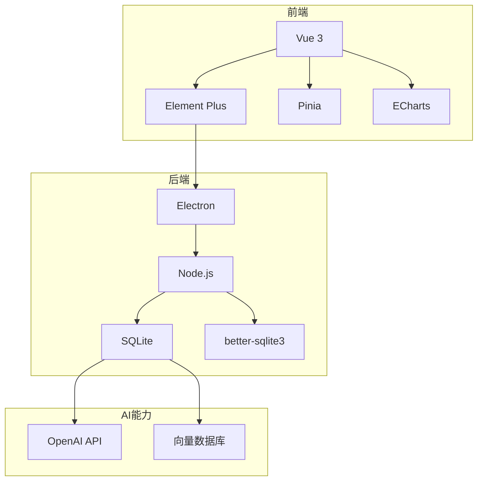

---

## 二、系统架构设计

### 2.1 整体架构

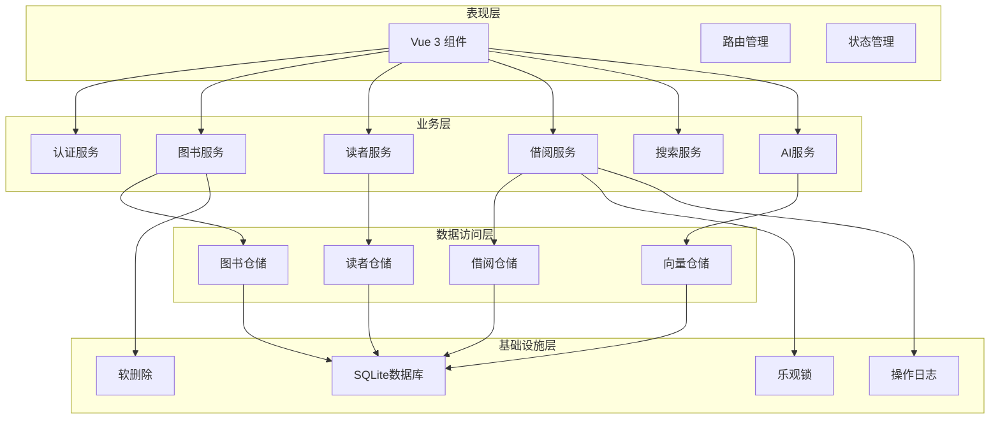

### 2.2 技术栈

| 层次 | 技术 | 说明 |
|------|------|------|
| 前端框架 | Vue 3 + TypeScript | 响应式UI开发 |
| UI组件 | Element Plus | 企业级组件库 |
| 状态管理 | Pinia | 轻量级状态管理 |
| 图表库 | ECharts | 数据可视化 |
| 桌面框架 | Electron | 跨平台桌面应用 |
| 数据库 | SQLite | 轻量级关系型数据库 |
| 数据库驱动 | better-sqlite3 | 同步SQLite驱动 |
| 密码加密 | bcryptjs | 密码哈希存储 |

### 2.3 分层架构

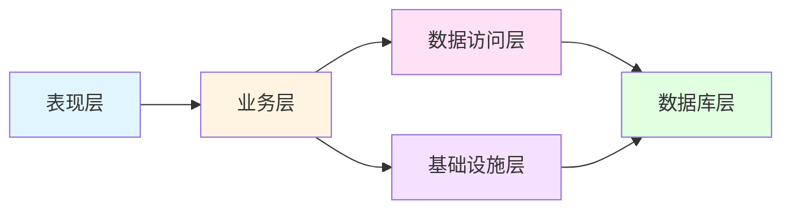

---

## 三、数据库设计

### 3.1 概念设计

#### ER图

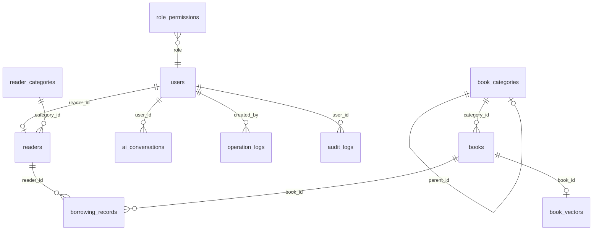

#### 实体关系说明

| 关系 | 类型 | 说明 |
|------|------|------|
| users → readers | 1:1 | 用户关联读者信息 |
| users → ai_conversations | 1:N | 用户拥有多条对话记录 |
| reader_categories → readers | 1:N | 读者种类包含多个读者 |
| book_categories → books | 1:N | 图书类别包含多本图书 |
| book_categories → book_categories | 1:N | 图书类别支持层级结构 |
| readers → borrowing_records | 1:N | 读者有多条借阅记录 |
| books → borrowing_records | 1:N | 图书有多条借阅记录 |

### 3.2 逻辑设计

#### 核心业务表

| 表名 | 用途 | 主要字段 |
|------|------|---------|
| users | 用户表 | id, username, password, name, role, reader_id |
| reader_categories | 读者种类表 | id, code, name, max_borrow_count, max_borrow_days |
| readers | 读者表 | id, reader_no, name, category_id, user_id, status, expiry_date |
| book_categories | 图书类别表 | id, code, name, keywords, parent_id |
| books | 图书表 | id, isbn, title, category_id, author, publisher, total_quantity, available_quantity, status |
| borrowing_records | 借阅记录表 | id, reader_id, book_id, borrow_date, due_date, return_date, status, fine_amount |
| ai_conversations | AI对话历史表 | id, user_id, title, messages (JSON) |

#### 表结构详情

**users（用户表）**

| 字段 | 类型 | 约束 | 说明 |
|------|------|------|------|
| id | INTEGER | PRIMARY KEY | 用户ID |
| username | VARCHAR | UNIQUE, NOT NULL | 用户名 |
| password | VARCHAR | NOT NULL | 密码哈希 |
| name | VARCHAR | NOT NULL | 真实姓名 |
| role | VARCHAR | CHECK | 角色：admin/librarian/teacher/student |
| reader_id | INTEGER | FOREIGN KEY | 关联读者ID |
| email | VARCHAR | UNIQUE | 邮箱 |
| phone | VARCHAR | | 电话 |

**readers（读者表）**

| 字段 | 类型 | 约束 | 说明 |
|------|------|------|------|
| id | INTEGER | PRIMARY KEY | 读者ID |
| reader_no | VARCHAR | UNIQUE, NOT NULL | 读者编号 |
| name | VARCHAR | NOT NULL | 姓名 |
| category_id | INTEGER | FOREIGN KEY | 读者种类ID |
| user_id | INTEGER | FOREIGN KEY | 关联用户ID |
| status | VARCHAR | CHECK | 状态：active/suspended/expired/pending |
| expiry_date | DATE | | 有效期 |
| gender | VARCHAR | CHECK | 性别：male/female/other |

**books（图书表）**

| 字段 | 类型 | 约束 | 说明 |
|------|------|------|------|
| id | INTEGER | PRIMARY KEY | 图书ID |
| isbn | VARCHAR | UNIQUE, NOT NULL | ISBN编号 |
| title | VARCHAR | NOT NULL | 书名 |
| category_id | INTEGER | FOREIGN KEY | 图书类别ID |
| author | VARCHAR | NOT NULL | 作者 |
| publisher | VARCHAR | NOT NULL | 出版社 |
| total_quantity | INTEGER | NOT NULL | 总数量 |
| available_quantity | INTEGER | NOT NULL | 可借数量 |
| status | VARCHAR | CHECK | 状态：normal/damaged/lost/destroyed |

**borrowing_records（借阅记录表）**

| 字段 | 类型 | 约束 | 说明 |
|------|------|------|------|
| id | INTEGER | PRIMARY KEY | 记录ID |
| reader_id | INTEGER | FOREIGN KEY | 读者ID |
| book_id | INTEGER | FOREIGN KEY | 图书ID |
| borrow_date | DATE | NOT NULL | 借阅日期 |
| due_date | DATE | NOT NULL | 应还日期 |
| return_date | DATE | | 实际归还日期 |
| status | VARCHAR | CHECK | 状态：borrowed/returned/overdue/lost |
| renewal_count | INTEGER | DEFAULT 0 | 续借次数 |
| fine_amount | DECIMAL | DEFAULT 0 | 罚款金额 |

### 3.3 索引设计

| 索引名 | 表 | 字段 | 类型 | 用途 |
|--------|-----|------|------|------|
| idx_readers_category | readers | category_id | 单列 | 按读者种类查询 |
| idx_readers_status | readers | status | 单列 | 按读者状态查询 |
| idx_books_category | books | category_id | 单列 | 按图书类别查询 |
| idx_books_status | books | status | 单列 | 按图书状态查询 |
| idx_books_title | books | title | 单列 | 按书名搜索 |
| idx_books_author | books | author | 单列 | 按作者搜索 |
| idx_borrowing_reader | borrowing_records | reader_id | 单列 | 查询读者借阅记录 |
| idx_borrowing_book | borrowing_records | book_id | 单列 | 查询图书借阅历史 |
| idx_borrowing_status | borrowing_records | status | 单列 | 按借阅状态查询 |
| idx_borrowing_dates | borrowing_records | borrow_date, due_date | 复合 | 日期范围查询 |
| idx_books_is_deleted | books | is_deleted | 单列 | 软删除查询优化 |
| idx_books_version | books | version | 单列 | 乐观锁版本查询 |

### 3.4 完整性约束

#### 外键约束

| 外键 | 约束类型 | 说明 |
|------|----------|------|
| users.reader_id | ON DELETE SET NULL | 删除读者时，用户保留但 reader_id 置空 |
| readers.category_id | ON DELETE RESTRICT | 有读者使用的种类不能删除 |
| books.category_id | ON DELETE RESTRICT | 有图书使用的类别不能删除 |
| borrowing_records.reader_id | ON DELETE RESTRICT | 有借阅记录的读者不能删除 |
| borrowing_records.book_id | ON DELETE RESTRICT | 有借阅记录的图书不能删除 |

#### 唯一约束

| 表 | 字段 |
|-----|------|
| users | username |
| readers | reader_no, id_card |
| books | isbn |
| book_categories | code |
| reader_categories | code |

#### CHECK约束

| 表 | 字段 | 约束 |
|-----|------|------|
| users | role | IN ('admin', 'librarian', 'teacher', 'student') |
| readers | status | IN ('active', 'suspended', 'expired', 'pending') |
| books | status | IN ('normal', 'damaged', 'lost', 'destroyed') |
| borrowing_records | status | IN ('borrowed', 'returned', 'overdue', 'lost') |

---

## 四、数据库原理应用

### 4.1 事务处理

#### 借阅事务流程

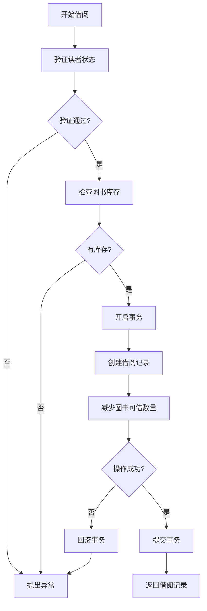

#### ACID特性保证

| 特性 | 实现方式 |
|------|---------|
| **原子性** | SQLite事务，借阅记录和库存更新要么全部成功，要么全部回滚 |
| **一致性** | 事务前后数据库状态一致，借阅数量与库存数量同步 |
| **隔离性** | SQLite默认SERIALIZABLE隔离级别，避免脏读、不可重复读 |
| **持久性** | 数据写入磁盘，应用重启后数据不丢失 |

#### 事务代码实现

```typescript
// 借书事务
const transaction = db.transaction(() => {
  // 1. 创建借阅记录
  const record = this.borrowingRepository.create({
    reader_id: readerId,
    book_id: bookId,
    borrow_date: borrowDate.toISOString().split('T')[0],
    due_date: dueDate.toISOString().split('T')[0],
    renewal_count: 0,
    status: 'borrowed',
    fine_amount: 0
  })

  // 2. 减少图书可借数量
  this.bookRepository.decreaseAvailableQuantity(bookId, 1)

  return record
})

const result = transaction()
```

### 4.2 并发控制

#### 乐观锁机制

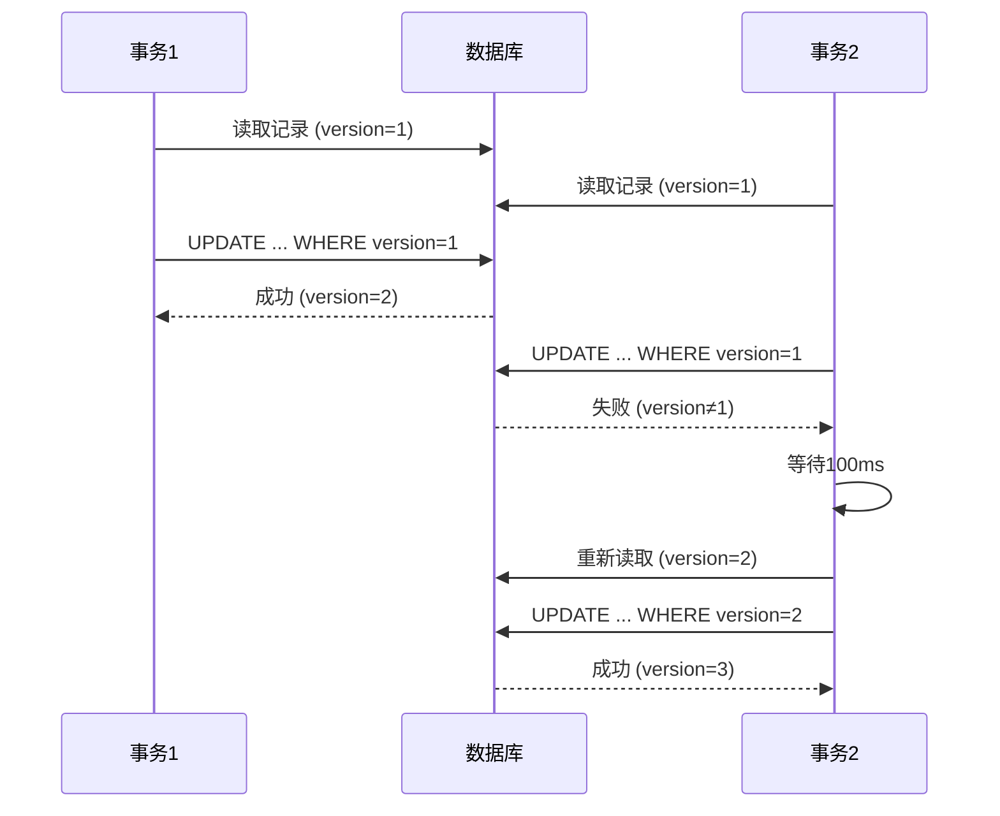

#### CAS操作实现

```sql
-- 乐观锁更新语句
UPDATE books
SET title = ?, author = ?, version = version + 1, updated_at = CURRENT_TIMESTAMP
WHERE id = ? AND version = ?
```

#### 重试策略

| 尝试次数 | 延迟时间 |
|---------|---------|
| 第1次 | 100ms |
| 第2次 | 200ms |
| 第3次 | 300ms |

```typescript
// 指数退避重试
for (let attempt = 0; attempt < maxRetries; attempt++) {
  const currentVersion = await this.getCurrentVersion(tableName, id)
  const newVersion = await this.updateAndGetNewVersion(...)

  if (newVersion !== null) return newVersion

  // 指数退避延迟
  await new Promise(resolve => setTimeout(resolve, 100 * (attempt + 1)))
}

throw new OptimisticLockError('乐观锁冲突，重试次数已达上限')
```

#### 适用场景

| 场景 | 说明 |
|------|------|
| 并发更新图书信息 | 多管理员同时编辑同一本书 |
| 库存扣减 | 借书时减少可借数量 |
| 读者借阅计数 | 防止超限借阅 |
| 低冲突环境 | 读多写少的业务场景 |

### 4.3 两阶段提交

#### 操作日志预写机制

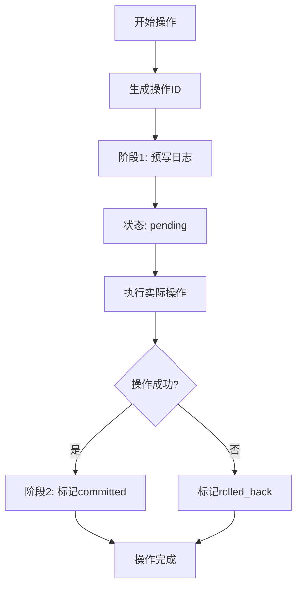

#### 状态转换

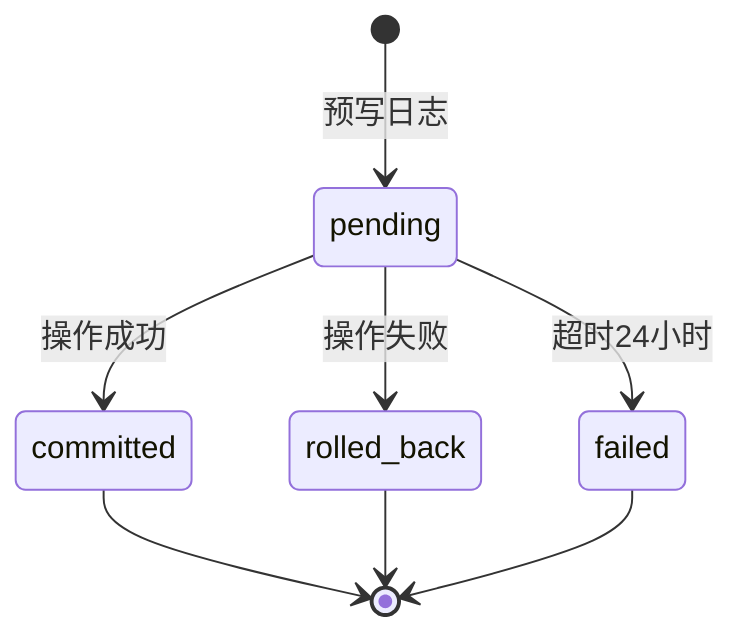

#### 恢复机制

```typescript
// 恢复未完成的操作
const operationAge = Date.now() - new Date(operation.created_at).getTime()
const maxAge = 24 * 60 * 60 * 1000 // 24小时

if (operationAge > maxAge) {
  await this.markAsFailed(operation.operation_id, '恢复时标记为失败：操作超时')
}
```

### 4.4 软删除机制

#### 软删除流程

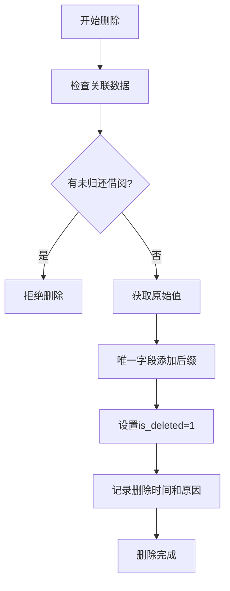

#### 数据恢复策略

```sql
-- 软删除
UPDATE books
SET is_deleted = 1,
    deleted_at = CURRENT_TIMESTAMP,
    deleted_by = ?,
    delete_reason = ?
WHERE id = ? AND is_deleted = 0

-- 恢复
UPDATE books
SET is_deleted = 0,
    deleted_at = NULL,
    deleted_by = NULL,
    delete_reason = NULL,
    isbn = ?,  -- 恢复原始ISBN
    title = ?   -- 恢复原始值
WHERE id = ? AND is_deleted = 1
```

#### 唯一约束处理

| 表 | 唯一约束字段 | 删除后处理 |
|-----|-------------|-----------|
| users | username | username → username#deleted_timestamp |
| readers | reader_no, id_card | 添加后缀释放原值 |
| books | isbn | isbn → isbn#deleted_timestamp |

#### 定期清理策略

```sql
-- 清理30天前的软删除记录
DELETE FROM books
WHERE is_deleted = 1
  AND deleted_at < datetime('now', '-30 days')
```

### 4.5 查询优化

#### 索引覆盖分析

| 查询场景 | 使用索引 | 覆盖字段 |
|---------|---------|---------|
| 按读者种类查询 | idx_readers_category | category_id |
| 按图书类别查询 | idx_books_category | category_id |
| 按书名搜索 | idx_books_title | title |
| 按作者搜索 | idx_books_author | author |
| 查询读者借阅记录 | idx_borrowing_reader | reader_id |
| 按日期范围查询 | idx_borrowing_dates | borrow_date, due_date |

#### 复杂查询优化

```sql
-- JOIN查询优化（带类别名称）
SELECT
    b.*,
    c.name AS category_name
FROM books b
LEFT JOIN book_categories c ON b.category_id = c.id
WHERE b.is_deleted = 0
ORDER BY b.created_at DESC
LIMIT 20

-- 统计查询优化（使用GROUP BY）
SELECT
    c.name AS category_name,
    COUNT(*) AS book_count,
    SUM(b.total_quantity) AS total_quantity
FROM books b
LEFT JOIN book_categories c ON b.category_id = c.id
WHERE b.is_deleted = 0
GROUP BY c.id
ORDER BY book_count DESC
```

#### SQL注入防护

```typescript
// 使用参数化查询防止SQL注入
const stmt = db.prepare('SELECT * FROM users WHERE username = ?')
const user = stmt.get(username)

// 白名单/黑名单机制
const ALLOWED_KEYWORDS = ['SELECT', 'WITH']
const FORBIDDEN_KEYWORDS = [
  'INSERT', 'UPDATE', 'DELETE', 'DROP',
  'CREATE', 'ALTER', 'TRUNCATE', 'EXEC', 'EXECUTE'
]
```

---

## 五、核心功能模块

### 5.1 高级搜索功能

#### 正则表达式搜索

<div align="center">
  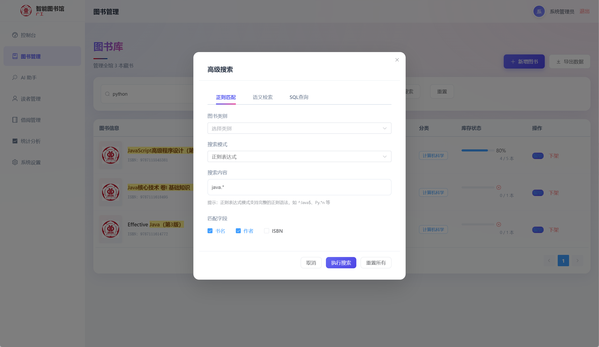
</div>

**支持模式：**
| 模式 | 说明 | 示例 |
|------|------|------|
| 精确匹配 | 完全相等 | `Python编程` |
| 前缀匹配 | 以...开头 | `^Python` |
| 后缀匹配 | 以...结尾 | `编程$` |
| 包含匹配 | 包含子串 | `编程` |
| 自定义正则 | 正则表达式 | `^Python.*编程$` |

#### SQL查询功能

<div align="center">
  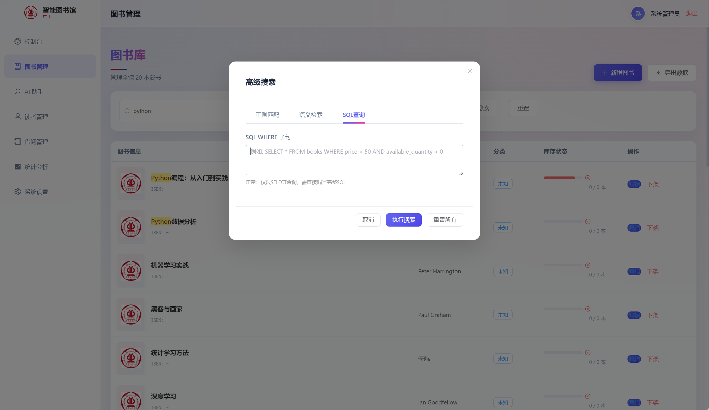
</div>

**安全机制：**
- 只允许SELECT查询
- 禁止INSERT/UPDATE/DELETE/DROP等危险操作
- 限制最大返回行数（1000行）

<div align="center">
  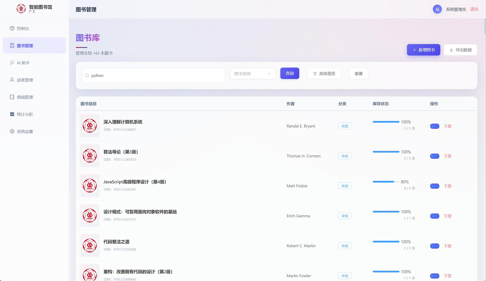
</div>

**复杂查询示例：**
```sql
-- 查询价格大于50且有库存的图书
SELECT * FROM books
WHERE price > 50 AND available_quantity > 0
ORDER BY title ASC
```

#### 语义检索

<div align="center">
  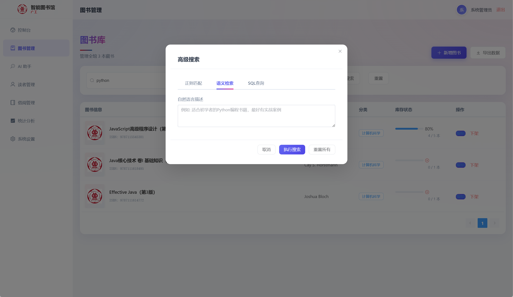
</div>

**向量相似度搜索：**

<div align="center">
  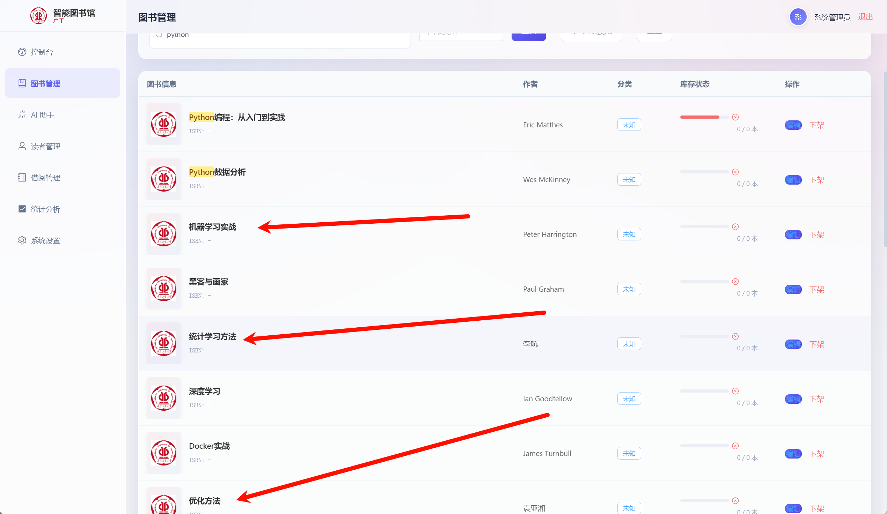
</div>

### 5.2 AI智能检索系统

#### RAG架构

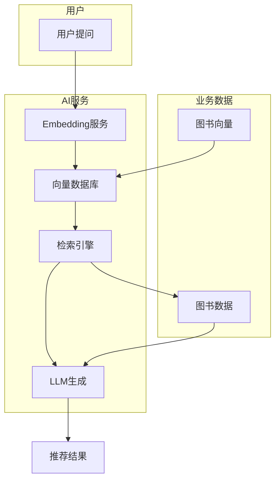

#### 向量数据库设计

| 表 | 字段 | 说明 |
|-----|------|------|
| book_vectors | id | 向量ID |
| book_vectors | book_id | 关联图书ID |
| book_vectors | vector | 向量数据（JSON） |
| book_vectors | text | 原始文本 |

#### Agent模式

<div align="center">
  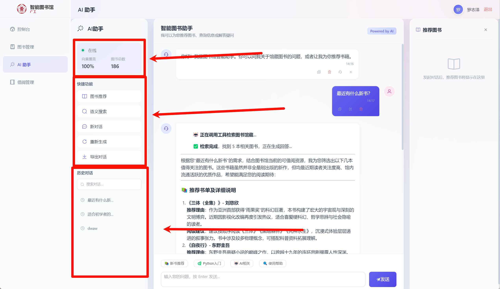
</div>

**功能特性：**
- 流式对话（SSE）
- 自动识别用户意图
- 调用搜索工具
- 智能图书推荐

### 5.3 借阅管理

#### 借阅流程

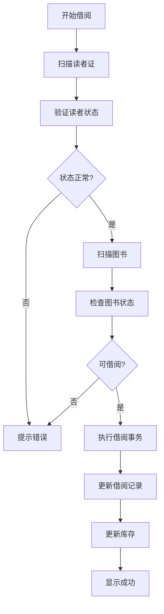

#### 事务保证

```typescript
// 借书事务保证数据一致性
const transaction = db.transaction(() => {
  // 1. 创建借阅记录
  const record = this.borrowingRepository.create({...})

  // 2. 减少图书可借数量
  this.bookRepository.decreaseAvailableQuantity(bookId, 1)

  return record
})
```

#### 权限控制

| 角色 | 可操作范围 |
|------|-----------|
| admin | 全部借阅操作 |
| librarian | 全部借阅操作 |
| teacher | 只能操作自己的借阅 |
| student | 只能操作自己的借阅 |

### 5.4 统计分析

#### 运营概览

<div align="center">
  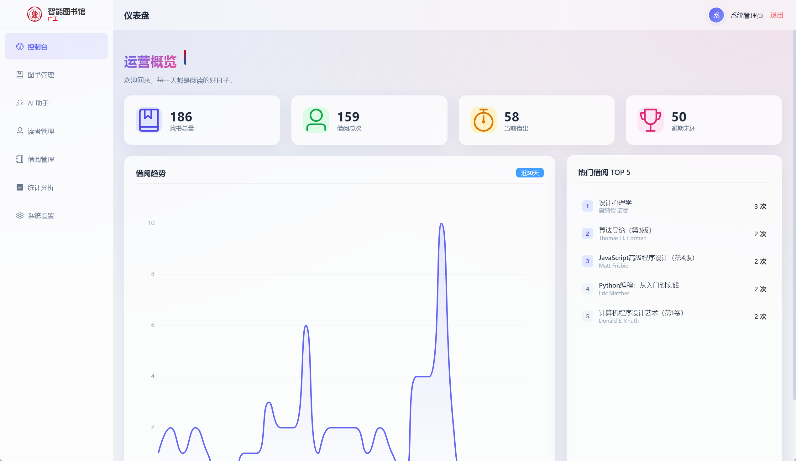
</div>

#### 借阅统计

<div align="center">
  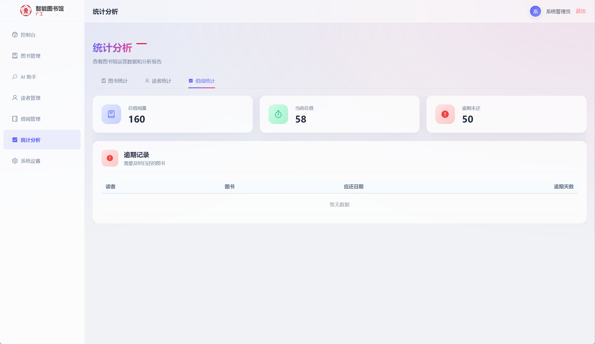
</div>

**统计维度：**
- 藏书总量
- 借阅总次数
- 当前借出数量
- 逾期图书数量
- 热门图书TOP 20
- 活跃读者TOP 20

---

## 六、系统特色与总结

### 6.1 数据库原理应用亮点

| 原理 | 实现位置 | 核心价值 |
|------|---------|---------|
| **事务管理** | borrowing.service.ts | 借阅记录与库存同步更新，保证数据一致性 |
| **乐观锁** | optimisticLock.ts | CAS操作+重试机制，处理并发冲突 |
| **两阶段提交** | operationLogger.ts | 预写日志+状态管理，保证操作可恢复 |
| **软删除** | softDelete.ts | 数据可恢复，保留审计追踪 |
| **索引优化** | database/index.ts | 12个索引覆盖常用查询场景 |
| **外键约束** | 数据库设计 | 保证参照完整性 |
| **SQL安全** | sql-search.service.ts | 参数化查询+白名单机制 |

### 6.2 技术创新点

| 创新点 | 说明 |
|--------|------|
| **领域驱动设计** | 按业务领域划分模块，清晰的分层架构 |
| **防重复提交** | DebounceSubmitManager实现防抖和重试 |
| **智能检索** | RAG架构+向量数据库，支持语义搜索 |
| **Agent模式** | AI自动识别意图并调用搜索工具 |
| **流式响应** | SSE实时显示AI生成内容 |

### 6.3 项目总结

本项目系统性地应用了数据库原理的核心知识，包括：

1. **数据模型设计**：规范的ER图设计，12张表覆盖核心业务
2. **事务处理**：借阅/还书操作使用事务保证ACID特性
3. **并发控制**：乐观锁机制处理多用户并发操作
4. **查询优化**：索引设计、复杂查询优化、SQL注入防护
5. **数据完整性**：外键约束、唯一约束、CHECK约束
6. **数据安全**：软删除、操作日志、审计日志

项目在数据库原理应用的基础上，创新性地集成了AI智能检索功能，实现了传统图书管理系统与现代AI技术的融合，展现了数据库技术在智能化应用中的核心价值。

---

**报告完成日期**：2026年1月
**项目名称**：图书馆管理系统
**课程名称**：数据库原理课程设计
