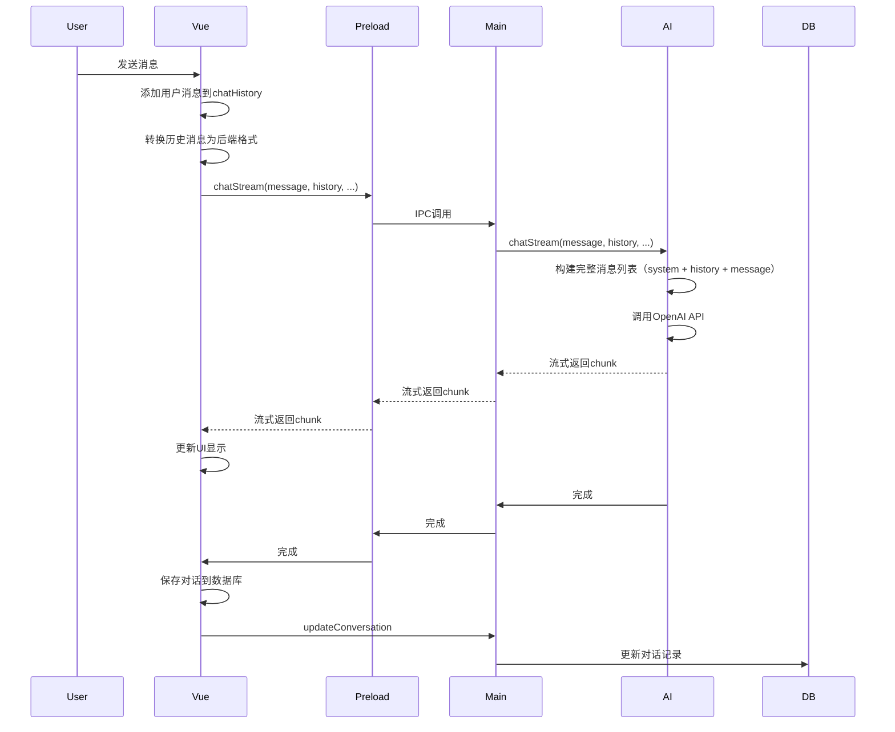

# AI助手对话保存与上下文传递修复计划

## 问题概述

### 1. 对话保存逻辑问题
- **问题描述**：点击"新对话"时会保存对话，但切换到其他对话时不保存
- **影响**：用户在切换对话时，当前对话的修改会丢失
- **根本原因**：[`loadChatHistory`](src/renderer/src/views/AIAssistant.vue:490-501) 函数在加载新对话前没有保存当前对话

### 2. 上下文丢失问题
- **问题描述**：每次请求都是独立的，AI无法记住之前的对话内容
- **影响**：用户无法进行连续对话，每次都需要重新提供背景信息
- **根本原因**：[`sendMessage`](src/renderer/src/views/AIAssistant.vue:800-921) 中调用 `chatStream` 时传递的是空数组 `[]`（第892行）

### 3. 日志问题
- **问题描述**：流式传输的日志太刷屏，而关键操作的日志又太少
- **影响**：调试困难，无法清晰追踪对话流程
- **根本原因**：
  - 每个chunk都打印日志（[`ai.service.ts:350`](src/main/domains/ai/ai.service.ts:350)，[`preload/index.ts:241`](src/preload/index.ts:241)）
  - 对话切换、保存等关键操作缺少清晰的日志

## 修复方案

### 修复 1: 对话保存逻辑

#### 1.1 修改 `loadChatHistory` 函数
在加载新对话前，先保存当前对话：

```typescript
const loadChatHistory = async (item: Conversation) => {
  console.log('[loadChatHistory] 开始加载对话历史')
  console.log('[loadChatHistory] 目标对话ID:', item.id)
  console.log('[loadChatHistory] 当前对话ID:', currentConversationId.value)

  // 如果正在加载中，先停止
  if (loading.value) {
    console.log('[loadChatHistory] AI正在生成中，先停止')
    stopGeneration()
  }

  // 先保存当前对话（如果有内容）
  if (currentConversationId.value && chatHistory.value.length > 1) {
    console.log('[loadChatHistory] 切换对话前，先保存当前对话')
    await saveCurrentConversation()
  }

  // 加载新对话
  chatHistory.value = [...item.messages]
  currentConversationId.value = item.id
  recommendedBooks.value = []
  scrollToBottom()

  console.log('[loadChatHistory] 对话加载完成')
}
```

#### 1.2 修改 `startNewChat` 函数
添加更详细的日志：

```typescript
const startNewChat = async () => {
  console.log('[startNewChat] 开始新对话')
  console.log('[startNewChat] 当前对话ID:', currentConversationId.value)
  console.log('[startNewChat] 当前聊天历史长度:', chatHistory.value.length)

  // 如果有当前对话且有内容，先保存到数据库
  await saveCurrentConversation()

  // 创建新对话
  chatHistory.value = [
    { id: 'init', role: 'assistant', content: '你好！我是图书馆智能助手。你可以问我关于馆藏图书的问题，或者让我为你推荐书籍。' }
  ]
  currentConversationId.value = null
  recommendedBooks.value = []

  console.log('[startNewChat] 新对话已创建')

  // 重新加载对话历史列表
  await loadConversations()
  console.log('[startNewChat] 对话历史列表已更新')
}
```

### 修复 2: 上下文传递问题

#### 2.1 添加历史消息转换函数
将前端消息格式转换为后端需要的格式：

```typescript
// 将前端消息转换为后端格式
const convertToChatMessages = (messages: Message[]): ChatMessage[] => {
  return messages
    .filter(m => !m.loading && m.id !== 'init') // 过滤掉loading状态和初始消息
    .map(m => ({
      role: m.role,
      content: m.content
    }))
}
```

#### 2.2 修改 `sendMessage` 函数
传递完整的历史消息：

```typescript
const sendMessage = async () => {
  const text = inputMessage.value.trim()
  if (!text || loading.value) return

  console.log('[sendMessage] 开始发送消息')
  console.log('[sendMessage] 消息内容:', text)
  console.log('[sendMessage] 当前对话ID:', currentConversationId.value)

  // Add user message
  chatHistory.value.push({
    id: Date.now().toString(),
    role: 'user',
    content: text,
    timestamp: Date.now()
  })
  inputMessage.value = ''
  loading.value = true
  scrollToBottom()

  // 如果是新对话，创建对话记录
  if (!currentConversationId.value) {
    if (!userStore.user?.id) {
      console.warn('[sendMessage] 用户未登录，无法保存对话')
      ElMessage.warning('请先登录以保存对话历史')
    } else {
      try {
        const messagesToSave = JSON.parse(JSON.stringify(chatHistory.value))
        const result = await window.api.ai.saveConversation(
          userStore.user.id,
          text.substring(0, 50) + (text.length > 50 ? '...' : ''),
          messagesToSave
        )
        if (result.success) {
          currentConversationId.value = result.data.id
          console.log('[sendMessage] 新对话已创建，ID:', currentConversationId.value)
          await loadConversations()
        }
      } catch (error) {
        console.error('[sendMessage] 保存对话失败:', error)
        ElMessage.error('保存对话失败')
      }
    }
  }

  // Add placeholder for AI response
  const aiMsgIndex = chatHistory.value.push({
    id: Date.now().toString() + '-ai',
    role: 'assistant',
    content: '',
    loading: true,
    timestamp: Date.now()
  }) - 1
  scrollToBottom()

  try {
    // 转换历史消息（传递给AI的上下文）
    const historyMessages = convertToChatMessages(chatHistory.value.slice(0, -1))
    console.log('[sendMessage] 历史消息数量:', historyMessages.length)

    const isRecommendation = text.includes('推荐') || text.includes('书') || text.includes('找')

    if (isRecommendation) {
      await new Promise<void>((resolve, reject) => {
        let fullContent = ''
        const cleanup = window.api.ai.recommendBooksStream(
          text,
          3,
          (chunk) => {
            chatHistory.value[aiMsgIndex].loading = false
            fullContent += chunk
            chatHistory.value[aiMsgIndex].content = fullContent
            scrollToBottom()
          },
          (error) => {
            console.error('[sendMessage] 推荐错误:', error)
            reject(new Error(error))
          },
          async () => {
            console.log('[sendMessage] 推荐完成，准备保存对话')
            recommendedBooks.value = parseRecommendedBooks(fullContent)
            await saveCurrentConversation()
            resolve()
          }
        )
        streamCleanup.value = cleanup
      })
    } else {
      await new Promise<void>((resolve, reject) => {
        let fullContent = ''
        const cleanup = window.api.ai.chatStream(
          text,
          historyMessages, // 传递历史消息
          undefined,
          (chunk) => {
            chatHistory.value[aiMsgIndex].loading = false
            fullContent += chunk
            chatHistory.value[aiMsgIndex].content = fullContent
            scrollToBottom()
          },
          (error) => {
            console.error('[sendMessage] 聊天错误:', error)
            reject(new Error(error))
          },
          async () => {
            console.log('[sendMessage] 聊天完成，准备保存对话')
            await saveCurrentConversation()
            resolve()
          }
        )
        streamCleanup.value = cleanup
      })
    }
  } catch (error: any) {
    console.error('[sendMessage] 发送消息失败:', error)
    chatHistory.value[aiMsgIndex].content = `抱歉，遇到了一些问题：${error.message || '网络请求超时'}`
    chatHistory.value[aiMsgIndex].loading = false
    await saveCurrentConversation()
  } finally {
    loading.value = false
    streamCleanup.value = null
    scrollToBottom()
    console.log('[sendMessage] 消息发送完成')
  }
}
```

### 修复 3: 优化日志策略

#### 3.1 减少流式传输日志

**修改 `ai.service.ts`**：
- 移除每个chunk的日志（第350行）
- 只在关键节点记录日志

```typescript
// 在 chatStream 方法中
let chunkCount = 0

response.data.on('data', (chunk: Buffer) => {
  const lines = chunk.toString().split('\n').filter(line => line.trim() !== '')

  for (const line of lines) {
    if (line.includes('[DONE]')) {
      continue
    }

    const message = line.replace(/^data: /, '')
    if (message === '[DONE]') {
      continue
    }

    try {
      const parsed = JSON.parse(message)
      const content = parsed.choices[0]?.delta?.content

      if (content) {
        chunkCount++
        // 移除每个chunk的日志，避免刷屏
        // console.log(`[后端] 收到chunk #${chunkCount}:`, content.substring(0, 20) + (content.length > 20 ? '...' : ''))
        onChunk(content)
      }
    } catch (error) {
      // 忽略无法解析的行
    }
  }
})
```

**修改 `preload/index.ts`**：
- 移除每个chunk的日志（第241行）
- 只在关键节点记录日志

```typescript
// 在 chatStream 方法中
const chunkListener = (_event: any, chunk: string) => {
  // 移除每个chunk的日志，避免刷屏
  // console.log('[Preload] 收到chunk，长度:', chunk.length)
  onChunk(chunk)
}
```

#### 3.2 增加关键操作日志

**在 `ai.service.ts` 中添加更多关键日志**：

```typescript
async chatStream(...) {
  // ... 现有代码 ...

  try {
    logger.info('========== [AI] 开始流式对话 ==========')
    logger.info('[AI] 用户消息:', message.substring(0, 100))
    logger.info('[AI] 历史消息数量:', history.length)
    logger.info('[AI] 使用模型:', aiConfig.chatModel)

    // ... 搜索逻辑 ...

    logger.info('[AI] 准备调用OpenAI API')

    // ... API调用 ...

    response.data.on('end', () => {
      logger.info(`[AI] 流式传输完成，共${chunkCount}个chunk`)
      logger.info('========== [AI] 流式对话结束 ==========')
      onComplete()
    })
  } catch (error: any) {
    logger.error('[AI] 流式对话失败:', error.message)
    logger.info('========== [AI] 流式对话结束（出错） ==========')
    onError(new Error(`AI助手对话失败: ${error.message}`))
  }
}
```

**在 `conversation.repository.ts` 中添加更多日志**：

```typescript
class ConversationRepository {
  create(userId: number, title: string, messages: any[]): ConversationWithMessages {
    const stmt = db.prepare(`
      INSERT INTO ai_conversations (user_id, title, messages)
      VALUES (?, ?, ?)
    `)
    const result = stmt.run(userId, title, JSON.stringify(messages))
    logger.info('[Conversation] 创建对话', { id: result.lastInsertRowid, userId, title, messageCount: messages.length })
    return this.findById(result.lastInsertRowid as number)!
  }

  update(id: number, title: string, messages: any[]): ConversationWithMessages | undefined {
    const stmt = db.prepare(`
      UPDATE ai_conversations
      SET title = ?, messages = ?, updated_at = CURRENT_TIMESTAMP
      WHERE id = ?
    `)
    stmt.run(title, JSON.stringify(messages), id)
    logger.info('[Conversation] 更新对话', { id, title, messageCount: messages.length })
    return this.findById(id)
  }
}
```

### 修复 4: 添加防抖保存机制

为了避免频繁保存数据库，可以添加防抖机制：

```typescript
import { debounce } from 'lodash-es'

// 创建防抖保存函数
const debouncedSave = debounce(async () => {
  console.log('[debouncedSave] 执行防抖保存')
  await saveCurrentConversation()
}, 2000) // 2秒内只保存一次

// 在需要保存的地方调用 debouncedSave() 而不是直接调用 saveCurrentConversation()
```

## 修改文件清单

| 文件 | 修改内容 |
|------|---------|
| `src/renderer/src/views/AIAssistant.vue` | 修改 `loadChatHistory`、`startNewChat`、`sendMessage` 函数，添加 `convertToChatMessages` 函数 |
| `src/main/domains/ai/ai.service.ts` | 减少流式传输日志，增加关键操作日志 |
| `src/preload/index.ts` | 减少流式传输日志 |
| `src/main/domains/ai/conversation.repository.ts` | 增加详细日志 |

## 数据流图



## 测试计划

1. **对话保存测试**
   - 发送消息后，切换到其他对话，再切换回来，检查消息是否保存
   - 点击"新对话"按钮，检查原对话是否保存

2. **上下文传递测试**
   - 发送第一条消息："我叫小明"
   - 发送第二条消息："我叫什么名字？"
   - 检查AI是否能正确回答

3. **日志测试**
   - 检查流式传输时控制台是否不再刷屏
   - 检查关键操作是否有清晰的日志

4. **边界情况测试**
   - 在AI生成过程中切换对话
   - 在AI生成过程中停止生成
   - 删除消息后切换对话
