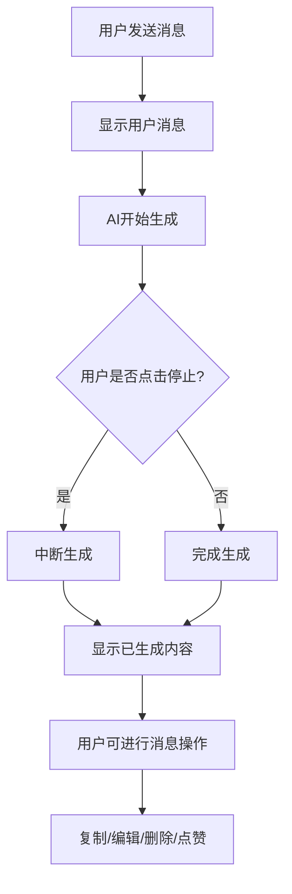
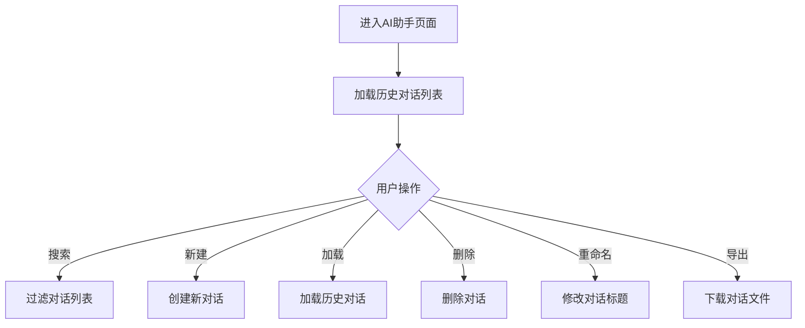

# AI助手功能增强计划

## 一、现有代码问题分析

### 1.1 关键问题列表

| 问题 | 位置 | 影响 | 优先级 |
|------|------|------|--------|
| 缺少停止生成功能 | `sendMessage` 函数 | 用户无法中断AI回复 | ⭐⭐⭐⭐⭐ |
| cleanup函数未保存 | 第522、548行 | 无法调用cleanup停止流 | ⭐⭐⭐⭐⭐ |
| 缺少消息时间戳 | `Message` 接口 | 无法显示消息发送时间 | ⭐⭐⭐⭐ |
| 缺少复制功能 | 消息气泡 | 无法复制消息内容 | ⭐⭐⭐⭐⭐ |
| 缺少编辑功能 | 消息操作区域 | 无法编辑已发送消息 | ⭐⭐⭐⭐ |
| 缺少删除消息功能 | 消息操作区域 | 无法删除单条消息 | ⭐⭐⭐ |
| 缺少点赞/点踩功能 | AI消息 | 无法对AI回复反馈 | ⭐⭐⭐⭐ |
| 缺少代码复制按钮 | 代码块 | 无法快速复制代码 | ⭐⭐⭐⭐ |
| 缺少搜索历史对话 | 历史对话区域 | 无法快速查找对话 | ⭐⭐⭐⭐ |
| 缺少导出对话功能 | 快捷功能区域 | 无法保存对话到文件 | ⭐⭐⭐ |

### 1.2 详细问题说明

#### 问题1：停止生成功能缺失
**问题描述**：当前代码中，`sendMessage` 函数调用了流式API（`recommendBooksStream` 和 `chatStream`），这些API返回了 `cleanup` 函数用于中断流式请求，但这个函数没有被保存到组件状态中，导致无法调用。

**代码位置**：
```typescript
// 第522-542行
const cleanup = window.api.ai.recommendBooksStream(...)
// cleanup 函数没有被保存，无法调用
```

**修复方案**：
```typescript
// 添加 cleanup 引用
const streamCleanup = ref<(() => void) | null>(null)

// 保存 cleanup 函数
streamCleanup.value = cleanup

// 添加停止生成函数
const stopGeneration = () => {
  if (streamCleanup.value) {
    streamCleanup.value()
    streamCleanup.value = null
    loading.value = false
  }
}
```

---

#### 问题2：消息时间戳缺失
**问题描述**：`Message` 接口中没有 `timestamp` 字段，无法显示消息的发送时间。

**代码位置**：
```typescript
// 第213-218行
interface Message {
  id?: string
  role: 'user' | 'assistant'
  content: string
  loading?: boolean
  // 缺少 timestamp 字段
}
```

**修复方案**：
```typescript
interface Message {
  id?: string
  role: 'user' | 'assistant'
  content: string
  loading?: boolean
  timestamp?: number  // 新增
}

// 在发送消息时添加时间戳
chatHistory.value.push({
  id: Date.now().toString(),
  role: 'user',
  content: text,
  timestamp: Date.now()  // 新增
})
```

---

#### 问题3：复制功能缺失
**问题描述**：消息气泡中没有复制按钮，用户无法快速复制消息内容。

**修复方案**：
```vue
<!-- 在消息气泡中添加复制按钮 -->
<div class="message-actions">
  <el-button text size="small" @click="copyMessage(msg.content)">
    <el-icon><DocumentCopy /></el-icon>
    复制
  </el-button>
</div>

// 添加复制函数
const copyMessage = async (content: string) => {
  try {
    await navigator.clipboard.writeText(content)
    ElMessage.success('复制成功')
  } catch (error) {
    ElMessage.error('复制失败')
  }
}
```

---

#### 问题4：编辑功能缺失
**问题描述**：用户无法编辑已发送的消息。

**修复方案**：
```vue
<!-- 添加编辑按钮 -->
<div class="message-actions">
  <el-button text size="small" @click="editMessage(index)">
    <el-icon><Edit /></el-icon>
    编辑
  </el-button>
</div>

// 添加编辑函数
const editMessage = (index: number) => {
  const msg = chatHistory.value[index]
  if (msg && msg.role === 'user') {
    inputMessage.value = msg.content
    // 删除该消息及后续消息
    chatHistory.value = chatHistory.value.slice(0, index)
    scrollToBottom()
  }
}
```

---

#### 问题5：删除消息功能缺失
**问题描述**：用户无法删除单条消息。

**修复方案**：
```vue
<!-- 添加删除按钮 -->
<div class="message-actions">
  <el-button text size="small" type="danger" @click="deleteMessage(index)">
    <el-icon><Delete /></el-icon>
  </el-button>
</div>

// 添加删除函数
const deleteMessage = async (index: number) => {
  const confirmed = await ElMessageBox.confirm(
    '确定要删除这条消息吗？',
    '确认删除',
    {
      confirmButtonText: '确定',
      cancelButtonText: '取消',
      type: 'warning'
    }
  ).catch(() => false)
  
  if (!confirmed) return
  
  chatHistory.value.splice(index, 1)
  await saveCurrentConversation()
}
```

---

#### 问题6：点赞/点踩功能缺失
**问题描述**：AI消息没有反馈机制，用户无法对AI回复进行评价。

**修复方案**：
```vue
<!-- 添加反馈按钮 -->
<div class="feedback-actions">
  <el-button text @click="feedbackMessage(msg.id, 'like')">
    <el-icon><Thumb /></el-icon>
  </el-button>
  <el-button text @click="feedbackMessage(msg.id, 'dislike')">
    <el-icon><Close /></el-icon>
  </el-button>
</div>

// 扩展 Message 接口
interface Message {
  id?: string
  role: 'user' | 'assistant'
  content: string
  loading?: boolean
  timestamp?: number
  feedback?: 'like' | 'dislike' | null  // 新增
}

// 添加反馈函数
const feedbackMessage = (msgId: string | undefined, type: 'like' | 'dislike') => {
  const msg = chatHistory.value.find(m => m.id === msgId)
  if (msg) {
    msg.feedback = msg.feedback === type ? null : type
    ElMessage.success(type === 'like' ? '已点赞' : '已点踩')
  }
}
```

---

#### 问题7：代码复制按钮缺失
**问题描述**：代码块没有一键复制按钮，用户需要手动选择复制。

**修复方案**：
```vue
<!-- 使用自定义组件包裹代码块 -->
<div class="code-block-wrapper">
  <div class="code-header">
    <span class="language-tag">{{ language }}</span>
    <el-button text size="small" @click="copyCode(code)">
      <el-icon><DocumentCopy /></el-icon>
      复制
    </el-button>
  </div>
  <pre><code>{{ code }}</code></pre>
</div>

// 添加代码复制函数
const copyCode = async (code: string) => {
  try {
    await navigator.clipboard.writeText(code)
    ElMessage.success('代码复制成功')
  } catch (error) {
    ElMessage.error('代码复制失败')
  }
}
```

---

#### 问题8：搜索历史对话功能缺失
**问题描述**：历史对话列表中没有搜索框，用户无法快速查找对话。

**修复方案**：
```vue
<!-- 添加搜索框 -->
<div class="history-section">
  <div class="section-title">历史对话</div>
  <el-input
    v-model="searchQuery"
    placeholder="搜索对话..."
    prefix-icon="Search"
    clearable
    size="small"
    class="history-search"
  />
  <div class="history-list">
    <!-- 使用计算属性过滤 -->
    <div v-for="item in filteredChatHistoryList" :key="item.id">
      ...
    </div>
  </div>
</div>

// 添加搜索状态和计算属性
const searchQuery = ref('')

const filteredChatHistoryList = computed(() => {
  if (!searchQuery.value) return chatHistoryList.value
  return chatHistoryList.value.filter(item =>
    item.title.toLowerCase().includes(searchQuery.value.toLowerCase())
  )
})
```

---

#### 问题9：导出对话功能缺失
**问题描述**：用户无法将对话导出为文件保存。

**修复方案**：
```vue
<!-- 添加导出按钮 -->
<button class="action-btn" @click="exportConversation">
  <el-icon><Download /></el-icon>
  <span>导出对话</span>
</button>

// 添加导出函数
const exportConversation = () => {
  let content = `# ${currentConversationId.value ? chatHistoryList.value.find(c => c.id === currentConversationId.value)?.title || '对话' : '新对话'}\n\n`
  
  chatHistory.value.forEach(msg => {
    const role = msg.role === 'user' ? '用户' : 'AI'
    const time = msg.timestamp ? new Date(msg.timestamp).toLocaleString('zh-CN') : ''
    content += `## ${role} ${time}\n\n${msg.content}\n\n`
  })
  
  const blob = new Blob([content], { type: 'text/markdown' })
  const url = URL.createObjectURL(blob)
  const a = document.createElement('a')
  a.href = url
  a.download = `对话_${Date.now()}.md`
  a.click()
  URL.revokeObjectURL(url)
  
  ElMessage.success('导出成功')
}
```

---

## 二、功能对比分析

### 1.1 主流AI聊天软件核心功能（参考ChatGPT、Claude、文心一言等）

#### 消息操作功能
| 功能 | 描述 | 重要性 | 当前状态 |
|------|------|--------|----------|
| 复制文本 | 复制AI回复或用户消息的内容 | ⭐⭐⭐⭐⭐ | ❌ 缺失 |
| 重新生成 | 重新生成AI的最后一条回复 | ⭐⭐⭐⭐⭐ | ✅ 已有 |
| 编辑消息 | 编辑已发送的用户消息 | ⭐⭐⭐⭐ | ❌ 缺失 |
| 删除消息 | 删除单条消息 | ⭐⭐⭐ | ❌ 缺失 |
| 点赞/点踩 | 对AI回复进行反馈 | ⭐⭐⭐⭐ | ❌ 缺失 |
| 引用回复 | 引用某条消息进行回复 | ⭐⭐⭐ | ❌ 缺失 |

#### 对话管理功能
| 功能 | 描述 | 重要性 | 当前状态 |
|------|------|--------|----------|
| 新对话 | 创建新的对话会话 | ⭐⭐⭐⭐⭐ | ✅ 已有 |
| 历史记录列表 | 显示所有历史对话 | ⭐⭐⭐⭐⭐ | ✅ 已有 |
| 删除对话 | 删除整个对话会话 | ⭐⭐⭐⭐ | ✅ 已有 |
| 重命名对话 | 修改对话标题 | ⭐⭐⭐ | ❌ 缺失 |
| 搜索历史对话 | 快速查找历史对话 | ⭐⭐⭐⭐ | ❌ 缺失 |
| 归档/收藏对话 | 标记重要对话 | ⭐⭐ | ❌ 缺失 |
| 导出对话 | 导出对话内容为文件 | ⭐⭐⭐ | ❌ 缺失 |

#### 输入功能
| 功能 | 描述 | 重要性 | 当前状态 |
|------|------|--------|----------|
| 多行输入 | 支持多行文本输入 | ⭐⭐⭐⭐⭐ | ✅ 已有 |
| 快捷提示/预设问题 | 提供快捷问题按钮 | ⭐⭐⭐⭐ | ✅ 已有 |
| 停止生成 | 中断AI生成过程 | ⭐⭐⭐⭐⭐ | ❌ 缺失 |
| 语音输入 | 语音转文字输入 | ⭐⭐ | ❌ 缺失 |
| 附件上传 | 上传图片、文档等 | ⭐⭐ | ❌ 缺失 |

#### 显示功能
| 功能 | 描述 | 重要性 | 当前状态 |
|------|------|--------|----------|
| Markdown渲染 | 支持Markdown格式 | ⭐⭐⭐⭐⭐ | ✅ 已有 |
| 代码高亮 | 代码块语法高亮 | ⭐⭐⭐⭐⭐ | ✅ 已有 |
| 流式输出 | 逐字显示AI回复 | ⭐⭐⭐⭐⭐ | ✅ 已有 |
| 打字指示器 | 显示AI正在输入 | ⭐⭐⭐⭐ | ✅ 已有 |
| 消息时间戳 | 显示消息发送时间 | ⭐⭐⭐ | ❌ 缺失 |
| 代码复制按钮 | 代码块一键复制 | ⭐⭐⭐⭐ | ❌ 缺失 |
| 代码语言标识 | 显示代码块语言 | ⭐⭐⭐ | ❌ 缺失 |

#### 其他功能
| 功能 | 描述 | 重要性 | 当前状态 |
|------|------|--------|----------|
| 模型选择 | 选择不同的AI模型 | ⭐⭐⭐ | ❌ 缺失 |
| 参数调整 | 调整温度等参数 | ⭐⭐ | ❌ 缺失 |
| 主题切换 | 切换亮色/暗色主题 | ⭐⭐⭐ | ❌ 缺失 |
| 响应式设计 | 适配不同屏幕尺寸 | ⭐⭐⭐⭐⭐ | ✅ 已有 |

### 1.2 当前AI助手界面功能总结

#### 已有功能（14项）
1. ✅ 聊天对话 - 显示用户和AI的对话
2. ✅ 流式响应 - 实时显示AI回复
3. ✅ Markdown渲染 - 支持富文本显示
4. ✅ 快捷提问 - 预设问题按钮
5. ✅ 图书推荐 - 根据描述推荐图书
6. ✅ 打字指示器 - 显示AI正在输入
7. ✅ 新对话 - 创建新的对话会话
8. ✅ 重新生成 - 重新生成AI的最后一条回复
9. ✅ 历史对话列表 - 显示之前的对话记录
10. ✅ 删除对话 - 删除整个对话会话
11. ✅ 重新发送用户消息 - 重新发送某条用户消息
12. ✅ AI服务状态显示 - 显示在线状态和向量覆盖率
13. ✅ 推荐图书卡片 - 在右侧面板展示推荐结果
14. ✅ 响应式设计 - 支持不同屏幕尺寸

#### 缺失的高优先级功能（9项）
1. ❌ 复制文本 - 复制AI回复或用户消息的内容
2. ❌ 停止生成 - 中断AI生成过程
3. ❌ 搜索历史对话 - 快速查找历史对话
4. ❌ 点赞/点踩 - 对AI回复进行反馈
5. ❌ 代码复制按钮 - 代码块一键复制
6. ❌ 编辑消息 - 编辑已发送的用户消息
7. ❌ 删除消息 - 删除单条消息
8. ❌ 消息时间戳 - 显示消息发送时间
9. ❌ 导出对话 - 导出对话内容为文件

#### 缺失的中低优先级功能（8项）
1. ❌ 重命名对话 - 修改对话标题
2. ❌ 归档/收藏对话 - 标记重要对话
3. ❌ 引用回复 - 引用某条消息进行回复
4. ❌ 代码语言标识 - 显示代码块语言
5. ❌ 模型选择 - 选择不同的AI模型
6. ❌ 参数调整 - 调整温度等参数
7. ❌ 主题切换 - 切换亮色/暗色主题
8. ❌ 语音输入 - 语音转文字输入

## 二、改进计划

### 2.1 第一阶段：高优先级功能（核心体验）

#### 2.1.1 消息操作增强

##### 功能1：复制文本
**描述**：为每条消息添加复制按钮，支持复制消息内容

**实现方式**：
```vue
<!-- 在消息气泡中添加复制按钮 -->
<div class="message-actions">
  <el-button text size="small" @click="copyMessage(msg.content)">
    <el-icon><DocumentCopy /></el-icon>
  </el-button>
</div>
```

**技术要点**：
- 使用 `navigator.clipboard.writeText()` API
- 添加复制成功提示
- 复制按钮hover时显示

---

##### 功能2：停止生成
**描述**：在AI生成过程中，提供停止按钮中断生成

**实现方式**：
```vue
<!-- 在发送按钮旁边添加停止按钮 -->
<el-button v-if="loading" type="danger" @click="stopGeneration">
  <el-icon><VideoPause /></el-icon>
  停止
</el-button>
```

**技术要点**：
- 需要维护一个 `cleanup` 函数引用
- 调用 `cleanup()` 中断流式请求
- 显示已生成的内容

---

##### 功能3：点赞/点踩反馈
**描述**：对AI回复进行点赞或点踩反馈

**实现方式**：
```vue
<!-- 在AI消息下方添加反馈按钮 -->
<div class="feedback-actions">
  <el-button text @click="feedbackMessage(msg.id, 'like')">
    <el-icon><Thumb /></el-icon>
  </el-button>
  <el-button text @click="feedbackMessage(msg.id, 'dislike')">
    <el-icon><Close /></el-icon>
  </el-button>
</div>
```

**技术要点**：
- 保存反馈状态到本地存储
- 可选：发送反馈到后端用于模型优化

---

##### 功能4：代码复制按钮
**描述**：为代码块添加一键复制按钮

**实现方式**：
```vue
<!-- 使用自定义组件包裹代码块 -->
<div class="code-block-wrapper">
  <div class="code-header">
    <span class="language-tag">{{ language }}</span>
    <el-button text size="small" @click="copyCode(code)">
      <el-icon><DocumentCopy /></el-icon>
      复制
    </el-button>
  </div>
  <pre><code>{{ code }}</code></pre>
</div>
```

**技术要点**：
- 解析Markdown中的代码块
- 提取代码语言标识
- 添加复制成功提示

---

#### 2.1.2 对话管理增强

##### 功能5：搜索历史对话
**描述**：在历史对话列表中添加搜索框，快速查找对话

**实现方式**：
```vue
<!-- 在历史对话区域添加搜索框 -->
<div class="history-section">
  <div class="section-title">历史对话</div>
  <el-input
    v-model="searchQuery"
    placeholder="搜索对话..."
    prefix-icon="Search"
    clearable
    size="small"
  />
  <div class="history-list">
    <!-- 过滤后的对话列表 -->
  </div>
</div>
```

**技术要点**：
- 使用计算属性过滤对话列表
- 支持按标题搜索
- 高亮匹配关键词

---

##### 功能6：编辑消息
**描述**：允许编辑已发送的用户消息

**实现方式**：
```vue
<!-- 在用户消息下方添加编辑按钮 -->
<div class="message-actions">
  <el-button text size="small" @click="editMessage(index)">
    <el-icon><Edit /></el-icon>
    编辑
  </el-button>
</div>
```

**技术要点**：
- 进入编辑模式时，将消息内容填充到输入框
- 编辑后删除原消息及后续消息
- 重新发送编辑后的消息

---

##### 功能7：删除消息
**描述**：允许删除单条消息

**实现方式**：
```vue
<!-- 在消息操作区域添加删除按钮 -->
<div class="message-actions">
  <el-button text size="small" type="danger" @click="deleteMessage(index)">
    <el-icon><Delete /></el-icon>
  </el-button>
</div>
```

**技术要点**：
- 删除消息后更新对话历史
- 如果删除的是用户消息，同时删除后续的AI回复
- 保存更新后的对话

---

##### 功能8：消息时间戳
**描述**：显示消息的发送时间

**实现方式**：
```vue
<!-- 在消息下方添加时间戳 -->
<div class="message-timestamp">
  {{ formatTime(msg.timestamp) }}
</div>
```

**技术要点**：
- 在发送消息时记录时间戳
- 格式化时间显示（如：10:30）
- hover时显示完整时间

---

##### 功能9：导出对话
**描述**：将当前对话导出为Markdown或文本文件

**实现方式**：
```vue
<!-- 在快捷功能区域添加导出按钮 -->
<button class="action-btn" @click="exportConversation">
  <el-icon><Download /></el-icon>
  <span>导出对话</span>
</button>
```

**技术要点**：
- 将对话转换为Markdown格式
- 使用 `Blob` 和 `URL.createObjectURL` 下载文件
- 支持导出为 .md 或 .txt 格式

---

### 2.2 第二阶段：中低优先级功能（增强体验）

#### 2.2.1 对话管理增强

##### 功能10：重命名对话
**描述**：允许修改历史对话的标题

**实现方式**：
```vue
<!-- 在历史对话项上添加重命名按钮 -->
<div class="history-item">
  <el-icon><Clock /></el-icon>
  <span v-if="!editingTitle" class="history-text">{{ item.title }}</span>
  <el-input
    v-else
    v-model="editingTitleText"
    size="small"
    @blur="saveTitle(item)"
    @keyup.enter="saveTitle(item)"
  />
  <el-button text @click="startRename(item)">
    <el-icon><Edit /></el-icon>
  </el-button>
</div>
```

**技术要点**：
- 双击或点击编辑按钮进入编辑模式
- 失去焦点或回车保存
- 调用后端API更新标题

---

##### 功能11：归档/收藏对话
**描述**：标记重要对话，方便后续查找

**实现方式**：
```vue
<!-- 在历史对话项上添加收藏按钮 -->
<div class="history-item">
  <el-icon><Clock /></el-icon>
  <span class="history-text">{{ item.title }}</span>
  <el-button
    text
    :type="item.isFavorite ? 'warning' : 'default'"
    @click="toggleFavorite(item)"
  >
    <el-icon><Star /></el-icon>
  </el-button>
</div>
```

**技术要点**：
- 在对话数据中添加 `isFavorite` 字段
- 添加筛选选项（全部/收藏）
- 保存收藏状态到数据库

---

##### 功能12：引用回复
**描述**：引用某条消息进行回复

**实现方式**：
```vue
<!-- 在消息操作区域添加引用按钮 -->
<div class="message-actions">
  <el-button text size="small" @click="quoteMessage(msg)">
    <el-icon><ChatLineSquare /></el-icon>
    引用
  </el-button>
</div>
```

**技术要点**：
- 点击引用后，在输入框上方显示引用内容
- 发送时将引用内容包含在消息中
- 引用内容以特殊格式显示

---

#### 2.2.2 显示功能增强

##### 功能13：代码语言标识
**描述**：在代码块顶部显示编程语言

**实现方式**：
```vue
<!-- 在代码块顶部添加语言标签 -->
<div class="code-block-wrapper">
  <div class="code-header">
    <span class="language-tag">{{ language }}</span>
  </div>
  <pre><code class="language-{{ language }}">{{ code }}</code></pre>
</div>
```

**技术要点**：
- 解析Markdown中的代码块语言
- 使用不同的颜色标识不同语言
- 添加语法高亮（可选）

---

##### 功能14：模型选择
**描述**：允许选择不同的AI模型（如需要）

**实现方式**：
```vue
<!-- 在左侧面板添加模型选择器 -->
<div class="model-selector">
  <el-select v-model="selectedModel" placeholder="选择模型">
    <el-option label="GPT-3.5" value="gpt-3.5" />
    <el-option label="GPT-4" value="gpt-4" />
  </el-select>
</div>
```

**技术要点**：
- 维护当前选择的模型
- 在发送请求时传递模型参数
- 保存用户偏好设置

---

##### 功能15：参数调整
**描述**：调整AI生成参数（温度、top_p等）

**实现方式**：
```vue
<!-- 在设置面板添加参数调整 -->
<div class="parameter-settings">
  <div class="param-item">
    <label>温度</label>
    <el-slider v-model="temperature" :min="0" :max="2" :step="0.1" />
  </div>
</div>
```

**技术要点**：
- 提供滑块调整参数
- 显示参数说明
- 保存用户设置

---

##### 功能16：主题切换
**描述**：支持亮色/暗色主题切换

**实现方式**：
```vue
<!-- 在设置区域添加主题切换 -->
<el-switch
  v-model="isDarkMode"
  active-text="暗色"
  inactive-text="亮色"
  @change="toggleTheme"
/>
```

**技术要点**：
- 使用CSS变量定义主题
- 切换时更新根元素的class
- 保存主题偏好到本地存储

---

## 三、实现优先级

### 3.1 第一批（紧急修复，立即实施）
1. **停止生成功能** - 修复cleanup函数未保存的问题，添加停止按钮
2. **消息时间戳** - 扩展Message接口，添加timestamp字段

### 3.2 第二批（高优先级，核心体验）
3. **复制文本** - 为每条消息添加复制按钮
4. **代码复制按钮** - 为代码块添加一键复制
5. **搜索历史对话** - 添加搜索框过滤对话列表
6. **点赞/点踩** - 对AI回复进行反馈

### 3.3 第三批（中优先级，增强体验）
7. **编辑消息** - 编辑已发送的用户消息
8. **删除消息** - 删除单条消息
9. **导出对话** - 导出为Markdown文件
10. **重命名对话** - 修改对话标题

### 3.4 第四批（低优先级，可选实施）
11. **归档/收藏对话** - 标记重要对话
12. **引用回复** - 引用某条消息回复
13. **代码语言标识** - 显示代码块语言
14. **模型选择** - 选择不同AI模型
15. **参数调整** - 调整温度等参数
16. **主题切换** - 亮色/暗色主题

## 四、技术实现要点

### 4.1 数据结构扩展

```typescript
// 扩展 Message 接口
interface Message {
  id?: string
  role: 'user' | 'assistant'
  content: string
  loading?: boolean
  timestamp?: number           // 新增：消息时间戳
  feedback?: 'like' | 'dislike' | null  // 新增：反馈状态
}

// 扩展 Conversation 接口
interface Conversation {
  id: number
  title: string
  messages: Message[]
  created_at: string
  isFavorite?: boolean         // 新增：是否收藏
  model?: string                // 新增：使用的模型
}
```

### 4.2 新增工具函数

```typescript
// 复制文本到剪贴板
const copyToClipboard = async (text: string) => {
  try {
    await navigator.clipboard.writeText(text)
    ElMessage.success('复制成功')
  } catch (error) {
    ElMessage.error('复制失败')
  }
}

// 格式化时间戳
const formatTime = (timestamp: number) => {
  const date = new Date(timestamp)
  return date.toLocaleTimeString('zh-CN', { hour: '2-digit', minute: '2-digit' })
}

// 导出对话为Markdown
const exportToMarkdown = (conversation: Conversation) => {
  let content = `# ${conversation.title}\n\n`
  conversation.messages.forEach(msg => {
    content += `## ${msg.role === 'user' ? '用户' : 'AI'}\n\n${msg.content}\n\n`
  })
  // 下载文件
}
```

### 4.3 UI组件设计

```vue
<!-- 消息操作按钮组组件 -->
<template>
  <div class="message-actions">
    <el-tooltip content="复制" placement="top">
      <el-button text size="small" @click="$emit('copy')">
        <el-icon><DocumentCopy /></el-icon>
      </el-button>
    </el-tooltip>
    <el-tooltip v-if="isUser" content="编辑" placement="top">
      <el-button text size="small" @click="$emit('edit')">
        <el-icon><Edit /></el-icon>
      </el-button>
    </el-tooltip>
    <el-tooltip v-if="isUser" content="删除" placement="top">
      <el-button text size="small" type="danger" @click="$emit('delete')">
        <el-icon><Delete /></el-icon>
      </el-button>
    </el-tooltip>
    <el-tooltip v-if="isAssistant" content="点赞" placement="top">
      <el-button text size="small" @click="$emit('like')">
        <el-icon><Thumb /></el-icon>
      </el-button>
    </el-tooltip>
  </div>
</template>
```

## 五、样式设计

### 5.1 消息操作按钮样式
```css
.message-actions {
  display: flex;
  gap: 4px;
  margin-top: 8px;
  opacity: 0;
  transition: opacity 0.2s;
}

.bubble:hover .message-actions {
  opacity: 1;
}

.message-actions .el-button {
  color: var(--text-muted);
  font-size: 12px;
  padding: 4px;
}

.message-actions .el-button:hover {
  color: var(--primary-color);
}
```

### 5.2 代码块样式
```css
.code-block-wrapper {
  position: relative;
  margin: 8px 0;
  border-radius: 8px;
  overflow: hidden;
  background: #1e293b;
}

.code-header {
  display: flex;
  justify-content: space-between;
  align-items: center;
  padding: 8px 12px;
  background: #334155;
  color: #e2e8f0;
}

.language-tag {
  font-size: 12px;
  text-transform: uppercase;
  color: #94a3b8;
}
```

## 六、交互流程图

### 6.1 消息操作流程


### 6.2 对话管理流程


## 七、总结

本计划基于主流AI聊天软件的核心功能，结合当前AI助手界面的实际情况，制定了分阶段的功能增强方案。

**核心改进点**：
1. 消息操作：复制、编辑、删除、点赞、代码复制
2. 对话管理：搜索、重命名、归档、导出
3. 输入功能：停止生成、引用回复
4. 显示功能：时间戳、代码语言标识

**实施建议**：
- 优先实现高优先级功能，快速提升用户体验
- 保持现有功能不受影响
- 采用渐进式增强的方式，逐步完善

通过这些改进，AI助手界面将更加完善，用户体验将得到显著提升。
