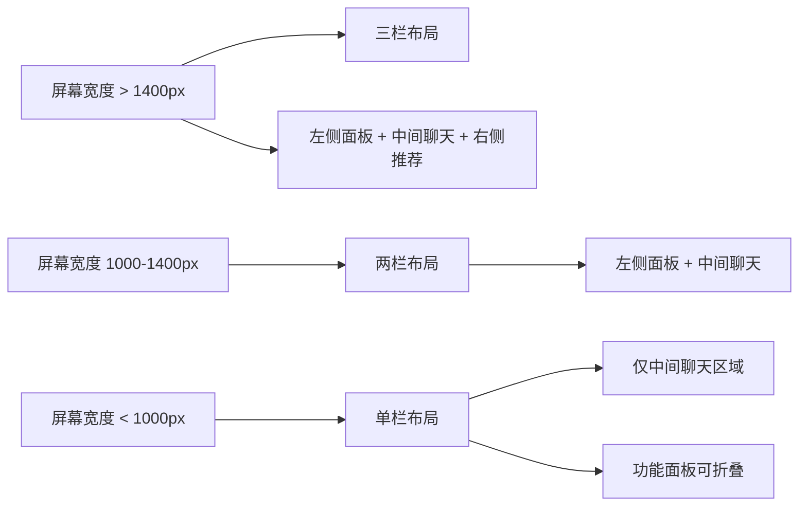
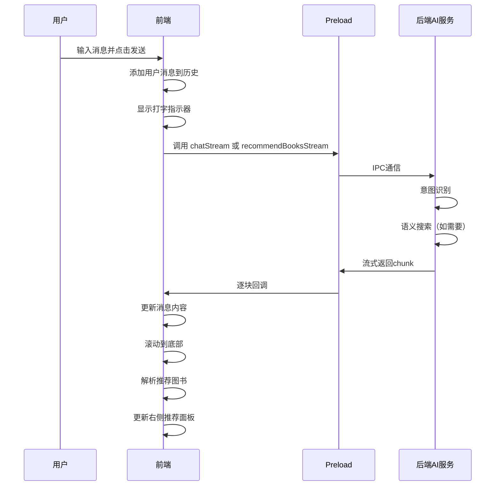

# AI助手页面重设计方案

## 一、当前问题分析

### 1.1 现有功能列表
| 功能 | 描述 | 后端接口 |
|------|------|----------|
| 聊天对话 | 显示用户和AI的对话历史 | `window.api.ai.chatStream` |
| 流式响应 | 实时显示AI回复 | `chatStream` / `recommendBooksStream` |
| 意图识别 | 自动识别推荐意图 | 前端简单判断 + 后端Agent |
| Markdown渲染 | 支持富文本显示 | `marked` + `DOMPurify` |
| 快捷提问 | 预设问题按钮 | 前端处理 |
| 图书推荐 | 根据描述推荐图书 | `window.api.ai.recommendBooksStream` |
| 打字指示器 | 显示AI正在输入 | 前端动画 |

### 1.2 布局问题
- 工具栏和输入区域混在一起，层次不清晰
- 缺少AI服务状态显示
- 没有历史对话管理功能
- 推荐结果展示不够突出
- 整体视觉层次单一

## 二、新布局设计方案

### 2.1 整体布局结构

```
┌─────────────────────────────────────────────────────────────────┐
│                        AI智能助手                                  │
├─────────────────────────────────────────────────────────────────┤
│  ┌──────────┐  ┌──────────────────────────────┐  ┌──────────┐   │
│  │ 功能面板 │  │       主聊天区域              │  │ 推荐面板 │   │
│  │          │  │                              │  │          │   │
│  │ AI状态   │  │  ┌────────────────────────┐  │  │ 推荐图书 │   │
│  │ 快捷功能 │  │  │     消息列表           │  │  │ 卡片列表 │   │
│  │ 历史对话 │  │  │                        │  │  │          │   │
│  │          │  │  └────────────────────────┘  │  └──────────┘   │
│  │          │  │                              │                 │
│  └──────────┘  │  ┌────────────────────────┐  │                 │
│                │  │     输入区域            │  │                 │
│                │  │  工具栏 + 文本框 + 按钮  │  │                 │
│                │  └────────────────────────┘  │                 │
│                └──────────────────────────────┘                 │
└─────────────────────────────────────────────────────────────────┘
```

### 2.2 详细布局设计

#### 左侧功能面板 (260px)
```
┌────────────────────────────┐
│  🤖 AI助手                 │
├────────────────────────────┤
│  ● 在线                    │  ← AI服务状态
│  向量覆盖: 85%              │
├────────────────────────────┤
│  快捷功能                   │
│  ┌──────────────────────┐  │
│  │ 📚 图书推荐           │  │
│  └──────────────────────┘  │
│  ┌──────────────────────┐  │
│  │ 🔍 语义搜索           │  │
│  └──────────────────────┘  │
│  ┌──────────────────────┐  │
│  │ 💬 新对话             │  │
│  └──────────────────────┘  │
├────────────────────────────┤
│  历史对话                   │
│  • Python入门推荐...       │
│  • 最近新书查询...         │
│  • 数据分析书籍...         │
└────────────────────────────┘
```

#### 中间主聊天区域 (flex: 1)
```
┌──────────────────────────────────────┐
│  智能图书助手         Powered by AI   │
│  我可以为您推荐图书、查询信息...      │
├──────────────────────────────────────┤
│  ┌────────────────────────────────┐  │
│  │  [AI头像]                       │  │
│  │  你好！我是图书馆智能助手...    │  │
│  └────────────────────────────────┘  │
│                                      │
│  ┌────────────────────────────────┐  │
│  │                 [用户头像]      │  │
│  │     请推荐几本Python入门书...  │  │
│  └────────────────────────────────┘  │
│                                      │
│  ┌────────────────────────────────┐  │
│  │  [AI头像]                       │  │
│  │  > 🤖 正在调用工具检索...       │  │
│  │  为您推荐以下Python入门书...    │  │
│  └────────────────────────────────┘  │
├──────────────────────────────────────┤
│  [📚] [🐍] [🔍] [⚙️]  快捷操作       │
│  ┌────────────────────────────────┐  │
│  │  输入您的问题...               │  │
│  │                                │  │
│  └────────────────────────────────┘  │
│                        [发送]       │
└──────────────────────────────────────┘
```

#### 右侧推荐面板 (300px)
```
┌────────────────────────────┐
│  📚 推荐图书               │
├────────────────────────────┤
│  ┌──────────────────────┐  │
│  │ 📖 Python编程...      │  │
│  │ 作者: Guido...        │  │
│  │ 相关度: 92%           │  │
│  │ [查看详情]            │  │
│  └──────────────────────┘  │
│  ┌──────────────────────┐  │
│  │ 📖 流畅的Python...    │  │
│  │ 作者: Luciano...      │  │
│  │ 相关度: 88%           │  │
│  │ [查看详情]            │  │
│  └──────────────────────┘  │
│  ┌──────────────────────┐  │
│  │ 📖 Python基础教程...  │  │
│  │ 作者: Magnus...       │  │
│  │ 相关度: 85%           │  │
│  │ [查看详情]            │  │
│  └──────────────────────┘  │
└────────────────────────────┘
```

### 2.3 响应式设计



## 三、功能保留与增强

### 3.1 保留的原有功能
| 功能 | 实现方式 |
|------|----------|
| 聊天对话 | 中间消息区域 |
| 流式响应 | 保持现有 `chatStream` 调用 |
| 意图识别 | 保持现有逻辑 |
| Markdown渲染 | 保持 `marked` + `DOMPurify` |
| 快捷提问 | 改为工具栏快捷按钮 |
| 图书推荐 | 保持 `recommendBooksStream` |
| 打字指示器 | 保持现有动画 |

### 3.2 新增功能
| 功能 | 描述 | 后端接口 |
|------|------|----------|
| AI服务状态显示 | 显示在线状态和向量覆盖率 | `window.api.ai.isAvailable`, `getStatistics` |
| 历史对话列表 | 显示之前的对话记录 | 前端存储 |
| 推荐图书卡片 | 在右侧面板展示推荐结果 | 解析AI回复中的图书信息 |
| 新对话按钮 | 清空当前对话 | 前端处理 |
| 快捷功能入口 | 更清晰的功能入口 | 前端处理 |

## 四、样式设计

### 4.1 配色方案
```css
/* 主色调 */
--ai-primary: #6366f1;
--ai-secondary: #ec4899;
--ai-success: #10b981;
--ai-warning: #f59e0b;

/* 背景色 */
--ai-bg-primary: rgba(255, 255, 255, 0.85);
--ai-bg-secondary: rgba(248, 250, 252, 0.9);
--ai-bg-accent: rgba(99, 102, 241, 0.08);

/* 文字色 */
--ai-text-main: #1e293b;
--ai-text-secondary: #64748b;
--ai-text-muted: #94a3b8;
```

### 4.2 组件样式
- **毛玻璃卡片**: 使用 `glass-card` 类
- **渐变按钮**: 使用项目统一的渐变样式
- **消息气泡**: 用户消息使用主色渐变，AI消息使用白色
- **推荐卡片**: 悬停效果，点击跳转到图书详情

## 五、交互流程

### 5.1 发送消息流程


### 5.2 推荐图书展示
当AI返回包含图书信息的回复时，解析并展示到右侧面板：
- 解析Markdown中的图书列表
- 提取书名、作者、相关度
- 创建推荐卡片
- 点击卡片可跳转到图书详情页

## 六、实现要点

### 6.1 不破坏现有功能
- 保持所有后端接口调用不变
- 保持消息数据结构不变
- 保持流式响应处理逻辑不变

### 6.2 新增逻辑
- 添加AI服务状态检测
- 添加历史对话管理（本地存储）
- 添加推荐图书解析和展示
- 添加响应式布局切换

### 6.3 样式兼容
- 使用项目已有的CSS变量
- 复用 `glass-card` 等通用类
- 保持与Dashboard等页面风格一致
