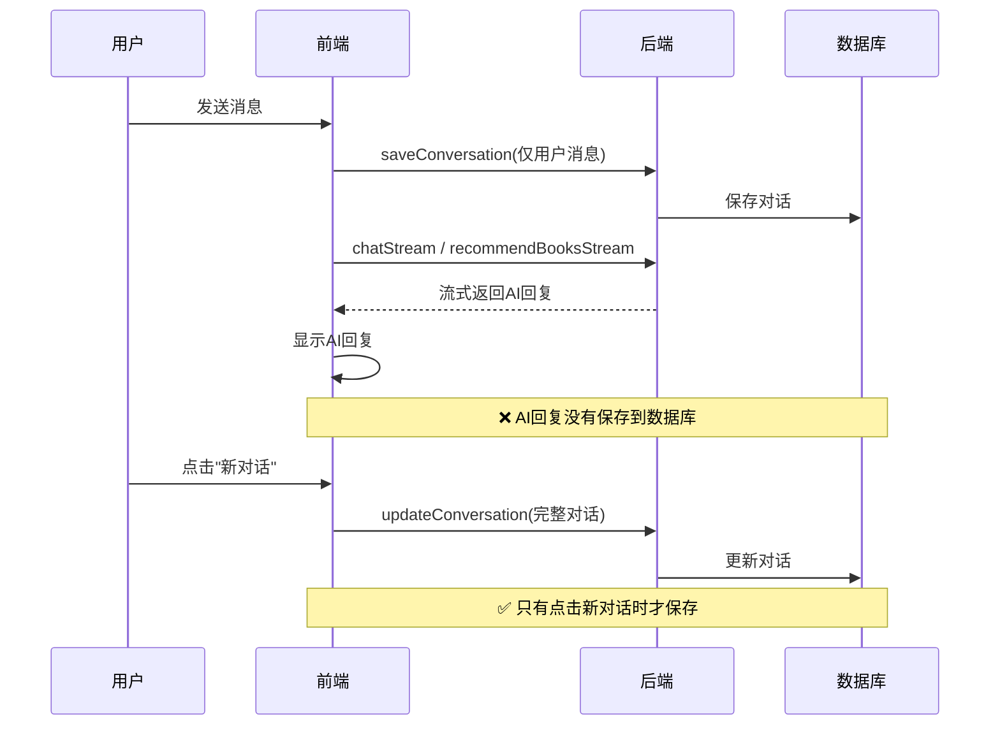
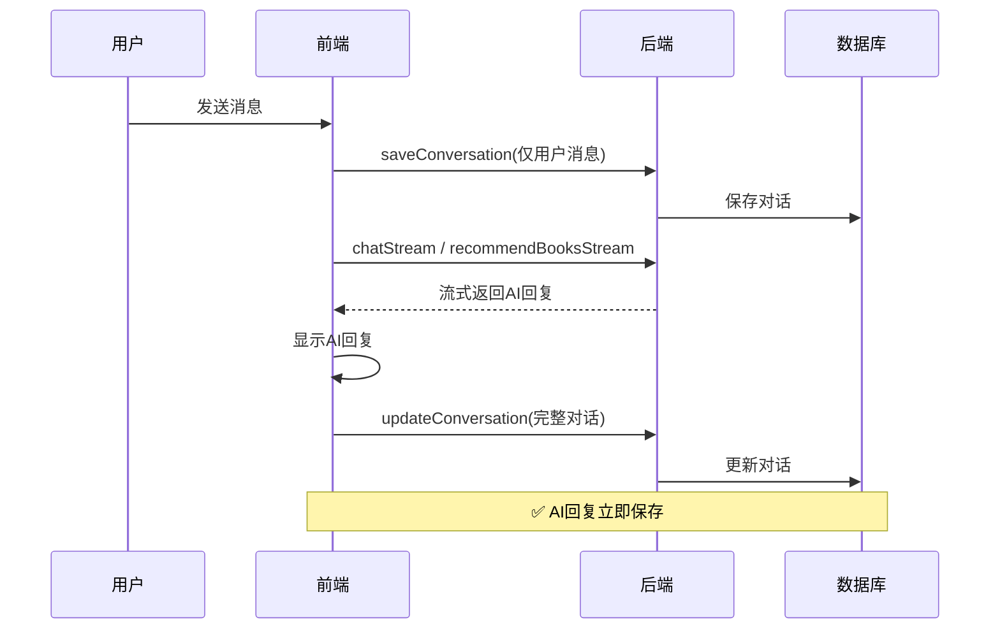
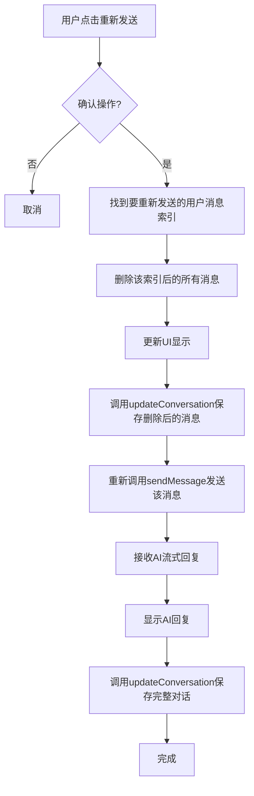

# AI对话历史存储修复计划

## 问题描述

1. AI的历史对话无法正确保存，AI的回答在刷新页面后会丢失
2. 需要添加重新发送消息功能，允许用户重新发送某条消息获取新的AI回复

## 根本原因

在 `src/renderer/src/views/AIAssistant.vue` 的 `sendMessage` 函数中：

1. **创建对话时**（第362-377行）：调用 `saveConversation` 只保存了用户消息
2. **AI回复后**（第379-436行）：流式接收AI回复，但完成后没有调用 `updateConversation` 更新数据库
3. **结果**：AI的回答只存在于前端内存中，刷新页面后丢失

### 当前流程问题



### 重新发送功能需求

用户可能需要重新发送某条消息以获取新的AI回复，当前没有此功能。

## 修复方案

### 1. 修复AI回复保存问题

在 `sendMessage` 函数中，当AI回复完成后立即调用 `updateConversation` 保存完整的对话历史。

### 2. 添加重新发送功能

在每条用户消息上添加"重新发送"按钮，允许用户重新发送该消息并获取新的AI回复。

### 修复后的流程



### 重新发送功能流程



## 具体修改步骤

### 1. 修改 `Message` 接口

**文件**: `src/renderer/src/views/AIAssistant.vue`

**修改位置**: 第187-191行

添加 `id` 字段用于唯一标识每条消息：

```typescript
interface Message {
  id?: string  // 添加唯一ID，用于标识消息
  role: 'user' | 'assistant'
  content: string
  loading?: boolean
}
```

### 2. 修改 `sendMessage` 函数

**文件**: `src/renderer/src/views/AIAssistant.vue`

**修改位置**: 第351-437行的 `sendMessage` 函数

#### 修改点1：在推荐流式回复完成后保存

在第404-409行的 `onComplete` 回调中添加保存逻辑：

```typescript
() => {
  // 解析推荐图书
  recommendedBooks.value = parseRecommendedBooks(fullContent)
  
  // ✅ 新增：保存完整对话到数据库
  await saveCurrentConversation()
  
  resolve()
}
```

#### 修改点2：在普通流式回复完成后保存

在第426行的 `onComplete` 回调中添加保存逻辑：

```typescript
() => {
  // ✅ 新增：保存完整对话到数据库
  await saveCurrentConversation()
  
  resolve()
}
```

#### 修改点3：在错误情况下也保存

在第430-436行的 `catch` 块中添加保存逻辑：

```typescript
catch (error: any) {
  chatHistory.value[aiMsgIndex].content = `抱歉，遇到了一些问题：${error.message || '网络请求超时'}`
  chatHistory.value[aiMsgIndex].loading = false
  
  // ✅ 新增：即使出错也保存对话
  await saveCurrentConversation()
}
```

### 3. 添加保存对话的辅助函数

在 `sendMessage` 函数之前添加一个辅助函数 `saveCurrentConversation`：

```typescript
// 保存当前对话到数据库
const saveCurrentConversation = async () => {
  if (currentConversationId.value && chatHistory.value.length > 1) {
    try {
      const lastUserMsg = chatHistory.value.findLast(m => m.role === 'user')
      if (lastUserMsg) {
        const title = lastUserMsg.content.substring(0, 50) + (lastUserMsg.content.length > 50 ? '...' : '')
        await window.api.ai.updateConversation(
          currentConversationId.value,
          title,
          chatHistory.value
        )
        // 重新加载对话历史列表以更新标题
        await loadConversations()
      }
    } catch (error) {
      console.error('保存对话历史失败:', error)
    }
  }
}
```

### 4. 添加重新发送功能

#### 修改点1：添加重新发送函数

在 `sendMessage` 函数之后添加 `resendMessage` 函数：

```typescript
// 重新发送消息
const resendMessage = async (messageIndex: number) => {
  // 确认操作
  const confirmed = await ElMessageBox.confirm(
    '确定要重新发送这条消息吗？后续的消息将被删除。',
    '确认重新发送',
    {
      confirmButtonText: '确定',
      cancelButtonText: '取消',
      type: 'warning'
    }
  ).catch(() => false)
  
  if (!confirmed) return
  
  const messageToResend = chatHistory.value[messageIndex]
  if (!messageToResend || messageToResend.role !== 'user') {
    ElMessage.warning('只能重新发送用户消息')
    return
  }
  
  // 删除该消息及其后的所有消息
  chatHistory.value = chatHistory.value.slice(0, messageIndex)
  
  // 保存删除后的消息
  await saveCurrentConversation()
  
  // 重新发送该消息
  inputMessage.value = messageToResend.content
  await sendMessage()
}
```

#### 修改点2：在消息气泡上添加重新发送按钮

修改第82-94行的消息显示部分：

```vue
<div v-for="(msg, index) in chatHistory" :key="index"
     class="message-row" :class="msg.role">
  <div class="avatar">
    <el-icon v-if="msg.role === 'assistant'"><Service /></el-icon>
    <el-icon v-else><User /></el-icon>
  </div>
  <div class="bubble">
    <div v-if="msg.loading" class="typing-indicator">
      <span></span><span></span><span></span>
    </div>
    <div v-else v-html="formatContent(msg.content)"></div>
    <!-- 重新发送按钮（仅用户消息） -->
    <div v-if="msg.role === 'user' && !loading" class="message-actions">
      <el-button
        text
        size="small"
        type="info"
        @click="resendMessage(index)"
        class="resend-btn"
      >
        <el-icon><RefreshRight /></el-icon>
        重新发送
      </el-button>
    </div>
  </div>
</div>
```

#### 修改点3：添加图标导入

在第178-181行的图标导入中添加 `RefreshRight`：

```typescript
import {
  MagicStick, User, Service, Reading, Search, ChatDotRound,
  Clock, Promotion, Document, Close, RefreshRight
} from '@element-plus/icons-vue'
```

#### 修改点4：添加样式

在样式部分添加重新发送按钮的样式：

```css
.message-actions {
  margin-top: 8px;
  display: flex;
  justify-content: flex-end;
}

.resend-btn {
  font-size: 12px;
  padding: 4px 8px;
  opacity: 0;
  transition: opacity 0.2s;
}

.bubble:hover .resend-btn {
  opacity: 1;
}

.user .bubble .resend-btn {
  color: rgba(255, 255, 255, 0.8);
}

.user .bubble .resend-btn:hover {
  color: white;
}
```

#### 修改点5：添加 ElMessageBox 导入

在第182行后添加：

```typescript
import { ElMessage, ElMessageBox } from 'element-plus'
```

### 5. 更新 startNewChat 函数

修改第237-264行的 `startNewChat` 函数，使用新的 `saveCurrentConversation` 函数：

```typescript
const startNewChat = async () => {
  // 如果有当前对话且有内容，先保存到数据库
  await saveCurrentConversation()

  // 创建新对话
  chatHistory.value = [
    { role: 'assistant', content: '你好！我是图书馆智能助手。你可以问我关于馆藏图书的问题，或者让我为你推荐书籍。' }
  ]
  currentConversationId.value = null
  recommendedBooks.value = []
  
  // 重新加载对话历史列表
  await loadConversations()
}
```

### 6. 修改初始消息添加ID

修改第213-215行的初始消息，添加ID：

```typescript
const chatHistory = ref<Message[]>([
  { id: 'init', role: 'assistant', content: '你好！我是图书馆智能助手。你可以问我关于馆藏图书的问题，或者让我为你推荐书籍。' }
])
```

### 7. 修改 sendMessage 函数添加ID

在第356行添加用户消息时，添加ID：

```typescript
chatHistory.value.push({
  id: Date.now().toString(),
  role: 'user',
  content: text
})
```

在第380行添加AI消息时，添加ID：

```typescript
const aiMsgIndex = chatHistory.value.push({
  id: Date.now().toString() + '-ai',
  role: 'assistant',
  content: '',
  loading: true
}) - 1
```

**文件**: `src/renderer/src/views/AIAssistant.vue`

**修改位置**: 第351-437行的 `sendMessage` 函数

#### 修改点1：在推荐流式回复完成后保存

在第404-409行的 `onComplete` 回调中添加保存逻辑：

```typescript
() => {
  // 解析推荐图书
  recommendedBooks.value = parseRecommendedBooks(fullContent)
  
  // ✅ 新增：保存完整对话到数据库
  if (currentConversationId.value) {
    try {
      window.api.ai.updateConversation(
        currentConversationId.value,
        chatHistory.value[0].content.substring(0, 50) + '...',
        chatHistory.value
      )
    } catch (error) {
      console.error('保存对话历史失败:', error)
    }
  }
  
  resolve()
}
```

#### 修改点2：在普通流式回复完成后保存

在第426行的 `onComplete` 回调中添加保存逻辑：

```typescript
() => {
  // ✅ 新增：保存完整对话到数据库
  if (currentConversationId.value) {
    try {
      window.api.ai.updateConversation(
        currentConversationId.value,
        chatHistory.value[0].content.substring(0, 50) + '...',
        chatHistory.value
      )
    } catch (error) {
      console.error('保存对话历史失败:', error)
    }
  }
  
  resolve()
}
```

#### 修改点3：在错误情况下也保存

在第430-436行的 `catch` 块中添加保存逻辑：

```typescript
catch (error: any) {
  chatHistory.value[aiMsgIndex].content = `抱歉，遇到了一些问题：${error.message || '网络请求超时'}`
  chatHistory.value[aiMsgIndex].loading = false
  
  // ✅ 新增：即使出错也保存对话
  if (currentConversationId.value) {
    try {
      window.api.ai.updateConversation(
        currentConversationId.value,
        chatHistory.value[0].content.substring(0, 50) + '...',
        chatHistory.value
      )
    } catch (saveError) {
      console.error('保存对话历史失败:', saveError)
    }
  }
}
```

## 验证步骤

### 验证AI回复保存功能

1. 启动应用，登录后进入AI助手页面
2. 发送一条消息，等待AI回复完成
3. 刷新页面或重新进入AI助手页面
4. 检查历史对话列表中是否包含刚才的完整对话（包括AI的回答）
5. 点击历史对话，验证能否正确加载完整的对话历史

### 验证重新发送功能

1. 发送多条消息，形成对话历史
2. 鼠标悬停在某个用户消息上，显示"重新发送"按钮
3. 点击"重新发送"按钮，确认操作
4. 验证该消息及其后的所有消息被删除
5. 验证消息被重新发送，并获取新的AI回复
6. 刷新页面，验证重新发送后的对话历史被正确保存

### 验证错误情况

1. 发送消息时模拟网络错误
2. 验证错误消息也被保存到数据库
3. 刷新页面，验证错误消息被正确加载

## 相关文件

- `src/renderer/src/views/AIAssistant.vue` - 前端AI助手页面
- `src/main/domains/ai/ai.service.ts` - AI服务层
- `src/main/domains/ai/conversation.repository.ts` - 对话仓库
- `src/main/lib/ipcHandlers.ts` - IPC处理
- `src/preload/index.ts` - 预加载脚本
