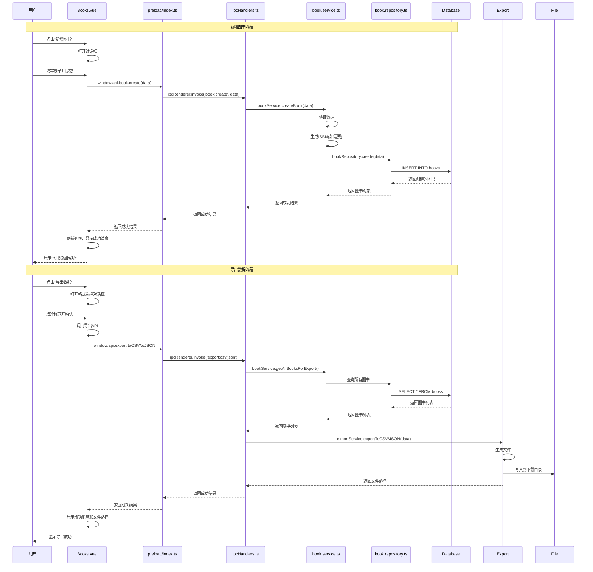

# 图书管理功能实施计划

## 概述
实现图书管理页面的新增图书和导出数据功能，确保与数据库表结构完全匹配。

## 数据库 books 表字段

根据 `src/main/database/index.ts`，books 表包含以下字段：

| 字段名 | 类型 | 约束 | 说明 |
|--------|------|------|------|
| id | INTEGER | PRIMARY KEY AUTOINCREMENT | 主键 |
| isbn | TEXT | UNIQUE NOT NULL | ISBN号 |
| title | TEXT | NOT NULL | 书名 |
| category_id | INTEGER | NOT NULL FK | 图书类别ID（外键） |
| author | TEXT | NOT NULL | 作者 |
| publisher | TEXT | NOT NULL | 出版社 |
| publish_date | DATE | - | 出版日期（可选） |
| price | REAL | - | 定价（可选） |
| pages | INTEGER | - | 页数（可选） |
| keywords | TEXT | - | 关键词（可选） |
| description | TEXT | - | 描述（可选） |
| cover_url | TEXT | - | 封面URL（可选） |
| total_quantity | INTEGER | NOT NULL DEFAULT 1 | 总库存 |
| available_quantity | INTEGER | NOT NULL DEFAULT 1 | 可借库存 |
| status | TEXT | NOT NULL DEFAULT 'normal' | 状态 |
| registration_date | DATE | DEFAULT date('now') | 登记日期 |
| notes | TEXT | - | 备注（可选） |
| created_at | DATETIME | DEFAULT CURRENT_TIMESTAMP | 创建时间 |
| updated_at | DATETIME | DEFAULT CURRENT_TIMESTAMP | 更新时间 |

## 功能一：新增图书

### 前端实现 (Books.vue)

#### 1. 添加状态变量
```typescript
// 新增图书对话框
const addVisible = ref(false)
const addForm = reactive({
  title: '',
  author: '',
  publisher: '',
  isbn: 'AUTO', // 默认自动生成
  category_id: null,
  price: null,
  total_quantity: 1
})
const categories = ref([])
const addLoading = ref(false)
```

#### 2. 添加新增图书对话框
在模板中添加新的 el-dialog，包含以下表单字段：
- 书名 (title) - 必填
- 作者 (author) - 必填
- 出版社 (publisher) - 必填
- ISBN (isbn) - 必填，默认值为 "AUTO" 表示自动生成
- 图书类别 (category_id) - 必填，下拉选择
- 定价 (price) - 可选，数字输入
- 总库存 (total_quantity) - 必填，数字输入，最小值1

#### 3. 获取图书类别
在 onMounted 中获取图书类别列表：
```typescript
const fetchCategories = async () => {
  const result = await window.api.bookCategory.getAll()
  if (result.success) {
    categories.value = result.data
  }
}
```

#### 4. 实现 handleAdd 函数
```typescript
const handleAdd = () => {
  addVisible.value = true
}

const handleAddSubmit = async () => {
  // 表单验证
  if (!addForm.title || !addForm.author || !addForm.publisher || !addForm.category_id || !addForm.total_quantity) {
    ElMessage.error('请填写所有必填字段')
    return
  }

  addLoading.value = true
  try {
    const result = await window.api.book.create({
      title: addForm.title,
      author: addForm.author,
      publisher: addForm.publisher,
      isbn: addForm.isbn,
      category_id: addForm.category_id,
      price: addForm.price,
      total_quantity: addForm.total_quantity,
      available_quantity: addForm.total_quantity, // 初始可借数量等于总库存
      status: 'normal',
      registration_date: new Date().toISOString().split('T')[0]
    })

    if (result.success) {
      ElMessage.success('图书添加成功')
      addVisible.value = false
      // 重置表单
      Object.assign(addForm, {
        title: '',
        author: '',
        publisher: '',
        isbn: 'AUTO',
        category_id: null,
        price: null,
        total_quantity: 1
      })
      fetchData()
    } else {
      ElMessage.error(result.error?.message || '添加失败')
    }
  } catch (error) {
    ElMessage.error('操作失败')
  } finally {
    addLoading.value = false
  }
}
```

### 后端实现
后端已完整实现，无需修改：
- `book.service.ts` 的 `createBook` 方法（第68-127行）
- `book.repository.ts` 的 `create` 方法（第166-197行）
- `ipcHandlers.ts` 的 `book:create` 处理器（第318-330行）

## 功能二：导出数据

### 后端实现

#### 1. 修改 exportService.ts
```typescript
import path from 'path'
import fs from 'fs'
import { app } from 'electron'
import { logger } from './logger'

interface BookExportData {
  id: number
  isbn: string
  title: string
  category_name: string
  author: string
  publisher: string
  publish_date: string | null
  price: number | null
  total_quantity: number
  available_quantity: number
  status: string
  registration_date: string
  notes: string | null
}

class ExportService {
  async exportToCSV(data: BookExportData[], filename?: string): Promise<string> {
    logger.info('Exporting books to CSV')

    const downloadPath = app.getPath('downloads')
    const fileName = filename || `books_export_${Date.now()}.csv`
    const filePath = path.join(downloadPath, fileName)

    // CSV 头部
    const headers = ['ID', 'ISBN', '书名', '类别', '作者', '出版社', '出版日期', '定价', '总库存', '可借库存', '状态', '登记日期', '备注']

    // 构建 CSV 内容
    const csvRows = [headers.join(',')]

    for (const book of data) {
      const row = [
        book.id,
        book.isbn,
        this.escapeCSV(book.title),
        this.escapeCSV(book.category_name),
        this.escapeCSV(book.author),
        this.escapeCSV(book.publisher),
        book.publish_date || '',
        book.price || '',
        book.total_quantity,
        book.available_quantity,
        book.status,
        book.registration_date,
        this.escapeCSV(book.notes || '')
      ]
      csvRows.push(row.join(','))
    }

    const content = csvRows.join('\n')
    await fs.promises.writeFile(filePath, content, 'utf-8')

    logger.info(`CSV export completed: ${filePath}`)
    return filePath
  }

  async exportToJSON(data: BookExportData[], filename?: string): Promise<string> {
    logger.info('Exporting books to JSON')

    const downloadPath = app.getPath('downloads')
    const fileName = filename || `books_export_${Date.now()}.json`
    const filePath = path.join(downloadPath, fileName)

    const content = JSON.stringify({
      export_time: new Date().toISOString(),
      total_count: data.length,
      books: data
    }, null, 2)

    await fs.promises.writeFile(filePath, content, 'utf-8')

    logger.info(`JSON export completed: ${filePath}`)
    return filePath
  }

  // CSV 转义处理
  private escapeCSV(value: string): string {
    if (!value) return ''
    // 如果包含逗号、引号或换行符，需要用引号包裹并转义内部引号
    if (value.includes(',') || value.includes('"') || value.includes('\n')) {
      return `"${value.replace(/"/g, '""')}"`
    }
    return value
  }
}

export const exportService = new ExportService()
```

#### 2. 修改 ipcHandlers.ts
更新导出相关的 IPC 处理器：
```typescript
// ============ 数据导出相关 ============
ipcMain.handle('export:books:csv', async () => {
  try {
    const books = bookService.getAllBooksForExport()
    const filePath = await exportService.exportToCSV(books)
    return { success: true, data: filePath } as SuccessResponse
  } catch (error) {
    return errorHandler.handle(error)
  }
})

ipcMain.handle('export:books:json', async () => {
  try {
    const books = bookService.getAllBooksForExport()
    const filePath = await exportService.exportToJSON(books)
    return { success: true, data: filePath } as SuccessResponse
  } catch (error) {
    return errorHandler.handle(error)
  }
})
```

#### 3. 修改 book.service.ts
添加获取所有图书用于导出的方法：
```typescript
// 获取所有图书用于导出
getAllBooksForExport(): Array<BookWithCategory> {
  const stmt = db.prepare(`
    SELECT b.*, bc.name as category_name, bc.code as category_code
    FROM books b
    JOIN book_categories bc ON b.category_id = bc.id
    ORDER BY b.registration_date DESC
  `)
  return stmt.all() as Array<BookWithCategory>
}
```

#### 4. 添加 IPC 处理器
在 ipcHandlers.ts 中添加：
```typescript
ipcMain.handle('book:getAllForExport', async () => {
  try {
    const books = bookService.getAllBooksForExport()
    return { success: true, data: books } as SuccessResponse
  } catch (error) {
    return errorHandler.handle(error)
  }
})
```

### 前端实现

#### 1. 添加导出相关状态
```typescript
// 导出数据
const exportVisible = ref(false)
const exportFormat = ref('csv')
const exportLoading = ref(false)
```

#### 2. 添加导出格式选择对话框
```vue
<!-- 导出数据对话框 -->
<el-dialog v-model="exportVisible" title="导出图书数据" width="400px" destroy-on-close>
  <el-form label-position="top">
    <el-form-item label="选择导出格式">
      <el-radio-group v-model="exportFormat">
        <el-radio value="csv">CSV 格式</el-radio>
        <el-radio value="json">JSON 格式</el-radio>
      </el-radio-group>
    </el-form-item>
    <el-alert
      title="提示"
      type="info"
      :closable="false"
      style="margin-top: 16px"
    >
      文件将保存到您的下载文件夹中
    </el-alert>
  </el-form>
  <template #footer>
    <el-button @click="exportVisible = false">取消</el-button>
    <el-button type="primary" @click="handleExport" :loading="exportLoading">导出</el-button>
  </template>
</el-dialog>
```

#### 3. 修改导出按钮
```vue
<el-button icon="Download" size="large" @click="handleExportClick">导出数据</el-button>
```

#### 4. 实现导出函数
```typescript
const handleExportClick = () => {
  exportVisible.value = true
}

const handleExport = async () => {
  exportLoading.value = true
  try {
    let result
    if (exportFormat.value === 'csv') {
      result = await window.api.export.toCSV({
        data: bookList.value,
        filename: `books_export_${Date.now()}.csv`
      })
    } else {
      result = await window.api.export.toJSON({
        data: bookList.value,
        filename: `books_export_${Date.now()}.json`
      })
    }

    if (result.success) {
      ElMessage.success(`导出成功！文件已保存到: ${result.data}`)
      exportVisible.value = false
    } else {
      ElMessage.error(result.error?.message || '导出失败')
    }
  } catch (error) {
    ElMessage.error('导出失败')
  } finally {
    exportLoading.value = false
  }
}
```

## 架构流程图



## 数据验证规则

### 新增图书表单验证
| 字段 | 验证规则 |
|------|----------|
| title | 非空，长度1-200字符 |
| author | 非空，长度1-100字符 |
| publisher | 非空，长度1-100字符 |
| isbn | 非空，唯一值，或"AUTO"自动生成 |
| category_id | 必须选择有效的类别ID |
| price | 可选，非负数 |
| total_quantity | 必填，整数，最小值1 |

## 实施顺序

1. 修改 `exportService.ts` 实现真正的导出功能
2. 修改 `book.service.ts` 添加 `getAllBooksForExport` 方法
3. 修改 `ipcHandlers.ts` 添加导出相关的 IPC 处理器
4. 修改 `Books.vue` 添加新增图书对话框和表单
5. 修改 `Books.vue` 添加导出数据对话框和功能
6. 测试新增图书功能
7. 测试导出数据功能

## 注意事项

1. **数据库字段匹配**：确保前端提交的数据字段与数据库 books 表字段完全一致
2. **ISBN 唯一性**：后端会自动检查 ISBN 是否已存在，如果已存在会返回错误
3. **类别验证**：category_id 必须是有效的图书类别ID，否则后端会返回错误
4. **文件编码**：导出的 CSV 和 JSON 文件使用 UTF-8 编码
5. **CSV 转义**：CSV 导出时需要正确处理包含逗号、引号、换行符的字段
6. **文件路径**：导出的文件保存在用户的下载文件夹中
