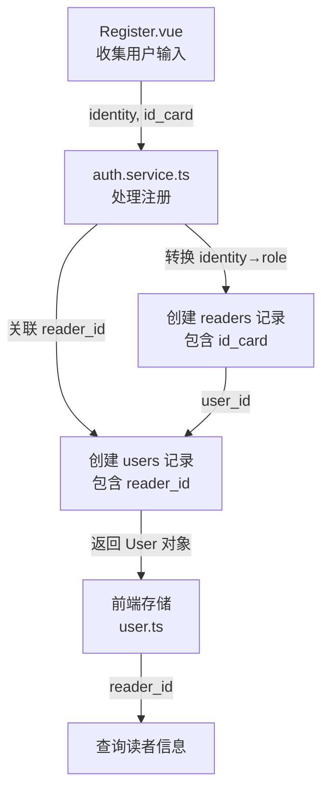

# 数据同步修复计划

## 问题概述

用户信息和注册界面的信息不同步，需要修复数据结构不一致的问题，确保前端、后端和数据库之间的数据定义一致。

## 发现的问题

### 1. User 接口缺少 reader_id 字段

**文件**: `src/main/domains/auth/user.repository.ts`

**当前接口定义**:
```typescript
export interface User {
  id: number
  username: string
  password: string
  name: string
  role: 'admin' | 'librarian' | 'teacher' | 'student'
  email?: string
  phone?: string
  created_at: string
  updated_at: string
}
```

**问题**: 缺少 `reader_id` 字段，但数据库表和前端存储都有这个字段

**数据库表结构**:
```sql
CREATE TABLE users (
  ...
  reader_id INTEGER,
  ...
  FOREIGN KEY (reader_id) REFERENCES readers(id) ON DELETE SET NULL
)
```

**前端存储** (`src/renderer/src/store/user.ts`):
```typescript
interface User {
  ...
  reader_id?: number
}
```

### 2. Reader 接口缺少 id_card 和 user_id 字段

**文件**: `src/main/domains/reader/reader.repository.ts`

**当前接口定义**:
```typescript
export interface Reader {
  id: number
  reader_no: string
  name: string
  category_id: number
  gender?: 'male' | 'female' | 'other'
  organization?: string
  address?: string
  phone?: string
  email?: string
  registration_date: string
  expiry_date?: string
  status: 'active' | 'suspended' | 'expired'
  notes?: string
  created_at: string
  updated_at: string
}
```

**问题**: 缺少 `id_card` 和 `user_id` 字段

**数据库表结构**:
```sql
CREATE TABLE readers (
  ...
  user_id INTEGER,
  ...
  id_card TEXT UNIQUE,
  ...
  FOREIGN KEY (user_id) REFERENCES users(id) ON DELETE SET NULL
)
```

### 3. 注册界面字段命名不一致

**文件**: `src/renderer/src/views/Register.vue`

**问题**: 注册界面使用 `identity` 字段（值为 'teacher' | 'student'），而后端使用 `role` 字段

**当前实现**:
```typescript
const form = reactive({
  ...
  identity: '' as 'teacher' | 'student',
  id_card: '',
  ...
})
```

**后端处理** (`auth.service.ts`):
```typescript
// 在注册时将 identity 转换为 role
const role = data.identity === 'teacher' ? 'teacher' : 'student'
```

**状态**: 后端已正确处理转换，注册流程本身没有问题

### 4. 读者管理界面缺少 id_card 字段

**文件**: `src/renderer/src/views/Readers.vue`

**问题**: 读者管理界面没有显示和编辑 `id_card` 字段

**当前表单字段**:
```typescript
const form = reactive({
  reader_no: '',
  name: '',
  category_id: undefined,
  gender: 'male',
  organization: '',
  phone: '',
  email: '',
  address: '',
  registration_date: new Date().toISOString().split('T')[0],
  status: 'active'
})
```

### 5. 其他表格检查结果

**book.repository.ts**: ✅ 接口与数据库表结构一致

**borrowing.repository.ts**: ✅ 接口与数据库表结构一致

## 修复计划

### 修复 1: 更新 user.repository.ts 的 User 接口

**文件**: `src/main/domains/auth/user.repository.ts`

**修改内容**:
```typescript
export interface User {
  id: number
  username: string
  password: string
  name: string
  role: 'admin' | 'librarian' | 'teacher' | 'student'
  reader_id?: number  // 添加此字段
  email?: string
  phone?: string
  created_at: string
  updated_at: string
}
```

**影响范围**:
- UserRepository.create() 方法需要更新
- UserRepository.update() 方法需要更新

### 修复 2: 更新 reader.repository.ts 的 Reader 接口

**文件**: `src/main/domains/reader/reader.repository.ts`

**修改内容**:
```typescript
export interface Reader {
  id: number
  reader_no: string
  name: string
  category_id: number
  user_id?: number  // 添加此字段
  gender?: 'male' | 'female' | 'other'
  id_card?: string  // 添加此字段
  organization?: string
  address?: string
  phone?: string
  email?: string
  registration_date: string
  expiry_date?: string
  status: 'active' | 'suspended' | 'expired'
  notes?: string
  created_at: string
  updated_at: string
}
```

**影响范围**:
- ReaderRepository.create() 方法需要更新
- ReaderRepository.update() 方法需要更新
- 所有查询方法需要确保返回这些字段

### 修复 3: 更新 Readers.vue 添加 id_card 字段

**文件**: `src/renderer/src/views/Readers.vue`

**修改内容**:
1. 在表格中添加 id_card 列
2. 在表单中添加 id_card 输入框
3. 更新 form 数据结构

**表格添加**:
```vue
<el-table-column prop="id_card" label="学号/工号" width="130" />
```

**表单添加**:
```vue
<el-form-item label="学号/工号" prop="id_card">
  <el-input v-model="form.id_card" placeholder="请输入学号或工号" />
</el-form-item>
```

**form 更新**:
```typescript
const form = reactive({
  ...
  id_card: '',
  ...
})
```

**验证规则添加**:
```typescript
const rules = {
  ...
  id_card: [{ required: true, message: '请输入学号或工号', trigger: 'blur' }]
}
```

### 修复 4: 验证注册流程

**文件**: `src/renderer/src/views/Register.vue`

**验证点**:
- 确认 identity 字段正确传递给后端
- 确认 id_card 字段正确传递给后端
- 确认后端正确处理注册流程

**当前状态**: 注册流程已经正确实现，auth.service.ts 会：
1. 将 identity 转换为 role
2. 创建 readers 记录（包含 id_card）
3. 创建 users 记录（关联 reader_id）

无需修改，但需要测试验证。

## 数据流图



## 执行步骤

1. ✅ 分析数据流和识别问题
2. ✅ 创建修复计划
3. ⏳ 修复 user.repository.ts 的 User 接口
4. ⏳ 修复 reader.repository.ts 的 Reader 接口
5. ⏳ 更新 Readers.vue 添加 id_card 字段
6. ⏳ 验证其他表格调用
7. ⏳ 测试注册流程

## 测试验证

### 测试用例 1: 用户注册
1. 访问注册页面
2. 填写所有字段（包括 id_card）
3. 提交注册
4. 验证 users 表中包含 reader_id
5. 验证 readers 表中包含 id_card 和 user_id

### 测试用例 2: 读者管理
1. 打开读者管理页面
2. 验证表格显示 id_card 列
3. 新增读者，填写 id_card
4. 验证数据正确保存

### 测试用例 3: 数据查询
1. 通过 user_id 查询 reader 信息
2. 通过 reader_id 查询 user 信息
3. 验证双向关联正确

## 注意事项

1. **向后兼容**: 修改接口时需要确保不破坏现有功能
2. **数据库迁移**: 确保数据库表结构已包含所有必需字段
3. **类型安全**: TypeScript 接口定义需要与实际数据结构一致
4. **测试覆盖**: 修改后需要充分测试相关功能
