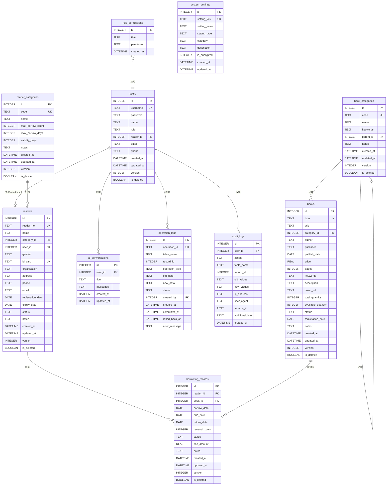
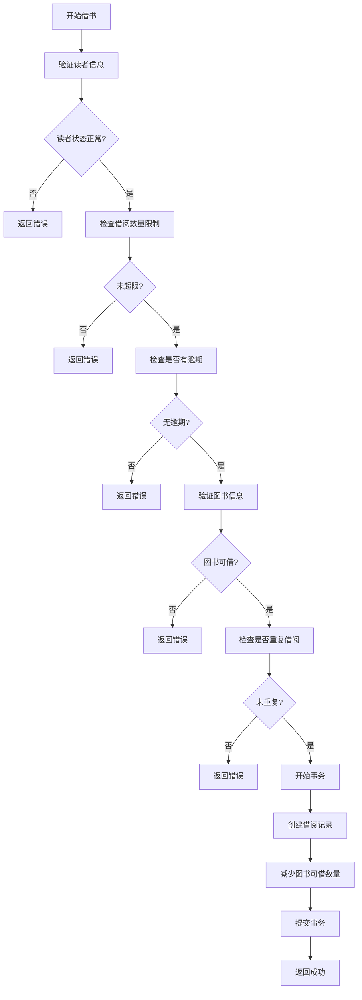
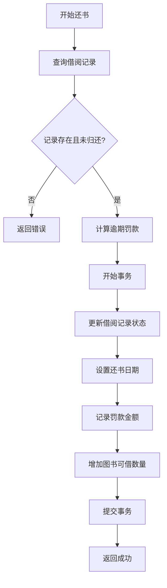

# 图书馆管理系统 - 数据库设计分析报告

## 一、项目概述

本项目是一个基于 Electron + Vue3 + SQLite 的图书馆管理系统，采用桌面应用架构，支持图书管理、读者管理、借阅管理、统计分析等核心功能，并集成了 AI 智能助手进行语义搜索。

**技术栈：**
- 前端：Vue 3 + TypeScript + Element Plus
- 后端：Electron (Node.js)
- 数据库：SQLite (better-sqlite3)
- 架构模式：MVC + Repository 模式

---

## 二、需求分析

### 2.1 功能需求

根据代码分析，系统包含以下核心功能模块：

| 模块 | 功能描述 |
|------|----------|
| **用户认证** | 用户登录、注册、角色权限管理（4种角色：admin、librarian、teacher、student） |
| **读者管理** | 读者信息增删改查、读者种类管理、读者证挂失/激活/续期 |
| **图书管理** | 图书信息增删改查、图书类别管理、高级搜索（正则/SQL/向量）、数据导出 |
| **借阅管理** | 借书、还书、续借、图书丢失处理、借阅记录查询 |
| **统计分析** | 图书统计、读者统计、借阅统计、热门排行、逾期分析 |
| **AI助手** | 对话历史管理、语义搜索图书、智能推荐 |
| **系统设置** | AI配置、业务规则配置、系统参数管理 |

### 2.2 业务规则

1. **借阅规则**
   - 不同读者种类有不同的最大借阅数量和借阅天数
   - 读者有逾期未还时不能借阅新书
   - 达到最大借阅数量时不能借阅新书
   - 已借阅的图书不能重复借阅
   - 续借有次数限制（默认3次）
   - 逾期图书不能续借

2. **读者证管理**
   - 读者证有有效期，过期后不能借阅
   - 读者证可以挂失（状态变为 suspended）
   - 读者证可以续期

3. **图书状态**
   - normal: 正常可借
   - damaged: 损坏
   - lost: 丢失
   - destroyed: 已销毁

4. **借阅记录状态**
   - borrowed: 借阅中
   - returned: 已归还
   - overdue: 逾期
   - lost: 丢失

---

## 三、数据库表结构

系统共包含 **12 张表**，分为核心业务表、权限管理表、日志审计表和系统配置表。

### 3.1 核心业务表

#### 3.1.1 users（用户表）

| 字段名 | 类型 | 约束 | 说明 |
|--------|------|------|------|
| id | INTEGER | PRIMARY KEY AUTOINCREMENT | 用户ID |
| username | TEXT | UNIQUE NOT NULL | 用户名 |
| password | TEXT | NOT NULL | 密码（bcrypt加密） |
| name | TEXT | NOT NULL | 真实姓名 |
| role | TEXT | NOT NULL CHECK | 角色：admin/librarian/teacher/student |
| reader_id | INTEGER | FOREIGN KEY | 关联读者ID |
| email | TEXT | - | 邮箱 |
| phone | TEXT | - | 电话 |
| created_at | DATETIME | DEFAULT CURRENT_TIMESTAMP | 创建时间 |
| updated_at | DATETIME | DEFAULT CURRENT_TIMESTAMP | 更新时间 |
| version | INTEGER | DEFAULT 1 | 乐观锁版本号 |
| is_deleted | BOOLEAN | DEFAULT 0 | 软删除标记 |

**外键关系：**
- `reader_id` → `readers(id)` ON DELETE SET NULL

---

#### 3.1.2 reader_categories（读者种类表）

| 字段名 | 类型 | 约束 | 说明 |
|--------|------|------|------|
| id | INTEGER | PRIMARY KEY AUTOINCREMENT | 种类ID |
| code | TEXT | UNIQUE NOT NULL | 种类编码（如：STUDENT、TEACHER） |
| name | TEXT | NOT NULL | 种类名称 |
| max_borrow_count | INTEGER | NOT NULL DEFAULT 5 | 最大借阅数量 |
| max_borrow_days | INTEGER | NOT NULL DEFAULT 30 | 最大借阅天数 |
| validity_days | INTEGER | NOT NULL DEFAULT 365 | 有效期（天） |
| notes | TEXT | - | 备注 |
| created_at | DATETIME | DEFAULT CURRENT_TIMESTAMP | 创建时间 |
| updated_at | DATETIME | DEFAULT CURRENT_TIMESTAMP | 更新时间 |
| version | INTEGER | DEFAULT 1 | 乐观锁版本号 |
| is_deleted | BOOLEAN | DEFAULT 0 | 软删除标记 |

**默认数据：**
- STUDENT（学生）：最多借5本，借期30天，有效期365天
- TEACHER（教师）：最多借10本，借期60天，有效期1095天
- STAFF（职工）：最多借8本，借期45天，有效期730天

---

#### 3.1.3 readers（读者表）

| 字段名 | 类型 | 约束 | 说明 |
|--------|------|------|------|
| id | INTEGER | PRIMARY KEY AUTOINCREMENT | 读者ID |
| reader_no | TEXT | UNIQUE NOT NULL | 读者编号（格式：种类代码+日期+序号） |
| name | TEXT | NOT NULL | 姓名 |
| category_id | INTEGER | NOT NULL | 读者种类ID |
| user_id | INTEGER | FOREIGN KEY | 关联用户ID |
| gender | TEXT | CHECK | 性别：male/female/other |
| id_card | TEXT | UNIQUE | 身份证号 |
| organization | TEXT | - | 单位/班级 |
| address | TEXT | - | 地址 |
| phone | TEXT | - | 电话 |
| email | TEXT | - | 邮箱 |
| registration_date | DATE | DEFAULT (date('now')) | 注册日期 |
| expiry_date | DATE | - | 有效期截止日期 |
| status | TEXT | NOT NULL DEFAULT 'active' CHECK | 状态：active/suspended/expired/pending |
| notes | TEXT | - | 备注 |
| created_at | DATETIME | DEFAULT CURRENT_TIMESTAMP | 创建时间 |
| updated_at | DATETIME | DEFAULT CURRENT_TIMESTAMP | 更新时间 |
| version | INTEGER | DEFAULT 1 | 乐观锁版本号 |
| is_deleted | BOOLEAN | DEFAULT 0 | 软删除标记 |

**外键关系：**
- `category_id` → `reader_categories(id)` ON DELETE RESTRICT
- `user_id` → `users(id)` ON DELETE SET NULL

**读者编号生成规则：**
格式：`{种类代码}{YYYYMMDD}{4位序号}`
示例：`STUDENT202512290001`

---

#### 3.1.4 book_categories（图书类别表）

| 字段名 | 类型 | 约束 | 说明 |
|--------|------|------|------|
| id | INTEGER | PRIMARY KEY AUTOINCREMENT | 类别ID |
| code | TEXT | UNIQUE NOT NULL | 类别编码（如：TP、I、K） |
| name | TEXT | NOT NULL | 类别名称 |
| keywords | TEXT | - | 关键词（逗号分隔） |
| parent_id | INTEGER | FOREIGN KEY | 父类别ID（支持层级结构） |
| notes | TEXT | - | 备注 |
| created_at | DATETIME | DEFAULT CURRENT_TIMESTAMP | 创建时间 |
| updated_at | DATETIME | DEFAULT CURRENT_TIMESTAMP | 更新时间 |
| version | INTEGER | DEFAULT 1 | 乐观锁版本号 |
| is_deleted | BOOLEAN | DEFAULT 0 | 软删除标记 |

**外键关系：**
- `parent_id` → `book_categories(id)` ON DELETE SET NULL

**默认数据：**
- TP：计算机科学
- I：文学
- K：历史地理
- O：数理科学
- J：艺术

---

#### 3.1.5 books（图书表）

| 字段名 | 类型 | 约束 | 说明 |
|--------|------|------|------|
| id | INTEGER | PRIMARY KEY AUTOINCREMENT | 图书ID |
| isbn | TEXT | UNIQUE NOT NULL | ISBN编号 |
| title | TEXT | NOT NULL | 书名 |
| category_id | INTEGER | NOT NULL | 图书类别ID |
| author | TEXT | NOT NULL | 作者 |
| publisher | TEXT | NOT NULL | 出版社 |
| publish_date | DATE | - | 出版日期 |
| price | REAL | - | 定价 |
| pages | INTEGER | - | 页数 |
| keywords | TEXT | - | 关键词 |
| description | TEXT | - | 内容简介 |
| cover_url | TEXT | - | 封面URL |
| total_quantity | INTEGER | NOT NULL DEFAULT 1 | 总库存 |
| available_quantity | INTEGER | NOT NULL DEFAULT 1 | 可借数量 |
| status | TEXT | NOT NULL DEFAULT 'normal' CHECK | 状态：normal/damaged/lost/destroyed |
| registration_date | DATE | DEFAULT (date('now')) | 入库日期 |
| notes | TEXT | - | 备注 |
| created_at | DATETIME | DEFAULT CURRENT_TIMESTAMP | 创建时间 |
| updated_at | DATETIME | DEFAULT CURRENT_TIMESTAMP | 更新时间 |
| version | INTEGER | DEFAULT 1 | 乐观锁版本号 |
| is_deleted | BOOLEAN | DEFAULT 0 | 软删除标记 |

**外键关系：**
- `category_id` → `book_categories(id)` ON DELETE RESTRICT

**ISBN生成规则：**
格式：`{类别代码}-{年份}-{6位序号}`
示例：`TP-2025-000001`

---

#### 3.1.6 borrowing_records（借阅记录表）

| 字段名 | 类型 | 约束 | 说明 |
|--------|------|------|------|
| id | INTEGER | PRIMARY KEY AUTOINCREMENT | 记录ID |
| reader_id | INTEGER | NOT NULL | 读者ID |
| book_id | INTEGER | NOT NULL | 图书ID |
| borrow_date | DATE | DEFAULT (date('now')) | 借书日期 |
| due_date | DATE | NOT NULL | 应还日期 |
| return_date | DATE | - | 实际还书日期 |
| renewal_count | INTEGER | DEFAULT 0 | 续借次数 |
| status | TEXT | NOT NULL DEFAULT 'borrowed' CHECK | 状态：borrowed/returned/overdue/lost |
| fine_amount | REAL | DEFAULT 0 | 罚款金额 |
| notes | TEXT | - | 备注 |
| created_at | DATETIME | DEFAULT CURRENT_TIMESTAMP | 创建时间 |
| updated_at | DATETIME | DEFAULT CURRENT_TIMESTAMP | 更新时间 |
| version | INTEGER | DEFAULT 1 | 乐观锁版本号 |
| is_deleted | BOOLEAN | DEFAULT 0 | 软删除标记 |

**外键关系：**
- `reader_id` → `readers(id)` ON DELETE RESTRICT
- `book_id` → `books(id)` ON DELETE RESTRICT

**业务逻辑：**
- 借书时：`available_quantity -= 1`
- 还书时：`available_quantity += 1`，计算逾期罚款
- 逾期：系统自动将 `borrowed` 状态更新为 `overdue`
- 丢失：`status = 'lost'`，罚款 = 书价 × 2

---

#### 3.1.7 ai_conversations（AI对话历史表）

| 字段名 | 类型 | 约束 | 说明 |
|--------|------|------|------|
| id | INTEGER | PRIMARY KEY AUTOINCREMENT | 对话ID |
| user_id | INTEGER | NOT NULL | 用户ID |
| title | TEXT | NOT NULL | 对话标题 |
| messages | TEXT | NOT NULL | 消息内容（JSON格式） |
| created_at | DATETIME | DEFAULT CURRENT_TIMESTAMP | 创建时间 |
| updated_at | DATETIME | DEFAULT CURRENT_TIMESTAMP | 更新时间 |

**外键关系：**
- `user_id` → `users(id)` ON DELETE CASCADE

---

### 3.2 权限管理表

#### 3.2.1 role_permissions（角色权限表）

| 字段名 | 类型 | 约束 | 说明 |
|--------|------|------|------|
| id | INTEGER | PRIMARY KEY AUTOINCREMENT | 权限ID |
| role | TEXT | NOT NULL CHECK | 角色：admin/librarian/teacher/student |
| permission | TEXT | NOT NULL | 权限字符串 |
| created_at | DATETIME | DEFAULT CURRENT_TIMESTAMP | 创建时间 |

**唯一约束：** `(role, permission)`

**默认权限配置：**

| 角色 | 权限 |
|------|------|
| admin | `*` (所有权限) |
| librarian | `books:*`, `readers:*`, `borrowing:*`, `statistics:read` |
| teacher | `books:read`, `borrowing:read`, `borrowing:borrow`, `statistics:read` |
| student | `books:read`, `borrowing:read`, `borrowing:borrow` |

---

### 3.3 日志审计表

#### 3.3.1 operation_logs（操作日志表）

| 字段名 | 类型 | 约束 | 说明 |
|--------|------|------|------|
| id | INTEGER | PRIMARY KEY AUTOINCREMENT | 日志ID |
| operation_id | TEXT | UNIQUE NOT NULL | 操作ID |
| table_name | TEXT | NOT NULL | 表名 |
| record_id | INTEGER | NOT NULL | 记录ID |
| operation_type | TEXT | NOT NULL CHECK | 操作类型：INSERT/UPDATE/DELETE |
| old_data | TEXT | - | 旧数据（JSON） |
| new_data | TEXT | - | 新数据（JSON） |
| status | TEXT | NOT NULL DEFAULT 'pending' CHECK | 状态：pending/committed/rolled_back/failed |
| created_by | INTEGER | FOREIGN KEY | 操作人ID |
| created_at | DATETIME | DEFAULT CURRENT_TIMESTAMP | 创建时间 |
| committed_at | DATETIME | - | 提交时间 |
| rolled_back_at | DATETIME | - | 回滚时间 |
| error_message | TEXT | - | 错误信息 |

**外键关系：**
- `created_by` → `users(id)` ON DELETE SET NULL

---

#### 3.3.2 audit_logs（审计日志表）

| 字段名 | 类型 | 约束 | 说明 |
|--------|------|------|------|
| id | INTEGER | PRIMARY KEY AUTOINCREMENT | 审计ID |
| user_id | INTEGER | FOREIGN KEY | 用户ID |
| action | TEXT | NOT NULL | 操作动作 |
| table_name | TEXT | - | 表名 |
| record_id | INTEGER | - | 记录ID |
| old_values | TEXT | - | 旧值（JSON） |
| new_values | TEXT | - | 新值（JSON） |
| ip_address | TEXT | - | IP地址 |
| user_agent | TEXT | - | 用户代理 |
| session_id | TEXT | - | 会话ID |
| additional_info | TEXT | - | 附加信息 |
| created_at | DATETIME | DEFAULT CURRENT_TIMESTAMP | 创建时间 |

**外键关系：**
- `user_id` → `users(id)` ON DELETE SET NULL

---

### 3.4 系统配置表

#### 3.4.1 system_settings（系统设置表）

| 字段名 | 类型 | 约束 | 说明 |
|--------|------|------|------|
| id | INTEGER | PRIMARY KEY AUTOINCREMENT | 设置ID |
| setting_key | TEXT | UNIQUE NOT NULL | 设置键 |
| setting_value | TEXT | - | 设置值 |
| setting_type | TEXT | NOT NULL CHECK | 值类型：string/number/boolean/json |
| category | TEXT | NOT NULL CHECK | 分类：ai/system/business |
| description | TEXT | - | 描述 |
| is_encrypted | INTEGER | NOT NULL DEFAULT 0 | 是否加密 |
| created_at | DATETIME | DEFAULT CURRENT_TIMESTAMP | 创建时间 |
| updated_at | DATETIME | DEFAULT CURRENT_TIMESTAMP | 更新时间 |

**默认AI配置：**
- `ai.openai.apiKey`: OpenAI API Key
- `ai.openai.baseURL`: https://api.openai.com/v1
- `ai.openai.embeddingModel`: text-embedding-3-small
- `ai.openai.chatModel`: gpt-4-turbo-preview

---

#### 3.4.2 database_version（数据库版本表）

| 字段名 | 类型 | 约束 | 说明 |
|--------|------|------|------|
| id | INTEGER | PRIMARY KEY AUTOINCREMENT | 版本ID |
| version | INTEGER | NOT NULL | 版本号 |
| applied_at | DATETIME | DEFAULT CURRENT_TIMESTAMP | 应用时间 |
| notes | TEXT | - | 说明 |

---

## 四、实体关系图（ER图）

---

## 五、表关系说明

### 5.1 一对一关系

| 表A | 表B | 关系描述 |
|-----|-----|----------|
| users | readers | 一个用户可以关联一个读者（通过 reader_id） |

**说明：** 教师和学生角色需要同时创建用户和读者记录，用户用于登录，读者用于借阅。

---

### 5.2 一对多关系

| 主表 | 从表 | 关系描述 |
|------|------|----------|
| reader_categories | readers | 一个读者种类包含多个读者 |
| book_categories | books | 一个图书类别包含多本图书 |
| book_categories | book_categories | 一个类别可以有多个子类别（自关联） |
| users | ai_conversations | 一个用户可以有多个AI对话 |
| users | operation_logs | 一个用户可以创建多个操作日志 |
| users | audit_logs | 一个用户可以产生多个审计日志 |

---

### 5.3 多对一关系

| 从表 | 主表 | 关系描述 |
|------|------|----------|
| readers | reader_categories | 多个读者属于一个种类 |
| books | book_categories | 多本图书属于一个类别 |
| borrowing_records | readers | 多条借阅记录属于一个读者 |
| borrowing_records | books | 多条借阅记录对应一本图书 |

---

### 5.4 外键约束说明

| 外键 | 约束类型 | 说明 |
|------|----------|------|
| users.reader_id | ON DELETE SET NULL | 删除读者时，用户保留但 reader_id 置空 |
| readers.category_id | ON DELETE RESTRICT | 有读者使用的种类不能删除 |
| readers.user_id | ON DELETE SET NULL | 删除用户时，读者保留但 user_id 置空 |
| books.category_id | ON DELETE RESTRICT | 有图书使用的类别不能删除 |
| borrowing_records.reader_id | ON DELETE RESTRICT | 有借阅记录的读者不能删除 |
| borrowing_records.book_id | ON DELETE RESTRICT | 有借阅记录的图书不能删除 |
| ai_conversations.user_id | ON DELETE CASCADE | 删除用户时，级联删除其对话历史 |
| operation_logs.created_by | ON DELETE SET NULL | 删除用户时，日志保留但 created_by 置空 |
| audit_logs.user_id | ON DELETE SET NULL | 删除用户时，审计日志保留但 user_id 置空 |
| book_categories.parent_id | ON DELETE SET NULL | 删除父类别时，子类别保留但 parent_id 置空 |

---

## 六、索引设计

系统为提高查询性能，在以下字段上建立了索引：

### 6.1 业务索引

| 索引名 | 表 | 字段 | 用途 |
|--------|-----|------|------|
| idx_readers_category | readers | category_id | 按读者种类查询 |
| idx_readers_status | readers | status | 按读者状态查询 |
| idx_books_category | books | category_id | 按图书类别查询 |
| idx_books_status | books | status | 按图书状态查询 |
| idx_books_title | books | title | 按书名搜索 |
| idx_books_author | books | author | 按作者搜索 |
| idx_borrowing_reader | borrowing_records | reader_id | 查询读者借阅记录 |
| idx_borrowing_book | borrowing_records | book_id | 查询图书借阅记录 |
| idx_borrowing_status | borrowing_records | status | 按借阅状态查询 |
| idx_borrowing_dates | borrowing_records | borrow_date, due_date | 按日期范围查询 |
| idx_ai_conversations_user | ai_conversations | user_id | 查询用户对话历史 |
| idx_ai_conversations_created | ai_conversations | created_at DESC | 按时间倒序查询 |

### 6.2 软删除索引

| 索引名 | 表 | 字段 | 用途 |
|--------|-----|------|------|
| idx_books_is_deleted | books | is_deleted | 过滤已删除图书 |
| idx_readers_is_deleted | readers | is_deleted | 过滤已删除读者 |
| idx_users_is_deleted | users | is_deleted | 过滤已删除用户 |
| idx_borrowing_records_is_deleted | borrowing_records | is_deleted | 过滤已删除借阅记录 |

### 6.3 乐观锁索引

| 索引名 | 表 | 字段 | 用途 |
|--------|-----|------|------|
| idx_books_version | books | version | 乐观锁检查 |
| idx_borrowing_records_version | borrowing_records | version | 乐观锁检查 |

### 6.4 日志索引

| 索引名 | 表 | 字段 | 用途 |
|--------|-----|------|------|
| idx_operation_logs_operation_id | operation_logs | operation_id | 操作日志查询 |
| idx_operation_logs_status | operation_logs | status | 按状态过滤 |
| idx_operation_logs_created_at | operation_logs | created_at | 按时间查询 |
| idx_audit_logs_user_id | audit_logs | user_id | 按用户查询 |
| idx_audit_logs_action | audit_logs | action | 按操作类型查询 |
| idx_audit_logs_table_name | audit_logs | table_name | 按表名查询 |
| idx_audit_logs_created_at | audit_logs | created_at | 按时间查询 |

---

## 七、数据库迁移

系统使用版本化的数据库迁移机制，当前版本为 **v2**。

### 7.1 迁移内容

**v1 → v2 迁移：**
1. 添加乐观锁版本字段 (`version`)
2. 添加软删除字段 (`is_deleted`)
3. 创建操作日志表 (`operation_logs`)
4. 创建审计日志表 (`audit_logs`)
5. 创建相关索引

### 7.2 迁移管理

- 迁移脚本位置：`src/main/database/migration.ts`
- 版本表：`database_version`
- 支持自动检测和执行迁移
- 提供迁移状态查询和数据库完整性验证

---

## 八、数据完整性约束

### 8.1 主键约束

所有表都使用自增整数主键 `id`。

### 8.2 外键约束

见第五章表关系说明。

### 8.3 唯一约束

| 表 | 字段 |
|-----|------|
| users | username |
| readers | reader_no, id_card |
| books | isbn |
| reader_categories | code |
| book_categories | code |
| operation_logs | operation_id |
| system_settings | setting_key |
| role_permissions | (role, permission) |

### 8.4 检查约束（CHECK）

| 表 | 字段 | 约束 |
|-----|------|------|
| users | role | IN ('admin', 'librarian', 'teacher', 'student') |
| readers | gender | IN ('male', 'female', 'other') |
| readers | status | IN ('active', 'suspended', 'expired', 'pending') |
| books | status | IN ('normal', 'damaged', 'lost', 'destroyed') |
| borrowing_records | status | IN ('borrowed', 'returned', 'overdue', 'lost') |
| role_permissions | role | IN ('admin', 'librarian', 'teacher', 'student') |
| operation_logs | operation_type | IN ('INSERT', 'UPDATE', 'DELETE') |
| operation_logs | status | IN ('pending', 'committed', 'rolled_back', 'failed') |
| system_settings | setting_type | IN ('string', 'number', 'boolean', 'json') |
| system_settings | category | IN ('ai', 'system', 'business') |

---

## 九、业务流程图

### 9.1 借书流程

### 9.2 还书流程

---

## 十、设计特点总结

### 10.1 架构特点

1. **清晰的分层设计**：采用 Repository 模式，数据访问层与业务逻辑层分离
2. **完善的权限体系**：基于角色的访问控制（RBAC），细粒度权限管理
3. **完整的审计追踪**：操作日志和审计日志双轨记录
4. **数据安全保障**：密码加密、软删除、乐观锁
5. **灵活的配置管理**：系统参数化配置，支持运行时调整

### 10.2 业务特点

1. **读者与用户分离**：支持不同角色的用户，教师和学生需要同时创建用户和读者
2. **智能编号生成**：读者编号和ISBN自动生成，避免重复
3. **灵活的借阅规则**：不同读者种类有不同的借阅限制
4. **完整的借阅生命周期**：借阅、续借、逾期、丢失全流程管理
5. **AI智能辅助**：支持语义搜索和智能推荐

### 10.3 技术特点

1. **SQLite轻量级**：适合桌面应用，无需额外数据库服务
2. **外键约束完整**：保证数据一致性
3. **索引优化**：针对常用查询场景建立索引
4. **版本化迁移**：支持数据库结构平滑升级
5. **事务支持**：关键操作使用事务保证数据一致性

---

## 十一、附录

### 11.1 表数量统计

| 类别 | 表数量 |
|------|--------|
| 核心业务表 | 7 |
| 权限管理表 | 1 |
| 日志审计表 | 2 |
| 系统配置表 | 2 |
| **总计** | **12** |

### 11.2 核心实体统计

| 实体 | 数量 |
|------|------|
| 用户角色 | 4 (admin, librarian, teacher, student) |
| 读者种类 | 3 (学生, 教师, 职工) |
| 图书类别 | 5 (计算机科学, 文学, 历史地理, 数理科学, 艺术) |
| 借阅状态 | 4 (借阅中, 已归还, 逾期, 丢失) |
| 读者状态 | 4 (正常, 挂失, 过期, 待审核) |
| 图书状态 | 4 (正常, 损坏, 丢失, 已销毁) |

---

**报告生成时间：** 2025-12-29
**数据库版本：** v2
**分析依据：** 项目源代码（src/main/database、src/main/domains、src/renderer/src/views）
