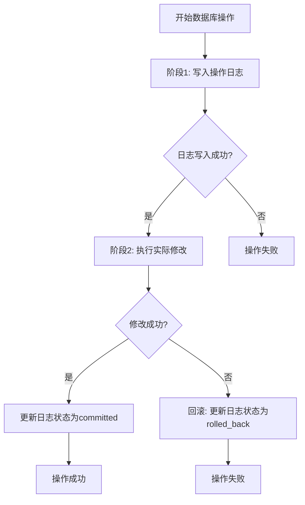

# 数据库功能增强计划

## 项目概述
为图书馆管理系统添加企业级数据库功能，包括乐观锁、预写日志、防重复提交、错误重试机制和企业级数据库技巧。

## 需求分析

### 1. 乐观锁实现
- **目标**：防止并发借阅导致的数据不一致
- **范围**：图书库存和借阅记录
- **实现方式**：版本号（version）字段 + CAS（Compare-And-Swap）操作

### 2. 数据库操作修改逻辑（先写后改）
- **目标**：实现预写日志机制，支持事务回滚
- **范围**：所有数据库修改操作
- **实现方式**：操作日志表 + 两阶段提交

### 3. 防重复提交机制
- **目标**：防止用户多次点击导致重复操作
- **范围**：所有前端按钮操作
- **实现方式**：请求令牌 + 状态管理

### 4. 错误处理和重试机制
- **目标**：优雅处理网络错误和超时，自动重试
- **范围**：所有API调用
- **实现方式**：指数退避重试 + 错误状态显示

### 5. 企业级数据库技巧
- **目标**：实现软删除、审计日志等企业级特性
- **范围**：所有关键数据表
- **实现方式**：is_deleted标志 + 审计日志表

## 技术设计方案

### 1. 乐观锁实现方案

#### 数据库表结构修改
```sql
-- 为books表添加版本号字段
ALTER TABLE books ADD COLUMN version INTEGER DEFAULT 1;

-- 为borrowing_records表添加版本号字段  
ALTER TABLE borrowing_records ADD COLUMN version INTEGER DEFAULT 1;
```

#### 乐观锁更新方法
```typescript
// 新的更新方法，包含版本检查
async updateWithOptimisticLock(
  table: string, 
  id: number, 
  updates: Record<string, any>, 
  currentVersion: number
): Promise<boolean> {
  const fields = Object.keys(updates).map(key => `${key} = ?`).join(', ');
  const values = Object.values(updates);
  values.push(currentVersion + 1, id, currentVersion);
  
  const sql = `
    UPDATE ${table} 
    SET ${fields}, version = ?, updated_at = CURRENT_TIMESTAMP
    WHERE id = ? AND version = ?
  `;
  
  const result = db.prepare(sql).run(...values);
  return result.changes > 0;
}
```

### 2. 预写日志（Write-Ahead Logging）系统

#### 操作日志表设计
```sql
CREATE TABLE IF NOT EXISTS operation_logs (
  id INTEGER PRIMARY KEY AUTOINCREMENT,
  operation_id TEXT UNIQUE NOT NULL,  -- 操作唯一标识
  table_name TEXT NOT NULL,           -- 操作的表名
  record_id INTEGER NOT NULL,         -- 记录ID
  operation_type TEXT NOT NULL CHECK(operation_type IN ('INSERT', 'UPDATE', 'DELETE')),
  old_data TEXT,                      -- 旧数据（JSON格式）
  new_data TEXT,                      -- 新数据（JSON格式）
  status TEXT NOT NULL DEFAULT 'pending' CHECK(status IN ('pending', 'committed', 'rolled_back')),
  created_by INTEGER,                 -- 操作人
  created_at DATETIME DEFAULT CURRENT_TIMESTAMP,
  committed_at DATETIME,
  rolled_back_at DATETIME
);
```

#### 两阶段提交流程


### 3. 防重复提交机制

#### 前端实现方案
```typescript
// 防重复提交工具函数
class DebounceSubmit {
  private pendingRequests = new Map<string, boolean>();
  private requestTimeouts = new Map<string, NodeJS.Timeout>();
  
  async submit<T>(
    key: string, 
    action: () => Promise<T>,
    options = { timeout: 3000 }
  ): Promise<T> {
    if (this.pendingRequests.has(key)) {
      throw new Error('请求正在处理中，请勿重复提交');
    }
    
    this.pendingRequests.set(key, true);
    
    try {
      const result = await action();
      return result;
    } finally {
      // 延迟清除，防止快速连续点击
      const timeout = setTimeout(() => {
        this.pendingRequests.delete(key);
        this.requestTimeouts.delete(key);
      }, options.timeout);
      
      this.requestTimeouts.set(key, timeout);
    }
  }
  
  cancel(key: string) {
    const timeout = this.requestTimeouts.get(key);
    if (timeout) {
      clearTimeout(timeout);
    }
    this.pendingRequests.delete(key);
    this.requestTimeouts.delete(key);
  }
}
```

#### 后端请求令牌验证
```typescript
// 请求令牌验证中间件
class RequestTokenValidator {
  private tokenStore = new Map<string, number>();
  private readonly TOKEN_EXPIRY = 5 * 60 * 1000; // 5分钟
  
  generateToken(): string {
    const token = crypto.randomUUID();
    const expiry = Date.now() + this.TOKEN_EXPIRY;
    this.tokenStore.set(token, expiry);
    return token;
  }
  
  validateToken(token: string): boolean {
    const expiry = this.tokenStore.get(token);
    if (!expiry) return false;
    
    if (Date.now() > expiry) {
      this.tokenStore.delete(token);
      return false;
    }
    
    this.tokenStore.delete(token); // 一次性令牌
    return true;
  }
}
```

### 4. 错误处理和重试机制

#### 指数退避重试策略
```typescript
class RetryableOperation {
  async execute<T>(
    operation: () => Promise<T>,
    options = {
      maxRetries: 3,
      initialDelay: 1000,
      maxDelay: 10000,
      backoffFactor: 2
    }
  ): Promise<T> {
    let lastError: Error;
    
    for (let attempt = 0; attempt <= options.maxRetries; attempt++) {
      try {
        return await operation();
      } catch (error) {
        lastError = error as Error;
        
        // 如果是业务错误，不重试
        if (error instanceof BusinessError || error instanceof ValidationError) {
          throw error;
        }
        
        // 最后一次尝试，直接抛出错误
        if (attempt === options.maxRetries) {
          break;
        }
        
        // 计算延迟时间
        const delay = Math.min(
          options.initialDelay * Math.pow(options.backoffFactor, attempt),
          options.maxDelay
        );
        
        console.log(`操作失败，${delay}ms后重试 (${attempt + 1}/${options.maxRetries})`, error);
        await new Promise(resolve => setTimeout(resolve, delay));
      }
    }
    
    throw lastError!;
  }
}
```

#### 前端错误状态显示
```vue
<template>
  <el-button 
    :type="buttonType"
    :loading="isLoading"
    :disabled="isDisabled"
    @click="handleClick"
  >
    <template v-if="errorCount > 0">
      <el-icon><Warning /></el-icon>
      重试中 ({{ errorCount }}/3)
    </template>
    <template v-else>
      {{ buttonText }}
    </template>
  </el-button>
</template>

<script setup>
import { ref, computed } from 'vue'

const props = defineProps({
  action: Function,
  buttonText: String
})

const isLoading = ref(false)
const errorCount = ref(0)
const lastError = ref(null)

const buttonType = computed(() => {
  if (errorCount.value > 0) return 'warning'
  return 'primary'
})

const isDisabled = computed(() => {
  return isLoading.value || errorCount.value >= 3
})

const handleClick = async () => {
  if (isDisabled.value) return
  
  isLoading.value = true
  errorCount.value = 0
  
  try {
    await props.action()
    errorCount.value = 0
    lastError.value = null
  } catch (error) {
    errorCount.value++
    lastError.value = error
    // 可以在这里添加自动重试逻辑
  } finally {
    isLoading.value = false
  }
}
</script>
```

### 5. 企业级数据库技巧

#### 软删除实现
```sql
-- 为所有关键表添加软删除字段
ALTER TABLE books ADD COLUMN is_deleted BOOLEAN DEFAULT 0;
ALTER TABLE readers ADD COLUMN is_deleted BOOLEAN DEFAULT 0;
ALTER TABLE borrowing_records ADD COLUMN is_deleted BOOLEAN DEFAULT 0;
ALTER TABLE users ADD COLUMN is_deleted BOOLEAN DEFAULT 0;

-- 修改查询语句，默认排除已删除记录
-- 原查询: SELECT * FROM books WHERE ...
-- 新查询: SELECT * FROM books WHERE is_deleted = 0 AND ...
```

#### 审计日志表
```sql
CREATE TABLE IF NOT EXISTS audit_logs (
  id INTEGER PRIMARY KEY AUTOINCREMENT,
  user_id INTEGER,                    -- 操作用户
  action TEXT NOT NULL,               -- 操作类型
  table_name TEXT NOT NULL,           -- 操作的表
  record_id INTEGER,                  -- 记录ID
  old_values TEXT,                    -- 旧值（JSON格式）
  new_values TEXT,                    -- 新值（JSON格式）
  ip_address TEXT,                    -- IP地址
  user_agent TEXT,                    -- 用户代理
  created_at DATETIME DEFAULT CURRENT_TIMESTAMP,
  FOREIGN KEY (user_id) REFERENCES users(id) ON DELETE SET NULL
);

-- 创建索引提高查询性能
CREATE INDEX idx_audit_logs_user ON audit_logs(user_id);
CREATE INDEX idx_audit_logs_table ON audit_logs(table_name);
CREATE INDEX idx_audit_logs_created ON audit_logs(created_at);
```

#### 数据版本控制
```sql
CREATE TABLE IF NOT EXISTS book_versions (
  id INTEGER PRIMARY KEY AUTOINCREMENT,
  book_id INTEGER NOT NULL,
  version_number INTEGER NOT NULL,
  data TEXT NOT NULL,                 -- 完整数据快照（JSON格式）
  changed_by INTEGER,                 -- 修改人
  change_reason TEXT,                 -- 修改原因
  created_at DATETIME DEFAULT CURRENT_TIMESTAMP,
  FOREIGN KEY (book_id) REFERENCES books(id) ON DELETE CASCADE,
  FOREIGN KEY (changed_by) REFERENCES users(id) ON DELETE SET NULL,
  UNIQUE(book_id, version_number)
);
```

## 实施步骤

### 阶段1：数据库结构修改（1-2天）
1. 添加乐观锁版本字段
2. 创建操作日志表
3. 添加软删除字段
4. 创建审计日志表
5. 创建数据版本表

### 阶段2：后端服务层改造（2-3天）
1. 实现乐观锁更新方法
2. 实现预写日志系统
3. 集成防重复提交验证
4. 实现错误重试机制
5. 添加软删除逻辑
6. 实现审计日志记录

### 阶段3：前端界面改造（1-2天）
1. 实现防重复提交按钮
2. 添加错误状态显示
3. 集成请求令牌机制
4. 优化用户反馈

### 阶段4：测试和优化（1-2天）
1. 单元测试
2. 集成测试
3. 并发测试
4. 性能测试
5. 用户体验测试

## 文件修改清单

### 需要修改的现有文件
1. `src/main/database/index.ts` - 数据库表结构修改
2. `src/main/domains/book/book.repository.ts` - 乐观锁和软删除
3. `src/main/domains/borrowing/borrowing.repository.ts` - 乐观锁和软删除
4. `src/main/domains/reader/reader.repository.ts` - 软删除
5. `src/main/lib/errorHandler.ts` - 新增错误类型
6. `src/main/lib/ipcHandlers.ts` - 集成新功能

### 需要创建的新文件
1. `src/main/lib/optimisticLock.ts` - 乐观锁工具
2. `src/main/lib/operationLogger.ts` - 操作日志系统
3. `src/main/lib/retryHandler.ts` - 重试处理器
4. `src/main/lib/auditLogger.ts` - 审计日志
5. `src/renderer/src/utils/debounceSubmit.ts` - 防重复提交
6. `src/renderer/src/components/RetryButton.vue` - 重试按钮组件

## 风险与缓解措施

### 风险1：数据库迁移影响现有数据
- **风险**：添加新字段可能影响现有查询
- **缓解**：使用默认值，确保向后兼容

### 风险2：性能影响
- **风险**：额外的日志记录和版本检查可能影响性能
- **缓解**：添加适当的索引，异步记录审计日志

### 风险3：复杂性增加
- **风险**：新功能增加系统复杂性
- **缓解**：模块化设计，清晰的文档，充分的测试

### 风险4：用户体验变化
- **风险**：防重复提交可能让用户感到困惑
- **缓解**：清晰的用户反馈，适当的超时设置

## 预期收益

### 1. 数据一致性提升
- 乐观锁防止并发冲突
- 预写日志确保事务完整性

### 2. 用户体验改善
- 防重复提交减少误操作
- 错误重试提高系统可用性
- 清晰的错误反馈

### 3. 系统可维护性增强
- 审计日志便于问题追踪
- 软删除支持数据恢复
- 版本控制支持历史追溯

### 4. 企业级特性
- 符合企业应用标准
- 支持合规性要求
- 提高系统可靠性

## 验收标准

### 功能验收
1. ✅ 乐观锁：并发借阅不会导致库存负数
2. ✅ 预写日志：系统崩溃后可以恢复未完成操作
3. ✅ 防重复提交：快速点击按钮不会产生重复记录
4. ✅ 错误重试：网络错误自动重试3次
5. ✅ 软删除：删除操作可恢复
6. ✅ 审计日志：所有关键操作都有记录

### 性能验收
1. ✅ 乐观锁更新性能影响 < 10%
2. ✅ 日志记录对主要操作延迟影响 < 20%
3. ✅ 系统在高并发下保持稳定

### 用户体验验收
1. ✅ 用户能清晰看到操作状态
2. ✅ 错误信息明确易懂
3. ✅ 重试机制透明自然

## 后续优化建议

### 短期优化（1-2个月）
1. 添加操作日志查询界面
2. 实现批量操作支持
3. 添加性能监控仪表板

### 中期优化（3-6个月）
1. 实现分布式锁支持
2. 添加数据归档策略
3. 实现实时数据同步

### 长期优化（6-12个月）
1. 微服务架构改造
2. 多数据库支持
3. 人工智能异常检测

---

**计划制定者**：Roo (技术架构师)  
**制定时间**：2025-12-22  
**预计总工时**：6-9人日  
**优先级**：高（核心功能增强）