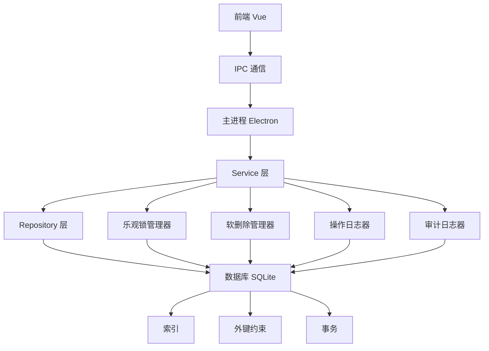
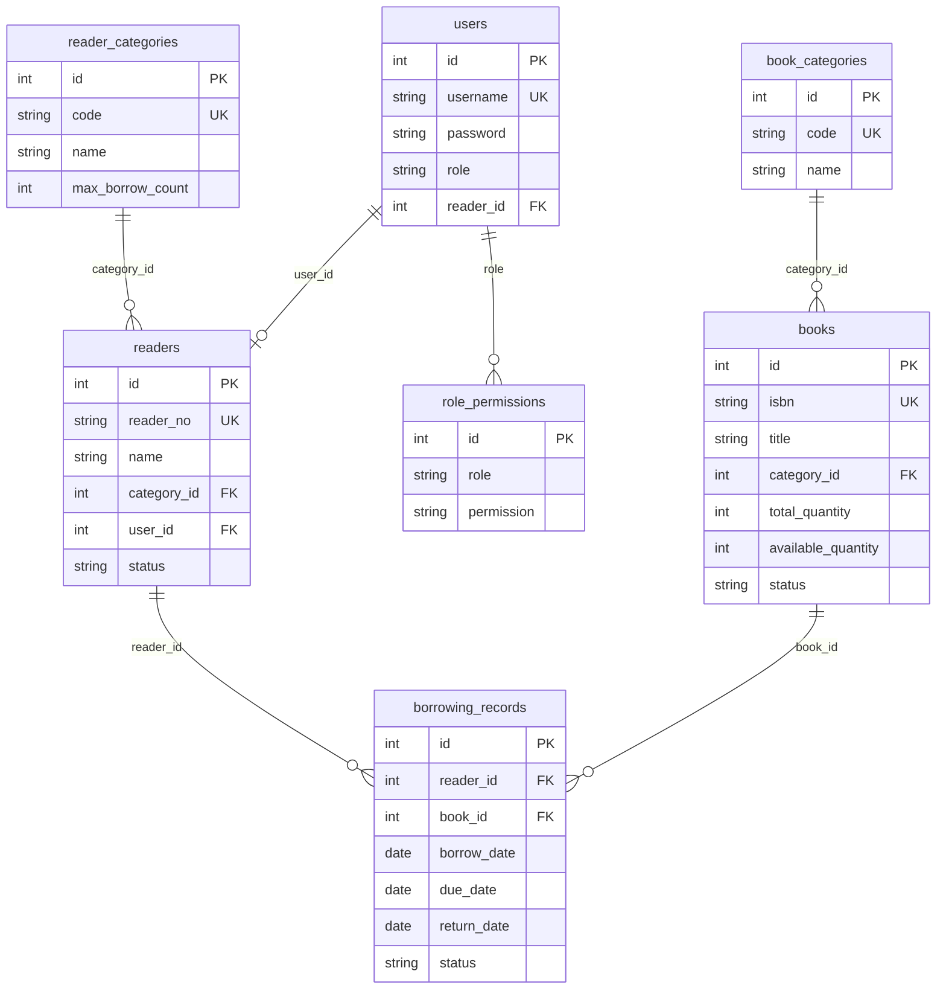

# 数据库原理知识点分析 - 图书管理系统

本文档从数据库原理的知识点角度，对图书管理系统项目进行详细分析，将理论知识与实际代码实现相对应。

---

## 一、数据库连接与初始化

### 1.1 数据库连接管理

**知识点：数据库连接池、连接生命周期管理**

项目使用 `better-sqlite3` 作为数据库驱动，采用单例模式管理数据库连接。

**代码位置：** [`src/main/database/index.ts:18`](../src/main/database/index.ts:18)

```typescript
// 创建数据库连接
export const db = new Database(dbPath)
```

**知识点对应：**
- 使用 SQLite 嵌入式数据库，适合桌面应用场景
- 单例连接模式，避免多连接带来的资源浪费
- 连接在应用启动时建立，应用关闭时自动释放

---

### 1.2 外键约束

**知识点：参照完整性、外键约束**

**代码位置：** [`src/main/database/index.ts:21`](../src/main/database/index.ts:21)

```typescript
// 启用外键约束
db.pragma('foreign_keys = ON')
```

**知识点对应：**
- 外键约束确保表间关系的完整性
- 防止孤立记录（如删除读者时，如果有借阅记录会报错）
- SQLite 需要显式启用外键约束（`PRAGMA foreign_keys = ON`）

**外键约束示例：**

| 表 | 外键字段 | 引用表 | 约束类型 | 代码位置 |
|---|---------|--------|---------|----------|
| users | reader_id | readers(id) | ON DELETE SET NULL | [`index.ts:55`](../src/main/database/index.ts:55) |
| readers | category_id | reader_categories(id) | ON DELETE RESTRICT | [`index.ts:177`](../src/main/database/index.ts:177) |
| readers | user_id | users(id) | ON DELETE SET NULL | [`index.ts:178`](../src/main/database/index.ts:178) |
| books | category_id | book_categories(id) | ON DELETE RESTRICT | [`index.ts:257`](../src/main/database/index.ts:257) |
| borrowing_records | reader_id | readers(id) | ON DELETE RESTRICT | [`index.ts:276`](../src/main/database/index.ts:276) |
| borrowing_records | book_id | books(id) | ON DELETE RESTRICT | [`index.ts:277`](../src/main/database/index.ts:277) |

**约束类型说明：**
- `ON DELETE RESTRICT`: 阻止删除被引用的记录（有借阅记录的图书/读者不能删除）
- `ON DELETE SET NULL`: 删除被引用记录时，外键设为 NULL（用户删除后读者记录保留）

---

## 二、数据模型与表结构设计

### 2.1 表结构设计原则

**知识点：范式理论、数据完整性**

项目遵循第三范式（3NF）设计，包含以下核心表：

#### 2.1.1 用户表 (users)

**代码位置：** [`src/main/database/index.ts:110-123`](../src/main/database/index.ts:110-123)

```sql
CREATE TABLE users (
  id INTEGER PRIMARY KEY AUTOINCREMENT,
  username TEXT UNIQUE NOT NULL,
  password TEXT NOT NULL,
  name TEXT NOT NULL,
  role TEXT NOT NULL CHECK(role IN ('admin', 'librarian', 'teacher', 'student')),
  reader_id INTEGER,
  email TEXT,
  phone TEXT,
  created_at DATETIME DEFAULT CURRENT_TIMESTAMP,
  updated_at DATETIME DEFAULT CURRENT_TIMESTAMP,
  FOREIGN KEY (reader_id) REFERENCES readers(id) ON DELETE SET NULL
)
```

**知识点对应：**
- `PRIMARY KEY AUTOINCREMENT`: 自增主键，确保每条记录唯一标识
- `UNIQUE`: 用户名唯一约束，防止重复注册
- `CHECK`: 角色值域约束，只能为指定角色
- `DEFAULT CURRENT_TIMESTAMP`: 自动记录创建和更新时间

#### 2.1.2 读者表 (readers)

**代码位置：** [`src/main/database/index.ts:196-217`](../src/main/database/index.ts:196-217)

```sql
CREATE TABLE readers (
  id INTEGER PRIMARY KEY AUTOINCREMENT,
  reader_no TEXT UNIQUE NOT NULL,
  name TEXT NOT NULL,
  category_id INTEGER NOT NULL,
  user_id INTEGER,
  gender TEXT CHECK(gender IN ('male', 'female', 'other')),
  id_card TEXT UNIQUE,
  organization TEXT,
  address TEXT,
  phone TEXT,
  email TEXT,
  registration_date DATE DEFAULT (date('now')),
  expiry_date DATE,
  status TEXT NOT NULL DEFAULT 'active' CHECK(status IN ('active', 'suspended', 'expired', 'pending')),
  notes TEXT,
  created_at DATETIME DEFAULT CURRENT_TIMESTAMP,
  updated_at DATETIME DEFAULT CURRENT_TIMESTAMP,
  FOREIGN KEY (category_id) REFERENCES reader_categories(id) ON DELETE RESTRICT,
  FOREIGN KEY (user_id) REFERENCES users(id) ON DELETE SET NULL
)
```

**知识点对应：**
- `reader_no UNIQUE`: 读者证号唯一
- `id_card UNIQUE`: 身份证号唯一
- `status CHECK`: 读者状态枚举约束
- `registration_date DEFAULT (date('now'))`: 自动设置注册日期

#### 2.1.3 图书表 (books)

**代码位置：** [`src/main/database/index.ts:237-259`](../src/main/database/index.ts:237-259)

```sql
CREATE TABLE IF NOT EXISTS books (
  id INTEGER PRIMARY KEY AUTOINCREMENT,
  isbn TEXT UNIQUE NOT NULL,
  title TEXT NOT NULL,
  category_id INTEGER NOT NULL,
  author TEXT NOT NULL,
  publisher TEXT NOT NULL,
  publish_date DATE,
  price REAL,
  pages INTEGER,
  keywords TEXT,
  description TEXT,
  cover_url TEXT,
  total_quantity INTEGER NOT NULL DEFAULT 1,
  available_quantity INTEGER NOT NULL DEFAULT 1,
  status TEXT NOT NULL DEFAULT 'normal' CHECK(status IN ('normal', 'damaged', 'lost', 'destroyed')),
  registration_date DATE DEFAULT (date('now')),
  notes TEXT,
  created_at DATETIME DEFAULT CURRENT_TIMESTAMP,
  updated_at DATETIME DEFAULT CURRENT_TIMESTAMP,
  FOREIGN KEY (category_id) REFERENCES book_categories(id) ON DELETE RESTRICT
)
```

**知识点对应：**
- `isbn UNIQUE`: ISBN 号唯一
- `total_quantity` vs `available_quantity`: 区分总库存和可借数量
- `status CHECK`: 图书状态约束

#### 2.1.4 借阅记录表 (borrowing_records)

**代码位置：** [`src/main/database/index.ts:263-279`](../src/main/database/index.ts:263-279)

```sql
CREATE TABLE IF NOT EXISTS borrowing_records (
  id INTEGER PRIMARY KEY AUTOINCREMENT,
  reader_id INTEGER NOT NULL,
  book_id INTEGER NOT NULL,
  borrow_date DATE DEFAULT (date('now')),
  due_date DATE NOT NULL,
  return_date DATE,
  renewal_count INTEGER DEFAULT 0,
  status TEXT NOT NULL DEFAULT 'borrowed' CHECK(status IN ('borrowed', 'returned', 'overdue', 'lost')),
  fine_amount REAL DEFAULT 0,
  notes TEXT,
  created_at DATETIME DEFAULT CURRENT_TIMESTAMP,
  updated_at DATETIME DEFAULT CURRENT_TIMESTAMP,
  FOREIGN KEY (reader_id) REFERENCES readers(id) ON DELETE RESTRICT,
  FOREIGN KEY (book_id) REFERENCES books(id) ON DELETE RESTRICT
)
```

**知识点对应：**
- 记录借阅历史，支持续借（`renewal_count`）
- 状态机：borrowed → returned/overdue/lost
- `fine_amount`: 罚款金额

---

### 2.2 数据库范式应用

**知识点：第一范式(1NF)、第二范式(2NF)、第三范式(3NF)**

#### 第一范式 (1NF) - 原子性
- 所有字段都是原子值，不可再分
- 例如：`readers` 表的 `name`、`phone` 等都是单一值

#### 第二范式 (2NF) - 完全依赖
- 非主键字段完全依赖于主键
- 例如：`borrowing_records` 表中，`due_date` 依赖于 `(reader_id, book_id)`

#### 第三范式 (3NF) - 无传递依赖
- 非主键字段不传递依赖于主键
- 例如：读者类别信息独立为 `reader_categories` 表，避免在 `readers` 表中重复存储类别名称

**反范式化示例：**
[`src/main/domains/book/book.repository.ts:116-143`](../src/main/domains/book/book.repository.ts:116-143)

```typescript
findAll(filters?: {...}): BookWithCategory[] {
  let sql = `
    SELECT b.*, bc.name as category_name, bc.code as category_code
    FROM books b
    JOIN book_categories bc ON b.category_id = bc.id
    WHERE 1=1
  `
  // ...
}
```

**知识点对应：**
- 查询时通过 JOIN 获取关联数据
- 使用 `BookWithCategory` 接口包含反范式化字段（`category_name`, `category_code`）
- 减少查询次数，提高性能

---

## 三、数据访问层（Repository模式）

### 3.1 Repository模式

**知识点：数据访问对象(DAO)模式、关注点分离**

Repository 模式将数据访问逻辑与业务逻辑分离，提供统一的数据访问接口。

**代码位置：** [`src/main/domains/book/book.repository.ts:42`](../src/main/domains/book/book.repository.ts:42)

```typescript
export class BookRepository {
  findAllCategories(): BookCategory[] {
    const stmt = db.prepare('SELECT * FROM book_categories ORDER BY code')
    return stmt.all() as BookCategory[]
  }

  findCategoryById(id: number): BookCategory | undefined {
    const stmt = db.prepare('SELECT * FROM book_categories WHERE id = ?')
    return stmt.get(id) as BookCategory | undefined
  }

  create(book: Omit<Book, 'id' | 'created_at' | 'updated_at'>): Book {
    // ...
  }

  update(id: number, updates: Partial<Book>): Book {
    // ...
  }

  delete(id: number): void {
    // ...
  }
}
```

**知识点对应：**
- CRUD 操作封装：Create, Read, Update, Delete
- 使用 prepared statements 防止 SQL 注入
- 类型安全：TypeScript 接口定义数据结构

### 3.2 Prepared Statements

**知识点：SQL注入防护、查询优化**

**代码位置：** [`src/main/domains/book/book.repository.ts:45`](../src/main/domains/book/book.repository.ts:45)

```typescript
const stmt = db.prepare('SELECT * FROM book_categories ORDER BY code')
return stmt.all() as BookCategory[]
```

**代码位置：** [`src/main/domains/book/book.repository.ts:167-173`](../src/main/domains/book/book.repository.ts:167-173)

```typescript
const stmt = db.prepare(`
  INSERT INTO books (
    isbn, title, category_id, author, publisher, publish_date,
    price, pages, keywords, description, cover_url,
    total_quantity, available_quantity, status, registration_date, notes
  ) VALUES (?, ?, ?, ?, ?, ?, ?, ?, ?, ?, ?, ?, ?, ?, ?, ?)
`)
```

**知识点对应：**
- Prepared statements 预编译 SQL，提高执行效率
- 参数化查询防止 SQL 注入攻击
- SQLite 自动缓存 prepared statements

### 3.3 动态SQL构建

**知识点：条件查询、SQL拼接**

**代码位置：** [`src/main/domains/book/book.repository.ts:200-228`](../src/main/domains/book/book.repository.ts:200-228)

```typescript
update(id: number, updates: Partial<Book>): Book {
  const fields: string[] = []
  const values: any[] = []

  Object.keys(updates).forEach((key) => {
    if (key !== 'id' && key !== 'isbn' && key !== 'created_at' && key !== 'updated_at') {
      fields.push(`${key} = ?`)
      values.push(updates[key as keyof Book])
    }
  })

  if (fields.length > 0) {
    fields.push('updated_at = CURRENT_TIMESTAMP')
    values.push(id)
    const sql = `UPDATE books SET ${fields.join(', ')} WHERE id = ?`
    db.prepare(sql).run(...values)
  }

  const updated = this.findById(id)
  if (!updated) throw new NotFoundError('图书')
  return updated
}
```

**知识点对应：**
- 根据更新字段动态构建 SQL
- 使用展开运算符 `...values` 传递参数
- 排除不可更新字段（主键、时间戳）

---

## 四、事务处理机制

### 4.1 ACID特性

**知识点：原子性(Atomicity)、一致性(Consistency)、隔离性(Isolation)、持久性(Durability)**

#### 4.1.1 原子性 - 借书操作

**代码位置：** [`src/main/domains/borrowing/borrowing.service.ts:77-102`](../src/main/domains/borrowing/borrowing.service.ts:77-102)

```typescript
// 使用事务确保数据一致性
const transaction = db.transaction(() => {
  // 7.1 创建借阅记录
  const record = this.borrowingRepository.create({
    reader_id: readerId,
    book_id: bookId,
    borrow_date: borrowDate.toISOString().split('T')[0],
    due_date: dueDate.toISOString().split('T')[0],
    renewal_count: 0,
    status: 'borrowed',
    fine_amount: 0
  })

  // 7.2 减少图书可借数量
  this.bookRepository.decreaseAvailableQuantity(bookId, 1)

  logger.info('借书成功', {
    reader: reader.name,
    book: book.title,
    dueDate: dueDate.toISOString().split('T')[0],
    recordId: record.id
  })

  return record
})

const result = transaction()
```

**知识点对应：**
- **原子性**：借阅记录创建和库存减少要么全部成功，要么全部失败
- 使用 `db.transaction()` 包装多个操作
- 任何操作失败，整个事务回滚

#### 4.1.2 还书操作

**代码位置：** [`src/main/domains/borrowing/borrowing.service.ts:179-200`](../src/main/domains/borrowing/borrowing.service.ts:179-200)

```typescript
// 使用事务
const transaction = db.transaction(() => {
  // 更新借阅记录
  const updated = this.borrowingRepository.update(recordId, {
    return_date: returnDate.toISOString().split('T')[0],
    status: 'returned',
    fine_amount: fine
  })

  // 增加图书可借数量
  this.bookRepository.increaseAvailableQuantity(record.book_id, 1)

  logger.info('还书成功', {
    reader: record.reader_name,
    book: record.book_title,
    fine,
    recordId: updated.id
  })

  return updated
})

const result = transaction()
```

**知识点对应：**
- 借阅记录更新和库存增加在同一事务中
- 确保库存数据一致性

### 4.2 两阶段提交（2PC）

**知识点：分布式事务、预写日志(WAL)**

**代码位置：** [`src/main/lib/operationLogger.ts:264-324`](../src/main/lib/operationLogger.ts:264-324)

```typescript
static async executeWithTwoPhaseCommit<T>(
  operationId: string,
  tableName: string,
  recordId: number,
  operationType: OperationType,
  oldData: string | undefined,
  newData: string | undefined,
  createdBy: number | undefined,
  executeAction: () => Promise<T>
): Promise<T> {
  let logId: number | null = null

  try {
    // 阶段1：预写日志
    logId = await this.createOperationLog(
      operationId,
      tableName,
      recordId,
      operationType,
      oldData,
      newData,
      createdBy
    )

    // 阶段2：执行实际操作
    logger.info('开始执行实际操作', {
      operationId,
      tableName,
      recordId,
      operationType
    })

    const result = await executeAction()

    // 操作成功，标记日志为已提交
    await this.markAsCommitted(operationId)

    logger.info('两阶段提交成功', {
      operationId,
      tableName,
      recordId,
      operationType
    })

    return result
  } catch (error) {
    logger.error('两阶段提交失败', {
      operationId,
      tableName,
      recordId,
      operationType,
      error
    })

    // 操作失败，标记日志为已回滚
    const errorMessage = error instanceof Error ? error.message : String(error)
    await this.markAsRolledBack(operationId, errorMessage)

    throw error
  }
}
```

**知识点对应：**
- **阶段1（Prepare）**：预写操作日志，状态为 `pending`
- **阶段2（Commit）**：执行实际操作，成功后标记为 `committed`
- **失败处理**：操作失败标记为 `rolled_back`
- **可恢复性**：可通过 `getPendingOperations()` 恢复未完成操作

**操作日志表结构：** [`src/main/database/migration.ts:179-195`](../src/main/database/migration.ts:179-195)

```sql
CREATE TABLE IF NOT EXISTS operation_logs (
  id INTEGER PRIMARY KEY AUTOINCREMENT,
  operation_id TEXT UNIQUE NOT NULL,
  table_name TEXT NOT NULL,
  record_id INTEGER NOT NULL,
  operation_type TEXT NOT NULL CHECK(operation_type IN ('INSERT', 'UPDATE', 'DELETE')),
  old_data TEXT,
  new_data TEXT,
  status TEXT NOT NULL DEFAULT 'pending' CHECK(status IN ('pending', 'committed', 'rolled_back', 'failed')),
  created_by INTEGER,
  created_at DATETIME DEFAULT CURRENT_TIMESTAMP,
  committed_at DATETIME,
  rolled_back_at DATETIME,
  error_message TEXT,
  FOREIGN KEY (created_by) REFERENCES users(id) ON DELETE SET NULL
)
```

---

## 五、并发控制（乐观锁）

### 5.1 乐观锁原理

**知识点：并发控制、版本控制、CAS(Compare-And-Swap)**

乐观锁假设冲突不常发生，通过版本号检测冲突。

**代码位置：** [`src/main/lib/optimisticLock.ts:29-95`](../src/main/lib/optimisticLock.ts:29-95)

```typescript
static async updateWithOptimisticLock(
  tableName: string,
  id: number,
  updates: Record<string, any>,
  currentVersion: number
): Promise<boolean> {
  try {
    // 准备更新字段和值
    const fields: string[] = []
    const values: any[] = []

    Object.keys(updates).forEach(key => {
      if (key !== 'version' && key !== 'created_at') { // 排除系统字段
        fields.push(`${key} = ?`)
        values.push(updates[key])
      }
    })

    // 添加版本号检查和更新
    fields.push('version = ?')
    fields.push('updated_at = CURRENT_TIMESTAMP')
    values.push(currentVersion + 1, id, currentVersion)

    const sql = `
      UPDATE ${tableName} 
      SET ${fields.join(', ')}
      WHERE id = ? AND version = ?
    `

    const result = db.prepare(sql).run(...values)

    const success = result.changes > 0

    if (success) {
      logger.info('乐观锁更新成功', {
        table: tableName,
        id,
        newVersion: currentVersion + 1
      })
    } else {
      logger.warn('乐观锁更新失败 - 版本冲突', {
        table: tableName,
        id,
        currentVersion
      })
    }

    return success
  } catch (error) {
    logger.error('乐观锁更新异常', {
      table: tableName,
      id,
      currentVersion,
      error
    })
    throw error
  }
}
```

**知识点对应：**
- **CAS 操作**：`UPDATE ... WHERE id = ? AND version = ?`
- **版本号递增**：每次更新 `version = version + 1`
- **冲突检测**：`result.changes === 0` 表示版本冲突
- **无锁设计**：不使用数据库锁，减少锁竞争

### 5.2 原子性数值更新

**代码位置：** [`src/main/lib/optimisticLock.ts:172-255`](../src/main/lib/optimisticLock.ts:172-255)

```typescript
static async atomicUpdateNumericField(
  tableName: string,
  id: number,
  fieldName: string,
  delta: number,
  currentVersion: number,
  minValue?: number,
  maxValue?: number
): Promise<boolean> {
  try {
    // 构建SQL条件
    let whereCondition = 'id = ? AND version = ?'
    const params = [id, currentVersion]

    // 添加数值范围检查
    if (minValue !== undefined || maxValue !== undefined) {
      if (delta > 0) {
        // 增加操作，检查最大值
        if (maxValue !== undefined) {
          whereCondition += ` AND ${fieldName} <= ?`
          params.push(maxValue - delta)
        }
      } else if (delta < 0) {
        // 减少操作，检查最小值
        if (minValue !== undefined) {
          whereCondition += ` AND ${fieldName} >= ?`
          params.push(minValue - delta) // delta为负数，所以用减法
        }
      }
    }

    const sql = `
      UPDATE ${tableName}
      SET ${fieldName} = ${fieldName} + ?,
          version = version + 1,
          updated_at = CURRENT_TIMESTAMP
      WHERE ${whereCondition}
    `

    const result = db.prepare(sql).run(delta, ...params)
    const success = result.changes > 0

    return success
  } catch (error) {
    logger.error('原子性数值更新异常', error)
    throw error
  }
}
```

**知识点对应：**
- **原子性**：`SET ${fieldName} = ${fieldName} + ?` 在数据库层面原子执行
- **边界检查**：WHERE 条件包含数值范围约束
- **乐观锁**：同时检查版本号

### 5.3 重试机制

**代码位置：** [`src/main/lib/optimisticLock.ts:266-329`](../src/main/lib/optimisticLock.ts:266-329)

```typescript
static async retryOptimisticUpdate(
  tableName: string,
  id: number,
  updates: Record<string, any>,
  maxRetries: number = 3,
  retryCallback?: () => Promise<any>
): Promise<number | null> {
  for (let attempt = 0; attempt < maxRetries; attempt++) {
    try {
      // 获取当前版本
      const currentVersion = await this.getCurrentVersion(tableName, id)
      if (currentVersion === null) {
        logger.warn('记录不存在，无法更新', { table: tableName, id })
        return null
      }

      // 尝试更新
      const newVersion = await this.updateAndGetNewVersion(
        tableName,
        id,
        updates,
        currentVersion
      )

      if (newVersion !== null) {
        return newVersion
      }

      // 更新失败，如果是最后一次尝试，则退出
      if (attempt === maxRetries - 1) {
        break
      }

      // 如果有重试回调，执行它来获取最新数据
      if (retryCallback) {
        await retryCallback()
      }

      logger.info('乐观锁更新失败，准备重试', {
        attempt: attempt + 1,
        maxRetries,
        table: tableName,
        id
      })

      // 短暂延迟后重试
      await new Promise(resolve => setTimeout(resolve, 100 * (attempt + 1)))
    } catch (error) {
      logger.error('乐观锁重试更新异常', error)
      
      if (attempt === maxRetries - 1) {
        throw error
      }
    }
  }

  return null
}
```

**知识点对应：**
- **指数退避**：重试间隔递增（100ms, 200ms, 300ms）
- **最大重试次数**：避免无限重试
- **回调刷新**：`retryCallback` 可用于重新获取最新数据

---

## 六、查询优化与索引策略

### 6.1 索引设计

**知识点：索引原理、B+树、查询优化**

**代码位置：** [`src/main/database/index.ts:334-345`](../src/main/database/index.ts:334-345)

```typescript
// 创建索引以提高查询性能
db.exec(`
  CREATE INDEX IF NOT EXISTS idx_readers_category ON readers(category_id);
  CREATE INDEX IF NOT EXISTS idx_readers_status ON readers(status);
  CREATE INDEX IF NOT EXISTS idx_books_category ON books(category_id);
  CREATE INDEX IF NOT EXISTS idx_books_status ON books(status);
  CREATE INDEX IF NOT EXISTS idx_books_title ON books(title);
  CREATE INDEX IF NOT EXISTS idx_books_author ON books(author);
  CREATE INDEX IF NOT EXISTS idx_borrowing_reader ON borrowing_records(reader_id);
  CREATE INDEX IF NOT EXISTS idx_borrowing_book ON borrowing_records(book_id);
  CREATE INDEX IF NOT EXISTS idx_borrowing_status ON borrowing_records(status);
  CREATE INDEX IF NOT EXISTS idx_borrowing_dates ON borrowing_records(borrow_date, due_date);
`)
```

**知识点对应：**

| 索引名称 | 表 | 字段 | 用途 | 查询场景 |
|---------|---|------|------|----------|
| idx_readers_category | readers | category_id | 按类别查询读者 | 查询某类别的所有读者 |
| idx_readers_status | readers | status | 按状态筛选读者 | 查询活跃/挂失读者 |
| idx_books_category | books | category_id | 按类别查询图书 | 图书分类浏览 |
| idx_books_status | books | status | 按状态筛选图书 | 查询可借图书 |
| idx_books_title | books | title | 按书名搜索 | 图书搜索功能 |
| idx_books_author | books | author | 按作者搜索 | 按作者查询 |
| idx_borrowing_reader | borrowing_records | reader_id | 查询读者借阅历史 | 读者借阅记录 |
| idx_borrowing_book | borrowing_records | book_id | 查询图书借阅历史 | 图书借阅情况 |
| idx_borrowing_status | borrowing_records | status | 按状态筛选借阅记录 | 查询逾期/借中图书 |
| idx_borrowing_dates | borrowing_records | borrow_date, due_date | 复合索引 | 日期范围查询 |

**索引类型说明：**
- **单列索引**：如 `idx_books_title`
- **复合索引**：如 `idx_borrowing_dates` (borrow_date, due_date)
- **复合索引最左前缀原则**：查询时必须包含最左边的列才能使用索引

### 6.2 软删除索引

**代码位置：** [`src/main/database/migration.ts:256-259`](../src/main/database/migration.ts:256-259)

```typescript
// 软删除查询优化索引
'CREATE INDEX IF NOT EXISTS idx_books_is_deleted ON books(is_deleted)',
'CREATE INDEX IF NOT EXISTS idx_readers_is_deleted ON readers(is_deleted)',
'CREATE INDEX IF NOT EXISTS idx_users_is_deleted ON users(is_deleted)',
'CREATE INDEX IF NOT EXISTS idx_borrowing_records_is_deleted ON borrowing_records(is_deleted)',
```

**知识点对应：**
- 软删除查询通常需要 `WHERE is_deleted = 0` 条件
- 为 `is_deleted` 字段建立索引加速过滤
- 避免全表扫描

### 6.3 查询优化示例

**代码位置：** [`src/main/domains/book/book.repository.ts:272-337`](../src/main/domains/book/book.repository.ts:272-337)

```typescript
advancedSearch(filters: {
  title?: string
  author?: string
  publisher?: string
  category_id?: number
  publishDateFrom?: string
  publishDateTo?: string
  priceMin?: number
  priceMax?: number
  keyword?: string
  status?: string
}): BookWithCategory[] {
  let sql = `
    SELECT b.*, bc.name as category_name, bc.code as category_code
    FROM books b
    JOIN book_categories bc ON b.category_id = bc.id
    WHERE 1=1
  `
  const params: any[] = []

  if (filters.title) {
    sql += ' AND b.title LIKE ?'
    params.push(`%${filters.title}%`)
  }
  if (filters.author) {
    sql += ' AND b.author LIKE ?'
    params.push(`%${filters.author}%`)
  }
  if (filters.publisher) {
    sql += ' AND b.publisher LIKE ?'
    params.push(`%${filters.publisher}%`)
  }
  if (filters.category_id) {
    sql += ' AND b.category_id = ?'
    params.push(filters.category_id)
  }
  if (filters.publishDateFrom) {
    sql += ' AND b.publish_date >= ?'
    params.push(filters.publishDateFrom)
  }
  if (filters.publishDateTo) {
    sql += ' AND b.publish_date <= ?'
    params.push(filters.publishDateTo)
  }
  if (filters.priceMin !== undefined) {
    sql += ' AND b.price >= ?'
    params.push(filters.priceMin)
  }
  if (filters.priceMax !== undefined) {
    sql += ' AND b.price <= ?'
    params.push(filters.priceMax)
  }
  if (filters.keyword) {
    sql += ' AND (b.title LIKE ? OR b.author LIKE ? OR b.keywords LIKE ?)'
    params.push(`%${filters.keyword}%`, `%${filters.keyword}%`, `%${filters.keyword}%`)
  }
  if (filters.status) {
    sql += ' AND b.status = ?'
    params.push(filters.status)
  }

  sql += ' ORDER BY b.created_at DESC'

  const stmt = db.prepare(sql)
  return stmt.all(...params) as BookWithCategory[]
}
```

**知识点对应：**
- **动态条件**：根据输入条件动态构建 WHERE 子句
- **LIKE 查询**：使用 `%` 通配符进行模糊匹配
- **范围查询**：使用 `>=` 和 `<=` 进行范围过滤
- **ORDER BY**：结果排序（可能使用索引）

### 6.4 聚合查询

**代码位置：** [`src/main/domains/borrowing/borrowing.service.ts:366-380`](../src/main/domains/borrowing/borrowing.service.ts:366-380)

```typescript
getPopularBorrowings(limit: number = 10): Array<{
  book_id: number
  book_title: string
  book_author: string
  borrow_count: number
}> {
  const stmt = db.prepare(`
    SELECT
      b.id as book_id,
      b.title as book_title,
      b.author as book_author,
      COUNT(br.id) as borrow_count
    FROM borrowing_records br
    JOIN books b ON br.book_id = b.id
    WHERE br.borrow_date >= date('now', '-30 days')
    GROUP BY b.id, b.title, b.author
    ORDER BY borrow_count DESC
    LIMIT ?
  `)
  return stmt.all(limit) as any
}
```

**知识点对应：**
- **GROUP BY**：按图书分组统计借阅次数
- **COUNT 聚合**：计算每组记录数
- **ORDER BY + LIMIT**：获取热门图书排行
- **日期过滤**：`date('now', '-30 days')` SQLite 日期函数

---

## 七、软删除机制

### 7.1 软删除原理

**知识点：逻辑删除、数据恢复、审计追踪**

软删除通过标记字段（`is_deleted`）实现，不真正删除数据。

**代码位置：** [`src/main/lib/softDelete.ts:28-92`](../src/main/lib/softDelete.ts:28-92)

```typescript
static async softDelete(
  tableName: string,
  id: number,
  deletedBy?: number,
  reason?: string
): Promise<boolean> {
  try {
    logger.info('执行软删除', {
      table: tableName,
      id,
      deletedBy,
      reason
    })

    // 构建更新SQL
    const updates: string[] = ['is_deleted = 1']
    const values: any[] = [id]

    if (deletedBy !== undefined) {
      updates.push('deleted_by = ?')
      values.push(deletedBy)
    }

    if (reason) {
      updates.push('delete_reason = ?')
      values.push(reason)
    }

    updates.push('deleted_at = CURRENT_TIMESTAMP')
    updates.push('updated_at = CURRENT_TIMESTAMP')

    const sql = `
      UPDATE ${tableName}
      SET ${updates.join(', ')}
      WHERE id = ? AND is_deleted = 0
    `

    const result = db.prepare(sql).run(...values)

    if (result.changes === 0) {
      logger.warn('软删除失败，记录不存在或已被删除', {
        table: tableName,
        id
      })
      return false
    }

    logger.info('软删除成功', {
      table: tableName,
      id,
      deletedBy
    })

    return true
  } catch (error) {
    logger.error('软删除异常', error)
    throw new SoftDeleteError('软删除失败', error)
  }
}
```

**知识点对应：**
- **标记删除**：设置 `is_deleted = 1`
- **审计信息**：记录删除人、删除原因、删除时间
- **防止重复删除**：`WHERE is_deleted = 0`

### 7.2 软删除恢复

**代码位置：** [`src/main/lib/softDelete.ts:101-160`](../src/main/lib/softDelete.ts:101-160)

```typescript
static async restore(
  tableName: string,
  id: number,
  restoredBy?: number
): Promise<boolean> {
  try {
    logger.info('恢复软删除记录', {
      table: tableName,
      id,
      restoredBy
    })

    const updates: string[] = [
      'is_deleted = 0',
      'deleted_by = NULL',
      'delete_reason = NULL',
      'deleted_at = NULL',
      'updated_at = CURRENT_TIMESTAMP'
    ]
    const values: any[] = [id]

    if (restoredBy !== undefined) {
      updates.push('restored_by = ?')
      updates.push('restored_at = CURRENT_TIMESTAMP')
      values.push(restoredBy)
    }

    const sql = `
      UPDATE ${tableName}
      SET ${updates.join(', ')}
      WHERE id = ? AND is_deleted = 1
    `

    const result = db.prepare(sql).run(...values)

    if (result.changes === 0) {
      logger.warn('恢复失败，记录不存在或未软删除', {
        table: tableName,
        id
      })
      return false
    }

    logger.info('软删除记录恢复成功', {
      table: tableName,
      id,
      restoredBy
    })

    return true
  } catch (error) {
    logger.error('恢复软删除记录异常', error)
    throw new SoftDeleteError('恢复软删除记录失败', error)
  }
}
```

**知识点对应：**
- **恢复标记**：设置 `is_deleted = 0`
- **清除删除信息**：清空 `deleted_by`, `delete_reason`, `deleted_at`
- **记录恢复操作**：`restored_by`, `restored_at`

### 7.3 批量软删除

**代码位置：** [`src/main/lib/softDelete.ts:389-447`](../src/main/lib/softDelete.ts:389-447)

```typescript
static async batchSoftDelete(
  tableName: string,
  ids: number[],
  deletedBy?: number,
  reason?: string
): Promise<number> {
  try {
    logger.info('批量软删除', {
      table: tableName,
      count: ids.length,
      deletedBy,
      reason
    })

    const updates: string[] = [
      'is_deleted = 1',
      'deleted_at = CURRENT_TIMESTAMP',
      'updated_at = CURRENT_TIMESTAMP'
    ]
    const values: any[] = []

    if (deletedBy !== undefined) {
      updates.push('deleted_by = ?')
      values.push(deletedBy)
    }

    if (reason) {
      updates.push('delete_reason = ?')
      values.push(reason)
    }

    // 构建WHERE子句
    const placeholders = ids.map(() => '?').join(',')
    const sql = `
      UPDATE ${tableName}
      SET ${updates.join(', ')}
      WHERE id IN (${placeholders}) AND is_deleted = 0
    `

    const result = db.prepare(sql).run(...values, ...ids)

    logger.info('批量软删除完成', {
      table: tableName,
      totalIds: ids.length,
      deletedCount: result.changes
    })

    return result.changes
  } catch (error) {
    logger.error('批量软删除异常', error)
    throw new SoftDeleteError('批量软删除失败', error)
  }
}
```

**知识点对应：**
- **IN 子句**：批量操作多个记录
- **动态占位符**：`ids.map(() => '?').join(',')` 生成占位符
- **返回影响行数**：`result.changes` 表示实际删除数量

### 7.4 清理过期软删除记录

**代码位置：** [`src/main/lib/softDelete.ts:313-347`](../src/main/lib/softDelete.ts:313-347)

```typescript
static async cleanupExpiredSoftDeletes(
  tableName: string,
  days: number = 30
): Promise<number> {
  try {
    logger.info('清理过期软删除记录', {
      table: tableName,
      days
    })

    const sql = `
      DELETE FROM ${tableName}
      WHERE is_deleted = 1 
      AND deleted_at < datetime('now', '-${days} days')
    `

    const result = db.prepare(sql).run()
    const deletedCount = result.changes

    logger.info('过期软删除记录清理完成', {
      table: tableName,
      days,
      deletedCount
    })

    return deletedCount
  } catch (error) {
    logger.error('清理过期软删除记录失败', error)
    throw new SoftDeleteError('清理过期软删除记录失败', error)
  }
}
```

**知识点对应：**
- **硬删除**：真正删除软删除过期的记录
- **日期计算**：`datetime('now', '-${days} days')` 计算过期时间
- **定期清理**：释放存储空间

---

## 八、数据迁移机制

### 8.1 数据库迁移管理

**知识点：版本控制、Schema 演进**

**代码位置：** [`src/main/database/migration.ts:12-38`](../src/main/database/migration.ts:12-38)

```typescript
static async migrate(): Promise<void> {
  try {
    logger.info('开始数据库迁移检查...')
    
    // 检查数据库版本
    const currentVersion = await this.getCurrentVersion()
    const targetVersion = 2 // 新版本号
    
    logger.info(`当前数据库版本: ${currentVersion}, 目标版本: ${targetVersion}`)
    
    if (currentVersion < targetVersion) {
      logger.info(`开始从版本 ${currentVersion} 迁移到版本 ${targetVersion}...`)
      
      await this.migrateToVersion2()
      
      // 更新数据库版本
      await this.updateVersion(targetVersion)
      
      logger.info('数据库迁移完成')
    } else {
      logger.info('数据库已是最新版本')
    }
  } catch (error) {
    logger.error('数据库迁移失败', error)
    throw error
  }
}
```

**知识点对应：**
- **版本管理**：通过 `database_version` 表跟踪版本
- **增量迁移**：从当前版本逐步升级到目标版本
- **幂等性**：重复执行不会出错

### 8.2 版本表结构

**代码位置：** [`src/main/database/migration.ts:71-85`](../src/main/database/migration.ts:71-85)

```typescript
private static async updateVersion(version: number): Promise<void> {
  // 创建版本表（如果不存在）
  db.exec(`
    CREATE TABLE IF NOT EXISTS database_version (
      id INTEGER PRIMARY KEY AUTOINCREMENT,
      version INTEGER NOT NULL,
      applied_at DATETIME DEFAULT CURRENT_TIMESTAMP,
      notes TEXT
    )
  `)

  // 插入新版本记录
  db.prepare(`
    INSERT INTO database_version (version, notes)
    VALUES (?, ?)
  `).run(version, `迁移到版本 ${version}`)
}
```

**知识点对应：**
- **版本历史**：记录每次迁移的版本和时间
- **可追溯性**：`notes` 字段记录迁移说明

### 8.3 表结构迁移

**代码位置：** [`src/main/database/index.ts:39-73`](../src/main/database/index.ts:39-73)

```typescript
// 如果是旧schema（只有admin, librarian），需要迁移
if (tableInfo && tableInfo.sql.includes("('admin', 'librarian')")) {
  console.log('🔄 检测到旧表结构，开始数据库迁移...')

  // 1. 创建新表（带正确的约束）
  db.exec(`
    CREATE TABLE users_new (
      id INTEGER PRIMARY KEY AUTOINCREMENT,
      username TEXT UNIQUE NOT NULL,
      password TEXT NOT NULL,
      name TEXT NOT NULL,
      role TEXT NOT NULL CHECK(role IN ('admin', 'librarian', 'teacher', 'student')),
      reader_id INTEGER,
      email TEXT,
      phone TEXT,
      created_at DATETIME DEFAULT CURRENT_TIMESTAMP,
      updated_at DATETIME DEFAULT CURRENT_TIMESTAMP,
      FOREIGN KEY (reader_id) REFERENCES readers(id) ON DELETE SET NULL
    )
  `)

  // 2. 复制现有数据
  db.exec(`
    INSERT INTO users_new (id, username, password, name, role, email, phone, created_at, updated_at)
    SELECT id, username, password, name, role, email, phone, created_at, updated_at
    FROM users
  `)

  // 3. 删除旧表
  db.exec('DROP TABLE users')

  // 4. 重命名新表
  db.exec('ALTER TABLE users_new RENAME TO users')

  console.log('✅ 数据库迁移完成')
}
```

**知识点对应：**
- **SQLite 迁移策略**：由于 SQLite 不支持直接修改约束，采用"创建新表→复制数据→删除旧表→重命名"的方式
- **数据保留**：通过 `INSERT INTO ... SELECT` 迁移现有数据
- **原子性**：整个迁移过程在事务中执行

### 8.4 添加字段迁移

**代码位置：** [`src/main/database/index.ts:76-106`](../src/main/database/index.ts:76-106)

```typescript
// 检查是否需要添加 reader_id 字段
if (tableInfo && !tableInfo.sql.includes('reader_id')) {
  console.log('🔄 添加 users.reader_id 字段...')

  // SQLite不支持直接添加带外键的列，需要重建表
  db.exec(`
    CREATE TABLE users_new (
      id INTEGER PRIMARY KEY AUTOINCREMENT,
      username TEXT UNIQUE NOT NULL,
      password TEXT NOT NULL,
      name TEXT NOT NULL,
      role TEXT NOT NULL CHECK(role IN ('admin', 'librarian', 'teacher', 'student')),
      reader_id INTEGER,
      email TEXT,
      phone TEXT,
      created_at DATETIME DEFAULT CURRENT_TIMESTAMP,
      updated_at DATETIME DEFAULT CURRENT_TIMESTAMP,
      FOREIGN KEY (reader_id) REFERENCES readers(id) ON DELETE SET NULL
    )
  `)

  db.exec(`
    INSERT INTO users_new (id, username, password, name, role, email, phone, created_at, updated_at)
    SELECT id, username, password, name, role, email, phone, created_at, updated_at
    FROM users
  `)

  db.exec('DROP TABLE users')
  db.exec('ALTER TABLE users_new RENAME TO users')

  console.log('✅ reader_id 字段添加完成')
}
```

**知识点对应：**
- **SQLite 限制**：不支持 `ALTER TABLE ADD COLUMN` 添加带外键的列
- **表重建**：需要重建表结构
- **向后兼容**：新字段设为可空，不影响现有数据

### 8.5 乐观锁字段迁移

**代码位置：** [`src/main/database/migration.ts:114-139`](../src/main/database/migration.ts:114-139)

```typescript
private static async addOptimisticLockFields(): Promise<void> {
  const tables = ['users', 'readers', 'books', 'borrowing_records', 'book_categories', 'reader_categories']
  
  for (const table of tables) {
    try {
      // 检查是否已存在version字段
      const tableInfo = db.prepare(`
        SELECT sql FROM sqlite_master 
        WHERE type = 'table' AND name = ?
      `).get(table) as { sql: string } | undefined

      if (tableInfo && !tableInfo.sql.includes('version INTEGER')) {
        logger.info(`添加乐观锁版本字段到 ${table} 表...`)
        
        db.exec(`
          ALTER TABLE ${table} 
          ADD COLUMN version INTEGER DEFAULT 1
        `)
        
        logger.info(`${table} 表版本字段添加完成`)
      }
    } catch (error) {
      logger.warn(`为表 ${table} 添加版本字段失败`, error)
    }
  }
}
```

**知识点对应：**
- **批量迁移**：遍历多个表添加字段
- **检查字段存在**：通过 `sqlite_master` 查询表结构
- **默认值**：`version INTEGER DEFAULT 1` 为现有记录设置初始版本

### 8.6 数据库验证

**代码位置：** [`src/main/database/migration.ts:317-375`](../src/main/database/migration.ts:317-375)

```typescript
static async validateDatabase(): Promise<{
  isValid: boolean
  issues: string[]
}> {
  const issues: string[] = []
  
  try {
    // 检查必要表是否存在
    const requiredTables = [
      'users', 'readers', 'books', 'borrowing_records', 
      'book_categories', 'reader_categories', 'operation_logs', 'audit_logs'
    ]
    
    for (const table of requiredTables) {
      const exists = db.prepare(`
        SELECT name FROM sqlite_master 
        WHERE type = 'table' AND name = ?
      `).get(table)
      
      if (!exists) {
        issues.push(`缺少必要的数据表: ${table}`)
      }
    }
    
    // 检查乐观锁字段
    const optimisticTables = ['books', 'borrowing_records']
    for (const table of optimisticTables) {
      const tableInfo = db.prepare(`
        SELECT sql FROM sqlite_master 
        WHERE type = 'table' AND name = ?
      `).get(table) as { sql: string } | undefined
      
      if (tableInfo && !tableInfo.sql.includes('version INTEGER')) {
        issues.push(`表 ${table} 缺少乐观锁版本字段`)
      }
    }
    
    // 检查软删除字段
    const softDeleteTables = ['users', 'readers', 'books', 'borrowing_records']
    for (const table of softDeleteTables) {
      const tableInfo = db.prepare(`
        SELECT sql FROM sqlite_master 
        WHERE type = 'table' AND name = ?
      `).get(table) as { sql: string } | undefined
      
      if (tableInfo && !tableInfo.sql.includes('is_deleted BOOLEAN')) {
        issues.push(`表 ${table} 缺少软删除字段`)
      }
    }
    
  } catch (error) {
    issues.push(`数据库验证异常: ${error instanceof Error ? error.message : String(error)}`)
  }
  
  return {
    isValid: issues.length === 0,
    issues
  }
}
```

**知识点对应：**
- **完整性检查**：验证表结构是否符合预期
- **字段验证**：检查乐观锁和软删除字段是否存在
- **问题报告**：返回所有发现的问题列表

---

## 九、审计日志

### 9.1 审计日志记录

**知识点：审计追踪、合规性、安全监控**

**代码位置：** [`src/main/lib/auditLogger.ts:64-100`](../src/main/lib/auditLogger.ts:64-100)

```typescript
static async log(logData: AuditLog): Promise<void> {
  try {
    // 添加默认信息
    const enhancedLogData: AuditLog = {
      ...logData,
      created_at: new Date().toISOString()
    }

    // 添加到批处理队列
    this.batch.push(enhancedLogData)

    // 如果批处理队列已满，立即刷新
    if (this.batch.length >= this.MAX_BATCH_SIZE) {
      await this.flushBatch()
    } else if (!this.flushTimer) {
      // 启动定时刷新
      this.flushTimer = setTimeout(() => {
        this.flushBatch().catch(error => {
          logger.error('审计日志定时刷新失败', error)
        })
      }, this.FLUSH_INTERVAL)
    }

    logger.debug('审计日志已加入批处理队列', {
      action: logData.action,
      table: logData.table_name,
      recordId: logData.record_id,
      batchSize: this.batch.length
    })
  } catch (error) {
    logger.error('记录审计日志失败', {
      logData,
      error
    })
    // 审计日志失败不应该影响主要业务逻辑
  }
}
```

**知识点对应：**
- **批处理**：减少数据库写入次数，提高性能
- **定时刷新**：5秒间隔自动写入（`FLUSH_INTERVAL = 5000`）
- **异步写入**：不阻塞主业务流程
- **容错处理**：审计日志失败不影响业务

### 9.2 审计日志表结构

**代码位置：** [`src/main/database/migration.ts:212-227`](../src/main/database/migration.ts:212-227)

```sql
CREATE TABLE IF NOT EXISTS audit_logs (
  id INTEGER PRIMARY KEY AUTOINCREMENT,
  user_id INTEGER,
  action TEXT NOT NULL,
  table_name TEXT,
  record_id INTEGER,
  old_values TEXT,
  new_values TEXT,
  ip_address TEXT,
  user_agent TEXT,
  session_id TEXT,
  additional_info TEXT,
  created_at DATETIME DEFAULT CURRENT_TIMESTAMP,
  FOREIGN KEY (user_id) REFERENCES users(id) ON DELETE SET NULL
)
```

**知识点对应：**
- **操作类型**：`action` 字段记录操作类型（CREATE, UPDATE, DELETE, LOGIN, BORROW, RETURN 等）
- **数据变更**：`old_values` 和 `new_values` 以 JSON 格式存储变更前后的数据
- **上下文信息**：`ip_address`, `user_agent`, `session_id` 记录操作环境
- **额外信息**：`additional_info` 存储自定义扩展信息

### 9.3 审计日志查询

**代码位置：** [`src/main/lib/auditLogger.ts:326-407`](../src/main/lib/auditLogger.ts:326-407)

```typescript
static async queryLogs(
  filters: {
    user_id?: number
    action?: AuditAction
    table_name?: string
    record_id?: number
    date_from?: string
    date_to?: string
  } = {},
  page: number = 1,
  pageSize: number = 50
): Promise<{ logs: AuditLog[], total: number }> {
  try {
    const whereConditions: string[] = []
    const params: any[] = []

    if (filters.user_id) {
      whereConditions.push('user_id = ?')
      params.push(filters.user_id)
    }

    if (filters.action) {
      whereConditions.push('action = ?')
      params.push(filters.action)
    }

    if (filters.table_name) {
      whereConditions.push('table_name = ?')
      params.push(filters.table_name)
    }

    if (filters.record_id) {
      whereConditions.push('record_id = ?')
      params.push(filters.record_id)
    }

    if (filters.date_from) {
      whereConditions.push('created_at >= ?')
      params.push(filters.date_from)
    }

    if (filters.date_to) {
      whereConditions.push('created_at <= ?')
      params.push(filters.date_to)
    }

    const whereClause = whereConditions.length > 0 
      ? `WHERE ${whereConditions.join(' AND ')}`
      : ''

    // 查询总数
    const countStmt = db.prepare(`
      SELECT COUNT(*) as total FROM audit_logs ${whereClause}
    `)
    const countResult = countStmt.get(...params) as { total: number }
    const total = countResult.total

    // 查询分页数据
    const offset = (page - 1) * pageSize
    const selectStmt = db.prepare(`
      SELECT * FROM audit_logs 
      ${whereClause}
      ORDER BY created_at DESC
      LIMIT ? OFFSET ?
    `)

    const logs = selectStmt.all(...params, pageSize, offset) as AuditLog[]

    logger.debug('查询审计日志', {
      filters,
      page,
      pageSize,
      total,
      resultCount: logs.length
    })

    return { logs, total }
  } catch (error) {
    logger.error('查询审计日志失败', { filters, page, pageSize, error })
    throw new AuditLoggerError('查询审计日志失败', error)
  }
}
```

**知识点对应：**
- **多条件查询**：支持按用户、操作类型、表、记录、日期范围筛选
- **分页查询**：使用 `LIMIT` 和 `OFFSET` 实现分页
- **总数查询**：先查询总数，再查询数据
- **排序**：按时间倒序排列

### 9.4 审计日志清理

**代码位置：** [`src/main/lib/auditLogger.ts:486-506`](../src/main/lib/auditLogger.ts:486-506)

```typescript
static async cleanupOldLogs(days: number = 365): Promise<number> {
  try {
    const stmt = db.prepare(`
      DELETE FROM audit_logs
      WHERE created_at < datetime('now', '-${days} days')
    `)

    const result = stmt.run()
    const deletedCount = result.changes

    logger.info('清理过期审计日志', {
      days,
      deletedCount
    })

    return deletedCount
  } catch (error) {
    logger.error('清理过期审计日志失败', { days, error })
    throw new AuditLoggerError('清理过期审计日志失败', error)
  }
}
```

**知识点对应：**
- **定期清理**：删除超过指定天数的日志
- **保留策略**：默认保留365天
- **空间释放**：定期清理释放存储空间

---

## 十、数据库完整性约束

### 10.1 主键约束

**知识点：实体完整性、主键选择**

所有表都使用自增整数主键：

```sql
id INTEGER PRIMARY KEY AUTOINCREMENT
```

**知识点对应：**
- **唯一标识**：每条记录有唯一标识符
- **自动递增**：数据库自动分配主键值
- **性能优化**：整数主键比字符串主键查询更快

### 10.2 唯一约束

**知识点：业务唯一性、防止重复**

| 表 | 唯一约束字段 | 业务含义 |
|---|-------------|---------|
| users | username | 用户名唯一 |
| users | (reader_id) | 一个读者只能关联一个用户 |
| readers | reader_no | 读者证号唯一 |
| readers | id_card | 身份证号唯一 |
| books | isbn | ISBN号唯一 |
| book_categories | code | 类别代码唯一 |
| reader_categories | code | 读者类别代码唯一 |
| role_permissions | (role, permission) | 角色权限组合唯一 |

### 10.3 检查约束 (CHECK)

**知识点：域完整性、数据有效性**

| 表 | CHECK 约束 | 代码位置 |
|---|-----------|----------|
| users | `role IN ('admin', 'librarian', 'teacher', 'student')` | [`index.ts:115`](../src/main/database/index.ts:115) |
| users | `gender IN ('male', 'female', 'other')` | [`index.ts:165`](../src/main/database/index.ts:165) |
| readers | `status IN ('active', 'suspended', 'expired', 'pending')` | [`index.ts:210`](../src/main/database/index.ts:210) |
| books | `status IN ('normal', 'damaged', 'lost', 'destroyed')` | [`index.ts:252`](../src/main/database/index.ts:252) |
| borrowing_records | `status IN ('borrowed', 'returned', 'overdue', 'lost')` | [`index.ts:271`](../src/main/database/index.ts:271) |
| role_permissions | `role IN ('admin', 'librarian', 'teacher', 'student')` | [`index.ts:285`](../src/main/database/index.ts:285) |
| system_settings | `setting_type IN ('string', 'number', 'boolean', 'json')` | [`index.ts:298`](../src/main/database/index.ts:298) |
| system_settings | `category IN ('ai', 'system', 'business')` | [`index.ts:299`](../src/main/database/index.ts:299) |
| operation_logs | `operation_type IN ('INSERT', 'UPDATE', 'DELETE')` | [`migration.ts:184`](../src/main/database/migration.ts:184) |
| operation_logs | `status IN ('pending', 'committed', 'rolled_back', 'failed')` | [`migration.ts:187`](../src/main/database/migration.ts:187) |

### 10.4 非空约束 (NOT NULL)

**知识点：必填字段、数据完整性**

关键字段设置 NOT NULL 约束：

```sql
username TEXT UNIQUE NOT NULL,
password TEXT NOT NULL,
name TEXT NOT NULL,
role TEXT NOT NULL,
isbn TEXT UNIQUE NOT NULL,
title TEXT NOT NULL,
author TEXT NOT NULL,
publisher TEXT NOT NULL,
total_quantity INTEGER NOT NULL DEFAULT 1,
available_quantity INTEGER NOT NULL DEFAULT 1
```

### 10.5 默认值约束

**知识点：默认值、数据初始化**

| 字段 | 默认值 | 含义 |
|-----|-------|------|
| created_at | CURRENT_TIMESTAMP | 自动设置创建时间 |
| updated_at | CURRENT_TIMESTAMP | 自动设置更新时间 |
| registration_date | date('now') | 自动设置注册日期 |
| total_quantity | 1 | 默认总库存为1 |
| available_quantity | 1 | 默认可借数量为1 |
| status | 'normal' / 'active' | 默认状态 |
| renewal_count | 0 | 默认续借次数为0 |
| fine_amount | 0 | 默认罚款为0 |
| version | 1 | 默认版本号为1 |
| is_deleted | 0 | 默认未删除 |

---

## 十一、数据库安全

### 11.1 密码加密

**知识点：密码哈希、单向加密、盐值**

**代码位置：** [`src/main/database/index.ts:376-382`](../src/main/database/index.ts:376-382)

```typescript
// 创建默认管理员账户
const salt = bcrypt.genSaltSync(10)
const hashedPassword = bcrypt.hashSync('admin123', salt)

db.prepare(`
  INSERT INTO users (username, password, name, role, email)
  VALUES (?, ?, ?, ?, ?)
`).run('admin', hashedPassword, '系统管理员', 'admin', 'admin@library.com')
```

**知识点对应：**
- **bcrypt 算法**：使用 bcrypt 进行密码哈希
- **盐值**：`genSaltSync(10)` 生成随机盐值，防止彩虹表攻击
- **成本因子**：10 表示计算复杂度，越高越安全但越慢
- **单向加密**：哈希后的密码无法逆向解密

### 11.2 SQL 注入防护

**知识点：参数化查询、预编译语句**

项目所有数据库操作都使用 prepared statements：

```typescript
// 正确示例 - 使用参数化查询
const stmt = db.prepare('SELECT * FROM users WHERE username = ?')
const user = stmt.get(username)

// 错误示例 - 直接拼接 SQL（不要这样做！）
// const sql = `SELECT * FROM users WHERE username = '${username}'`
// const user = db.exec(sql)
```

**知识点对应：**
- **参数化查询**：使用 `?` 占位符，数据库自动转义参数
- **预编译**：SQL 语句预先编译，参数值不会影响 SQL 结构
- **类型安全**：TypeScript 类型检查防止类型错误

### 11.3 权限管理

**知识点：基于角色的访问控制(RBAC)**

**代码位置：** [`src/main/database/index.ts:308-322`](../src/main/database/index.ts:308-322)

```typescript
// 插入默认权限
db.exec(`
  INSERT OR IGNORE INTO role_permissions (role, permission) VALUES
    ('admin', '*'),
    ('librarian', 'books:*'),
    ('librarian', 'readers:*'),
    ('librarian', 'borrowing:*'),
    ('librarian', 'statistics:read'),
    ('teacher', 'books:read'),
    ('teacher', 'borrowing:read'),
    ('teacher', 'borrowing:borrow'),
    ('teacher', 'statistics:read'),
    ('student', 'books:read'),
    ('student', 'borrowing:read'),
    ('student', 'borrowing:borrow')
`)
```

**知识点对应：**
- **角色定义**：admin, librarian, teacher, student
- **权限粒度**：资源:操作（如 `books:*` 表示图书所有操作）
- **通配符**：`*` 表示所有权限
- **最小权限原则**：不同角色分配不同权限

---

## 十二、数据库性能优化

### 12.1 查询优化技巧

#### 12.1.1 避免 SELECT *

**代码位置：** [`src/main/domains/book/book.repository.ts:116-120`](../src/main/domains/book/book.repository.ts:116-120)

```typescript
let sql = `
  SELECT b.*, bc.name as category_name, bc.code as category_code
  FROM books b
  JOIN book_categories bc ON b.category_id = bc.id
  WHERE 1=1
`
```

**知识点对应：**
- 虽然这里使用了 `b.*`，但明确指定了需要的关联字段
- 在实际应用中，应该只查询需要的字段

#### 12.1.2 使用索引字段排序

```typescript
sql += ' ORDER BY b.created_at DESC'
```

**知识点对应：**
- 如果 `created_at` 有索引，排序会更快
- `DESC` 表示降序排列

#### 12.1.3 分页查询

**代码位置：** [`src/main/lib/auditLogger.ts:384-391`](../src/main/lib/auditLogger.ts:384-391)

```typescript
const offset = (page - 1) * pageSize
const selectStmt = db.prepare(`
  SELECT * FROM audit_logs 
  ${whereClause}
  ORDER BY created_at DESC
  LIMIT ? OFFSET ?
`)

const logs = selectStmt.all(...params, pageSize, offset) as AuditLog[]
```

**知识点对应：**
- **LIMIT**：限制返回记录数
- **OFFSET**：跳过前 N 条记录
- **分页公式**：`offset = (page - 1) * pageSize`

### 12.2 批量操作

**代码位置：** [`src/main/lib/auditLogger.ts:277-303`](../src/main/lib/auditLogger.ts:277-303)

```typescript
static async flushBatch(): Promise<void> {
  if (this.batch.length === 0) {
    return
  }

  const batchToFlush = [...this.batch]
  this.batch = []

  if (this.flushTimer) {
    clearTimeout(this.flushTimer)
    this.flushTimer = null
  }

  try {
    const stmt = db.prepare(`
      INSERT INTO audit_logs (
        user_id, action, table_name, record_id, old_values, new_values,
        ip_address, user_agent, session_id, additional_info, created_at
      ) VALUES (?, ?, ?, ?, ?, ?, ?, ?, ?, ?, ?)
    `)

    const transaction = db.transaction((logs: AuditLog[]) => {
      for (const log of logs) {
        stmt.run(
          log.user_id,
          log.action,
          log.table_name,
          log.record_id,
          log.old_values,
          log.new_values,
          log.ip_address,
          log.user_agent,
          log.session_id,
          log.additional_info,
          log.created_at
        )
      }
    })

    transaction(batchToFlush)

    logger.info('审计日志批处理写入成功', {
      batchSize: batchToFlush.length
    })
  } catch (error) {
    logger.error('审计日志批处理写入失败', {
      batchSize: batchToFlush.length,
      error
    })

    // 重新加入队列等待下次重试
    this.batch.unshift(...batchToFlush)
    throw error
  }
}
```

**知识点对应：**
- **事务批处理**：多条 INSERT 在同一事务中执行
- **减少 I/O**：批量写入比单条写入效率高
- **错误恢复**：失败时重新加入队列

### 12.3 连接池（概念）

虽然 SQLite 是嵌入式数据库，不需要连接池，但项目采用了单例模式管理连接：

```typescript
export const db = new Database(dbPath)
```

**知识点对应：**
- **单例模式**：全局只有一个数据库连接
- **资源管理**：避免频繁创建/销毁连接
- **线程安全**：`better-sqlite3` 支持多线程访问

---

## 十三、数据备份与恢复

### 13.1 数据备份（概念）

虽然项目中没有显式的备份代码，但可以通过以下方式备份：

```bash
# 备份数据库文件
cp library.db library.db.backup

# 或使用 SQLite 命令行工具
sqlite3 library.db ".backup library.db.backup"
```

### 13.2 数据导出

**代码位置：** [`src/main/lib/exportService.ts`](../src/main/lib/exportService.ts)

项目提供了数据导出功能，可以将数据导出为 JSON 或 CSV 格式。

---

## 十四、总结

### 14.1 数据库原理知识点汇总

| 知识点 | 项目应用 | 代码位置 |
|-------|---------|----------|
| 数据库连接管理 | 单例连接、better-sqlite3 | [`index.ts:18`](../src/main/database/index.ts:18) |
| 外键约束 | 参照完整性、ON DELETE 策略 | [`index.ts:21`](../src/main/database/index.ts:21) |
| 范式理论 | 3NF 设计、表结构分离 | [`index.ts:110-279`](../src/main/database/index.ts:110-279) |
| Repository 模式 | 数据访问层封装 | [`book.repository.ts:42`](../src/main/domains/book/book.repository.ts:42) |
| Prepared Statements | SQL 注入防护 | [`book.repository.ts:45`](../src/main/domains/book/book.repository.ts:45) |
| ACID 特性 | 事务处理 | [`borrowing.service.ts:77`](../src/main/domains/borrowing/borrowing.service.ts:77) |
| 两阶段提交 | 预写日志、可恢复性 | [`operationLogger.ts:264`](../src/main/lib/operationLogger.ts:264) |
| 乐观锁 | 版本控制、CAS 操作 | [`optimisticLock.ts:29`](../src/main/lib/optimisticLock.ts:29) |
| 索引优化 | 查询性能提升 | [`index.ts:334`](../src/main/database/index.ts:334) |
| 软删除 | 逻辑删除、数据恢复 | [`softDelete.ts:28`](../src/main/lib/softDelete.ts:28) |
| 数据迁移 | Schema 演进、版本控制 | [`migration.ts:12`](../src/main/database/migration.ts:12) |
| 审计日志 | 操作追踪、合规性 | [`auditLogger.ts:64`](../src/main/lib/auditLogger.ts:64) |
| 完整性约束 | 主键、唯一、CHECK、NOT NULL | [`index.ts:110-279`](../src/main/database/index.ts:110-279) |
| 密码加密 | bcrypt 哈希、盐值 | [`index.ts:376`](../src/main/database/index.ts:376) |
| 权限管理 | RBAC、角色权限 | [`index.ts:308`](../src/main/database/index.ts:308) |
| 查询优化 | 索引、分页、批量操作 | [`auditLogger.ts:384`](../src/main/lib/auditLogger.ts:384) |

### 14.2 项目架构图



### 14.3 数据库表关系图



---

## 附录：数据库表结构速查

### 核心业务表

| 表名 | 用途 | 主键 | 主要外键 |
|-----|------|------|----------|
| users | 用户表 | id | reader_id → readers(id) |
| readers | 读者表 | id | category_id → reader_categories(id), user_id → users(id) |
| reader_categories | 读者类别表 | id | - |
| books | 图书表 | id | category_id → book_categories(id) |
| book_categories | 图书类别表 | id | parent_id → book_categories(id) |
| borrowing_records | 借阅记录表 | id | reader_id → readers(id), book_id → books(id) |

### 系统管理表

| 表名 | 用途 | 主键 | 主要外键 |
|-----|------|------|----------|
| role_permissions | 角色权限表 | id | - |
| system_settings | 系统设置表 | id | - |
| database_version | 数据库版本表 | id | - |
| operation_logs | 操作日志表 | id | created_by → users(id) |
| audit_logs | 审计日志表 | id | user_id → users(id) |

---

**文档版本：** 1.0  
**最后更新：** 2025-12-27  
**作者：** 数据库原理分析
