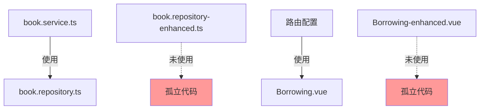

# -enhanced 文件分析报告

## 概述

项目中存在带有 `-enhanced` 后缀的文件，这些文件与对应的基础文件之间存在功能增强关系。本报告分析这些文件的关系，并提供重构建议。

---

## 一、文件关系分析

### 1.1 后端 Repository 层

#### 文件对：`book.repository.ts` vs `book.repository-enhanced.ts`

| 特性 | `book.repository.ts` (基础版) | `book.repository-enhanced.ts` (增强版) |
|------|-------------------------------|----------------------------------------|
| **当前使用状态** | ✅ 被 `book.service.ts` 使用 | ❌ 未被任何文件导入 |
| **方法签名** | 同步方法 | 异步方法 (async/await) |
| **版本控制** | 无 `version` 字段 | 有 `version` 字段 |
| **软删除** | 无 `is_deleted` 字段 | 有 `is_deleted` 字段 |
| **乐观锁** | ❌ 无 | ✅ 使用 `OptimisticLockManager` |
| **软删除功能** | 硬删除 `delete()` | `softDelete()`, `restore()`, `getDeletedBooks()`, `hardDelete()` |
| **审计日志** | ❌ 无 | ✅ 使用 `AuditLogger` |
| **操作日志** | ❌ 无 | ✅ 使用 `OperationLogger` |
| **两阶段提交** | ❌ 无 | ✅ 使用 `executeWithTwoPhaseCommit` |
| **代码行数** | 422 行 | 586 行 |
| **接口差异** | `Book`, `BookCategory` 不含 `version` 和 `is_deleted` | 包含 `version` 和 `is_deleted` |

**关键差异点：**

1. **数据模型差异**：增强版在接口中添加了 `version` 和 `is_deleted` 字段
2. **删除策略**：基础版使用硬删除，增强版使用软删除
3. **并发控制**：增强版引入了乐观锁机制
4. **审计追踪**：增强版添加了完整的审计日志功能
5. **异步处理**：增强版所有方法都是异步的

---

### 1.2 前端视图层

#### 文件对：`Borrowing.vue` vs `Borrowing-enhanced.vue`

| 特性 | `Borrowing.vue` (基础版) | `Borrowing-enhanced.vue` (增强版) |
|------|--------------------------|-----------------------------------|
| **当前使用状态** | ✅ 被路由配置使用 | ❌ 未被任何文件导入 |
| **代码行数** | 871 行 | 515 行 |
| **UI 设计风格** | 玻璃态卡片设计 + 渐变装饰 | 简单白色背景 |
| **图标使用** | 丰富 (Notebook, User, Reading, Check, etc.) | 简单 (Search, Loading, WarningFilled) |
| **借书流程** | 需要先搜索选择读者和图书 | 直接根据编号和 ISBN 查找 |
| **搜索对话框** | ✅ 有读者/图书选择对话框 | ❌ 无对话框 |
| **日期范围选择** | ✅ 支持日期范围筛选 | ❌ 不支持 |
| **样式定义** | 详细 (约 150 行 CSS) | 简单 (约 15 行 CSS) |
| **防重复提交** | ✅ 使用 `DebounceSubmitManager` | ✅ 使用 `DebounceSubmitManager` |

**关键差异点：**

1. **UI 复杂度**：基础版 UI 更完整、美观
2. **交互流程**：基础版提供更友好的选择对话框
3. **搜索功能**：基础版支持更多搜索条件
4. **代码组织**：增强版更简洁，但功能较少

---

## 二、问题分析

### 2.1 当前架构问题



**主要问题：**

1. **代码冗余**：两个版本实现相似功能，存在大量重复代码
2. **维护困难**：修改功能需要同时维护两个文件
3. **功能不一致**：增强版有更好的后端功能但未被使用
4. **命名混乱**：`-enhanced` 后缀没有明确的语义规范
5. **解耦不足**：增强功能与基础代码耦合在一起

### 2.2 技术债务

- **book.repository-enhanced.ts** 包含了企业级功能（乐观锁、软删除、审计日志），但完全未被使用
- **Borrowing-enhanced.vue** 是一个简化版本，但实际使用的是功能更完整的 `Borrowing.vue`
- 数据库 schema 可能已经支持 `version` 和 `is_deleted` 字段，但代码未使用

---

## 三、重构方案建议

### 方案 A：合并增强功能到基础文件（推荐）

**适用场景：** 确定需要使用增强功能，且不需要向后兼容

**实施步骤：**

1. **后端 Repository 层合并**
   - 将 `book.repository-enhanced.ts` 的功能合并到 `book.repository.ts`
   - 保留同步方法作为基础，添加异步方法作为增强
   - 通过配置开关控制是否启用增强功能

2. **前端视图层处理**
   - 删除 `Borrowing-enhanced.vue`（功能更少，无需保留）
   - 保留 `Borrowing.vue` 作为唯一版本

**优点：**
- 消除代码重复
- 统一维护入口
- 灵活的功能开关

**缺点：**
- 需要修改现有代码
- 可能影响现有功能

---

### 方案 B：使用策略模式分离关注点

**适用场景：** 需要支持多种配置，保持高度解耦

**实施步骤：**

1. **创建基础接口**
   ```typescript
   // book.repository.interface.ts
   interface IBookRepository {
     // 基础方法（同步）
     findById(id: number): Book | undefined
     create(book: Omit<Book, 'id'>): Book
     // ...
   }
   ```

2. **创建基础实现**
   ```typescript
   // book.repository.basic.ts
   export class BasicBookRepository implements IBookRepository {
     // 基础实现
   }
   ```

3. **创建增强实现**
   ```typescript
   // book.repository.enhanced.ts
   export class EnhancedBookRepository implements IBookRepository {
     // 增强实现（异步、乐观锁、软删除等）
   }
   ```

4. **使用工厂模式**
   ```typescript
   // book.repository.factory.ts
   export function createBookRepository(): IBookRepository {
     return config.useEnhancedFeatures
       ? new EnhancedBookRepository()
       : new BasicBookRepository()
   }
   ```

**优点：**
- 高度解耦
- 易于扩展
- 符合开闭原则

**缺点：**
- 文件数量增加
- 复杂度提高

---

### 方案 C：使用装饰器模式增强功能

**适用场景：** 需要在不修改原有代码的情况下添加功能

**实施步骤：**

1. **保留基础 Repository**
   ```typescript
   // book.repository.ts
   export class BookRepository {
     // 基础实现（同步）
   }
   ```

2. **创建装饰器**
   ```typescript
   // book.repository.decorators.ts
   export class AsyncBookRepositoryDecorator {
     constructor(private base: BookRepository) {}
     // 将同步方法包装为异步
   }

   export class SoftDeleteBookRepositoryDecorator {
     constructor(private base: BookRepository) {}
     // 添加软删除功能
   }
   ```

3. **组合使用**
   ```typescript
   const baseRepo = new BookRepository()
   const enhancedRepo = new SoftDeleteBookRepositoryDecorator(
     new AsyncBookRepositoryDecorator(baseRepo)
   )
   ```

**优点：**
- 不修改原有代码
- 灵活组合功能
- 符合单一职责原则

**缺点：**
- 装饰器链可能复杂
- TypeScript 类型推断可能困难

---

## 四、推荐方案详细设计

### 采用方案 A：合并增强功能到基础文件

#### 4.1 后端 Repository 重构

**目标结构：**

```
src/main/domains/book/
├── book.repository.ts           # 合并后的主文件
├── book.repository.types.ts      # 类型定义
├── book.repository.config.ts     # 配置选项
└── book.service.ts               # 使用 repository 的服务
```

**`book.repository.config.ts`**
```typescript
export interface BookRepositoryConfig {
  useAsync: boolean           // 是否使用异步方法
  useOptimisticLock: boolean  // 是否使用乐观锁
  useSoftDelete: boolean      // 是否使用软删除
  useAuditLog: boolean        // 是否记录审计日志
}

export const defaultConfig: BookRepositoryConfig = {
  useAsync: false,
  useOptimisticLock: false,
  useSoftDelete: false,
  useAuditLog: false
}
```

**`book.repository.ts` 设计要点：**

1. **保留同步方法**：确保现有代码不受影响
2. **添加异步方法**：提供增强功能
3. **配置驱动**：通过配置控制功能启用
4. **向后兼容**：保持现有 API 不变

#### 4.2 前端视图层处理

**操作：**
- 删除 `Borrowing-enhanced.vue`
- 保留 `Borrowing.vue` 作为唯一版本

**理由：**
- `Borrowing.vue` 功能更完整
- UI 设计更美观
- 用户体验更好

---

## 五、重构实施计划

### 阶段一：准备工作
- [ ] 备份现有代码
- [ ] 确认数据库 schema 是否支持 `version` 和 `is_deleted` 字段
- [ ] 确认增强功能是否真的需要
- [ ] 编写测试用例

### 阶段二：后端重构
- [ ] 创建 `book.repository.config.ts`
- [ ] 将 `book.repository-enhanced.ts` 的功能合并到 `book.repository.ts`
- [ ] 添加配置开关控制
- [ ] 更新 `book.service.ts` 使用新 API
- [ ] 运行测试验证

### 阶段三：前端清理
- [ ] 删除 `Borrowing-enhanced.vue`
- [ ] 确认 `Borrowing.vue` 功能完整
- [ ] 测试借还功能

### 阶段四：文档更新
- [ ] 更新 API 文档
- [ ] 更新配置说明
- [ ] 更新开发指南

---

## 六、风险评估

| 风险 | 影响 | 概率 | 缓解措施 |
|------|------|------|----------|
| 破坏现有功能 | 高 | 中 | 完整的测试覆盖 |
| 性能下降 | 中 | 低 | 性能基准测试 |
| 配置复杂度增加 | 低 | 中 | 提供默认配置 |
| 数据迁移问题 | 高 | 低 | 检查数据库 schema |

---

## 七、总结

**核心问题：**
- `-enhanced` 文件未被使用，造成代码冗余
- 增强功能与基础代码耦合在一起，不够解耦

**推荐方案：**
- 采用方案 A，合并增强功能到基础文件
- 使用配置开关控制功能启用
- 删除未使用的 `-enhanced` 文件

**预期收益：**
- 减少代码重复
- 统一维护入口
- 提高代码可维护性
- 更清晰的架构
