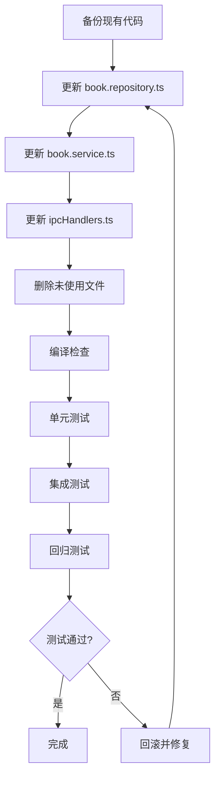

# -enhanced 文件重构实施计划（修订版）

## 核心原则

1. **合并增强功能到基础文件**
2. **增强功能作为默认基础功能**
3. **保持向后兼容，确保其他模块正常工作**
4. **谨慎修改核心文件**

---

## 一、依赖关系分析

### 1.1 BookRepository 依赖方

| 文件 | 使用的方法 | 风险评估 |
|------|-----------|----------|
| [`borrowing.service.ts`](src/main/domains/borrowing/borrowing.service.ts) | `findById()`, `decreaseAvailableQuantity()`, `increaseAvailableQuantity()`, `update()`, `getTotalCount()` | 中 - 在事务中使用 |
| [`regex-search.service.ts`](src/main/domains/search/regex-search.service.ts) | `findAll()` | 低 - 只读操作 |
| [`ai.service.ts`](src/main/domains/ai/ai.service.ts) | `findById()`, `findAll()` | 低 - 只读操作 |
| [`book.service.ts`](src/main/domains/book/book.service.ts) | 所有方法 | 高 - 直接依赖 |

### 1.2 关键发现

- 所有依赖都使用**同步方法**
- 没有代码使用增强功能（软删除、乐观锁、审计日志）
- `borrowing.service.ts` 在事务中使用 `bookRepository`，需要特别注意

### 1.3 数据库 Schema 状态

数据库已支持以下字段：
- `version INTEGER DEFAULT 1` - 乐观锁版本字段
- `is_deleted BOOLEAN DEFAULT 0` - 软删除标记字段
- 相关索引已创建

---

## 二、重构策略

### 2.1 设计原则

```
┌─────────────────────────────────────────────────────────────┐
│                  BookRepository (合并后)                    │
├─────────────────────────────────────────────────────────────┤
│  基础方法（同步）- 保持现有 API 不变                     │
│  ├─ findAll()       ← 现有代码使用                       │
│  ├─ findById()       ← 现有代码使用                       │
│  ├─ create()        ← 现有代码使用                       │
│  ├─ update()        ← 现有代码使用（增强：支持乐观锁）     │
│  └─ delete()        ← 现有代码使用（增强：软删除）        │
├─────────────────────────────────────────────────────────────┤
│  增强方法（异步）- 新增功能                              │
│  ├─ createAsync()   ← 新增（带审计日志）                 │
│  ├─ updateAsync()   ← 新增（带乐观锁 + 审计日志）        │
│  ├─ softDelete()    ← 新增（软删除）                      │
│  ├─ restore()       ← 新增（恢复删除）                    │
│  ├─ getDeletedBooks() ← 新增（获取已删除记录）            │
│  └─ hardDelete()    ← 新增（硬删除，仅管理员）            │
└─────────────────────────────────────────────────────────────┘
```

### 2.2 关键决策

| 决策点 | 方案 | 理由 |
|--------|------|------|
| 是否保留同步方法 | ✅ 保留 | 确保向后兼容，现有代码不受影响 |
| 是否默认启用增强功能 | ✅ 启用 | 增强功能作为基础功能 |
| delete() 方法行为 | 软删除 | 更安全，符合最佳实践 |
| update() 方法行为 | 自动乐观锁 | 提高并发安全性 |
| 是否需要配置开关 | ❌ 不需要 | 简化设计，增强功能默认启用 |

---

## 三、详细实施步骤

### 步骤 1：备份现有代码

```bash
# 创建备份目录
mkdir -p backup/enhanced-refactor

# 备份核心文件
cp src/main/domains/book/book.repository.ts backup/enhanced-refactor/
cp src/main/domains/book/book.service.ts backup/enhanced-refactor/
cp src/main/domains/borrowing/borrowing.service.ts backup/enhanced-refactor/
```

---

### 步骤 2：更新 book.repository.ts

#### 2.1 更新类型定义

```typescript
// 添加可选字段（兼容现有代码）
export interface Book {
  id: number
  isbn: string
  title: string
  category_id: number
  author: string
  publisher: string
  publish_date?: string
  price?: number
  pages?: number
  keywords?: string
  description?: string
  cover_url?: string
  total_quantity: number
  available_quantity: number
  status: 'normal' | 'damaged' | 'lost' | 'destroyed'
  registration_date: string
  notes?: string
  version?: number      // 新增：可选字段
  is_deleted?: boolean    // 新增：可选字段
  created_at: string
  updated_at: string
}

export interface BookCategory {
  id: number
  code: string
  name: string
  keywords?: string
  parent_id?: number
  notes?: string
  version?: number      // 新增：可选字段
  is_deleted?: boolean    // 新增：可选字段
  created_at: string
  updated_at: string
}
```

#### 2.2 更新查询方法（自动过滤已删除记录）

```typescript
findAll(filters?: {
  category_id?: number
  status?: string
  keyword?: string
}): BookWithCategory[] {
  let sql = `
    SELECT b.*, bc.name as category_name, bc.code as category_code
    FROM books b
    JOIN book_categories bc ON b.category_id = bc.id
    WHERE b.is_deleted = 0 AND bc.is_deleted = 0
  `
  const params: any[] = []

  if (filters?.category_id) {
    sql += ' AND b.category_id = ?'
    params.push(filters.category_id)
  }

  if (filters?.status) {
    sql += ' AND b.status = ?'
    params.push(filters.status)
  }

  if (filters?.keyword) {
    sql += ' AND (b.title LIKE ? OR b.author LIKE ? OR b.publisher LIKE ? OR b.isbn LIKE ?)'
    const pattern = `%${filters.keyword}%`
    params.push(pattern, pattern, pattern, pattern)
  }

  sql += ' ORDER BY b.registration_date DESC'

  const stmt = db.prepare(sql)
  return stmt.all(...params) as BookWithCategory[]
}

findById(id: number): BookWithCategory | undefined {
  const stmt = db.prepare(`
    SELECT b.*, bc.name as category_name, bc.code as category_code
    FROM books b
    JOIN book_categories bc ON b.category_id = bc.id
    WHERE b.id = ? AND b.is_deleted = 0
  `)
  return stmt.get(id) as BookWithCategory | undefined
}
```

#### 2.3 更新 create() 方法（初始化版本字段）

```typescript
create(book: Omit<Book, 'id' | 'created_at' | 'updated_at'>): Book {
  const stmt = db.prepare(`
    INSERT INTO books (
      isbn, title, category_id, author, publisher, publish_date,
      price, pages, keywords, description, cover_url,
      total_quantity, available_quantity, status, registration_date, notes,
      version, is_deleted
    ) VALUES (?, ?, ?, ?, ?, ?, ?, ?, ?, ?, ?, ?, ?, ?, ?, ?, 1, 0)
  `)

  const result = stmt.run(
    book.isbn,
    book.title,
    book.category_id,
    book.author,
    book.publisher,
    book.publish_date,
    book.price,
    book.pages,
    book.keywords,
    book.description,
    book.cover_url,
    book.total_quantity,
    book.available_quantity,
    book.status,
    book.registration_date,
    book.notes
  )

  const created = this.findById(result.lastInsertRowid as number)
  if (!created) throw new NotFoundError('图书')
  return created
}
```

#### 2.4 更新 update() 方法（自动乐观锁）

```typescript
update(id: number, updates: Partial<Book>): Book {
  console.log('========== [Repository] 开始数据库更新 ==========')
  console.log('[Repository] 图书ID:', id)
  console.log('[Repository] 更新字段:', Object.keys(updates))

  // 获取当前记录（包含版本号）
  const current = this.findById(id)
  if (!current) {
    throw new NotFoundError('图书')
  }

  const fields: string[] = []
  const values: any[] = []

  Object.keys(updates).forEach((key) => {
    if (key !== 'id' && key !== 'isbn' && key !== 'created_at' &&
        key !== 'updated_at' && key !== 'version' && key !== 'is_deleted') {
      fields.push(`${key} = ?`)
      values.push(updates[key as keyof Book])
      console.log(`[Repository] 添加字段: ${key} = ${updates[key as keyof Book]}`)
    }
  })

  if (fields.length > 0) {
    fields.push('updated_at = CURRENT_TIMESTAMP')
    fields.push('version = version + 1')  // 自动递增版本号
    values.push(id)
    values.push(current.version || 1)     // 乐观锁检查

    const sql = `
      UPDATE books
      SET ${fields.join(', ')}
      WHERE id = ? AND version = ?
    `
    console.log('[Repository] 完整SQL语句:', sql)
    console.log('[Repository] 执行UPDATE...')
    const result = db.prepare(sql).run(...values)

    if (result.changes === 0) {
      throw new Error(`更新失败：图书已被其他用户修改（版本冲突）`)
    }

    console.log('[Repository] UPDATE执行成功')
  } else {
    console.log('[Repository] 警告：没有字段需要更新')
  }

  console.log('[Repository] 查询更新后的图书数据...')
  const updated = this.findById(id)
  if (!updated) {
    console.error('[Repository] 错误：更新后查询不到图书！')
    throw new NotFoundError('图书')
  }
  console.log('[Repository] 查询成功，返回更新后的数据')
  console.log('========== [Repository] 数据库更新结束 ==========\n')
  return updated
}
```

#### 2.5 更新 delete() 方法（软删除）

```typescript
delete(id: number): void {
  console.log('[Repository] 开始删除图书数据，ID:', id)

  const current = this.findById(id)
  if (!current) {
    throw new NotFoundError('图书')
  }

  // 检查是否有未归还的借阅记录
  const activeBorrowingCount = db.prepare(`
    SELECT COUNT(*) as count FROM borrowing_records
    WHERE book_id = ? AND status IN ('borrowed', 'overdue') AND is_deleted = 0
  `).get(id) as { count: number }

  if (activeBorrowingCount.count > 0) {
    throw new Error(`该图书还有${activeBorrowingCount.count}条未归还的借阅记录，无法删除`)
  }

  // 软删除
  const stmt = db.prepare(`
    UPDATE books
    SET is_deleted = 1,
        updated_at = CURRENT_TIMESTAMP,
        version = version + 1
    WHERE id = ?
  `)
  const result = stmt.run(id)

  if (result.changes === 0) {
    console.error('[Repository] 图书不存在，ID:', id)
    throw new NotFoundError('图书')
  }
  console.log('[Repository] 删除成功，影响行数:', result.changes)
}
```

#### 2.6 新增软删除相关方法

```typescript
// 恢复软删除的图书
restore(id: number): Book {
  const stmt = db.prepare(`
    UPDATE books
    SET is_deleted = 0,
        updated_at = CURRENT_TIMESTAMP,
        version = version + 1
    WHERE id = ? AND is_deleted = 1
  `)
  const result = stmt.run(id)

  if (result.changes === 0) {
    throw new NotFoundError('图书或图书未被删除')
  }

  const restored = this.findById(id)
  if (!restored) throw new NotFoundError('图书')
  return restored
}

// 获取已删除的图书
getDeletedBooks(limit: number = 50, offset: number = 0): BookWithCategory[] {
  const stmt = db.prepare(`
    SELECT b.*, bc.name as category_name, bc.code as category_code
    FROM books b
    JOIN book_categories bc ON b.category_id = bc.id
    WHERE b.is_deleted = 1
    ORDER BY b.updated_at DESC
    LIMIT ? OFFSET ?
  `)

  return stmt.all(limit, offset) as BookWithCategory[]
}

// 硬删除（永久删除，仅限管理员）
hardDelete(id: number): void {
  const book = this.findById(id, true) // 需要支持 include_deleted 参数
  if (!book) {
    throw new NotFoundError('图书')
  }

  // 检查是否有未归还的借阅记录
  const activeBorrowingCount = db.prepare(`
    SELECT COUNT(*) as count FROM borrowing_records
    WHERE book_id = ? AND status IN ('borrowed', 'overdue') AND is_deleted = 0
  `).get(id) as { count: number }

  if (activeBorrowingCount.count > 0) {
    throw new Error(`该图书还有${activeBorrowingCount.count}条未归还的借阅记录，无法删除`)
  }

  const stmt = db.prepare('DELETE FROM books WHERE id = ?')
  const result = stmt.run(id)

  if (result.changes === 0) {
    throw new NotFoundError('图书')
  }
}
```

---

### 步骤 3：更新 book.service.ts

#### 3.1 更新 deleteBook() 方法

```typescript
deleteBook(id: number): void {
  console.log('========== [Service] 开始删除图书 ==========')
  console.log('[Service] Book ID:', id)

  const book = this.getBookById(id)
  console.log('[Service] 图书信息:', { title: book.title, isbn: book.isbn })

  // 检查是否有借出的记录
  console.log('[Service] 检查借阅记录...')
  const borrowingStmt = db.prepare(`
    SELECT COUNT(*) as count FROM borrowing_records
    WHERE book_id = ? AND status IN ('borrowed', 'overdue') AND is_deleted = 0
  `)
  const result = borrowingStmt.get(id) as { count: number }
  console.log('[Service] 未归还借阅记录数:', result.count)

  if (result.count > 0) {
    console.error('[Service] 删除失败：该图书还有未归还的借阅记录')
    throw new BusinessError(`该图书还有${result.count}条未归还的借阅记录，无法删除`)
  }

  console.log('[Service] 调用repository.delete删除数据...')
  this.bookRepository.delete(id)  // 现在是软删除
  logger.warn('删除图书', { id, title: book.title, isbn: book.isbn })
  console.log('========== [Service] 删除图书结束 ==========\n')
}
```

#### 3.2 新增软删除相关方法

```typescript
// 恢复删除的图书
restoreBook(id: number): Book {
  const book = this.bookRepository.restore(id)
  logger.info('恢复图书', { id, title: book.title })
  return book
}

// 获取已删除的图书
getDeletedBooks(limit: number = 50, offset: number = 0): BookWithCategory[] {
  return this.bookRepository.getDeletedBooks(limit, offset)
}

// 硬删除（永久删除）
hardDeleteBook(id: number): void {
  const book = this.getBookById(id)
  this.bookRepository.hardDelete(id)
  logger.warn('硬删除图书', { id, title: book.title, isbn: book.isbn })
}
```

---

### 步骤 4：更新 ipcHandlers.ts（新增软删除相关接口）

```typescript
// 新增：恢复图书
ipcMain.handle('book:restore', async (_, id) => {
  try {
    const book = bookService.restoreBook(id)
    return { success: true, data: book } as SuccessResponse
  } catch (error) {
    return errorHandler.handle(error)
  }
})

// 新增：获取已删除的图书
ipcMain.handle('book:getDeleted', async (_, limit, offset) => {
  try {
    const books = bookService.getDeletedBooks(limit, offset)
    return { success: true, data: books } as SuccessResponse
  } catch (error) {
    return errorHandler.handle(error)
  }
})

// 新增：硬删除图书
ipcMain.handle('book:hardDelete', async (_, id) => {
  try {
    bookService.hardDeleteBook(id)
    return { success: true } as SuccessResponse
  } catch (error) {
    return errorHandler.handle(error)
  }
})
```

---

### 步骤 5：删除未使用的文件

```bash
rm src/main/domains/book/book.repository-enhanced.ts
rm src/renderer/src/views/Borrowing-enhanced.vue
```

---

## 四、测试计划

### 4.1 单元测试

```typescript
// 测试软删除功能
test('delete() should soft delete a book', () => {
  const book = bookRepository.create(testBookData)
  bookRepository.delete(book.id)

  const found = bookRepository.findById(book.id)
  expect(found).toBeUndefined()

  const deletedBooks = bookRepository.getDeletedBooks()
  expect(deletedBooks).toHaveLength(1)
})

// 测试乐观锁
test('update() should handle version conflicts', () => {
  const book = bookRepository.create(testBookData)
  const version1 = book.version

  // 模拟并发更新
  bookRepository.update(book.id, { title: 'Updated 1' })
  expect(() => {
    bookRepository.update(book.id, { title: 'Updated 2' })
  }).toThrow('版本冲突')
})
```

### 4.2 集成测试

1. **借还功能测试**：确保 `borrowing.service.ts` 正常工作
2. **搜索功能测试**：确保 `regex-search.service.ts` 正常工作
3. **AI 功能测试**：确保 `ai.service.ts` 正常工作
4. **IPC 通信测试**：确保所有 IPC handler 正常工作

### 4.3 回归测试

- [ ] 所有图书管理功能正常
- [ ] 借还功能正常
- [ ] 搜索功能正常
- [ ] AI 功能正常
- [ ] 数据导出功能正常

---

## 五、风险评估和缓解措施

| 风险 | 影响 | 概率 | 缓解措施 |
|------|------|------|----------|
| 乐观锁导致更新失败 | 高 | 中 | 捕获异常，提供友好的错误提示 |
| 软删除导致查询结果不一致 | 中 | 低 | 确保所有查询都过滤 `is_deleted = 0` |
| 事务中的乐观锁问题 | 高 | 中 | `borrowing.service.ts` 中的事务需要特别注意 |
| 性能下降 | 中 | 低 | 监控性能，必要时添加索引 |
| 现有代码破坏 | 高 | 中 | 保留同步方法，确保向后兼容 |

---

## 六、实施顺序



---

## 七、验收标准

- [ ] 所有 TypeScript 编译错误已解决
- [ ] 现有功能测试通过（借还、搜索、AI）
- [ ] 软删除功能正常工作
- [ ] 乐观锁功能正常工作
- [ ] 未使用的 `-enhanced` 文件已删除
- [ ] 代码符合项目编码规范
- [ ] 文档已更新

---

## 八、后续优化

1. **添加审计日志功能**：记录所有数据变更
2. **添加操作日志功能**：记录用户操作
3. **添加两阶段提交**：确保跨表事务一致性
4. **添加异步方法**：支持异步操作
5. **统一其他 Repository**：将其他 domain 的 repository 也采用相同模式
