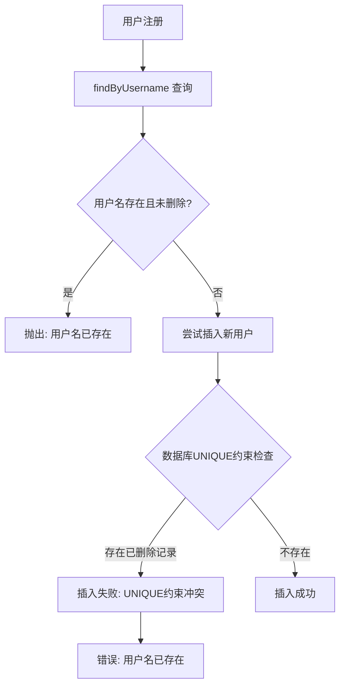

# 软删除问题修复计划

## 问题概述

### 错误信息
```
ValidationError: 用户名已存在
at AuthService.register (E:\个人项目\数据库期末课设作业\dist-electron\main\index.js:2516:13)
```

### 问题根源

1. **数据库约束冲突**：`users` 表中 `username` 字段有 `UNIQUE` 约束
2. **软删除与UNIQUE约束不兼容**：
   - 用户被软删除后（`is_deleted = 1`），用户名仍存在于数据库
   - 尝试用相同用户名注册新用户时，数据库 `UNIQUE` 约束拒绝插入
   - 但应用层 `findByUsername()` 只查询 `is_deleted = 0` 的记录，认为用户名可用

### 问题流程图



## 解决方案对比

### 方案A：部分唯一索引（推荐）

**原理**：使用 SQLite 的部分索引功能，只为未删除的记录强制唯一性

**实现步骤**：
1. 删除 `username` 字段的 `UNIQUE` 约束
2. 创建部分唯一索引：`CREATE UNIQUE INDEX idx_users_username_active ON users(username) WHERE is_deleted = 0`

**优点**：
- ✅ 数据库层面保证唯一性，性能最佳
- ✅ 语义清晰：只有活跃用户需要唯一用户名
- ✅ 不需要修改应用层代码
- ✅ 已删除用户名可被重复使用

**缺点**：
- ⚠️ 需要数据库迁移
- ⚠️ SQLite 部分索引需要 SQLite 3.8.0+（当前版本支持）

**迁移脚本**：
```sql
-- 1. 创建新表（移除 UNIQUE 约束）
CREATE TABLE users_new (
  id INTEGER PRIMARY KEY AUTOINCREMENT,
  username TEXT NOT NULL,
  password TEXT NOT NULL,
  name TEXT NOT NULL,
  role TEXT NOT NULL CHECK(role IN ('admin', 'librarian', 'teacher', 'student')),
  reader_id INTEGER,
  email TEXT,
  phone TEXT,
  version INTEGER DEFAULT 1,
  is_deleted BOOLEAN DEFAULT 0,
  created_at DATETIME DEFAULT CURRENT_TIMESTAMP,
  updated_at DATETIME DEFAULT CURRENT_TIMESTAMP,
  FOREIGN KEY (reader_id) REFERENCES readers(id) ON DELETE SET NULL
);

-- 2. 复制数据
INSERT INTO users_new SELECT * FROM users;

-- 3. 删除旧表
DROP TABLE users;

-- 4. 重命名新表
ALTER TABLE users_new RENAME TO users;

-- 5. 创建部分唯一索引
CREATE UNIQUE INDEX idx_users_username_active ON users(username) WHERE is_deleted = 0;
```

---

### 方案B：注册时处理已删除用户

**原理**：在注册时检查用户名是否存在（包括已删除），并做出处理

**实现步骤**：
1. 修改 `UserRepository.findByUsername()` 方法，添加 `includeDeleted` 参数
2. 修改 `AuthService.register()` 方法：
   - 检查用户名是否存在（包括已删除）
   - 如果存在且已删除，选择以下策略之一：
     - 策略B1：硬删除旧记录，创建新记录
     - 策略B2：恢复旧记录，更新信息
     - 策略B3：抛出错误，提示联系管理员

**优点**：
- ✅ 不需要修改数据库结构
- ✅ 实现简单快速

**缺点**：
- ❌ 性能较差（需要额外查询和删除操作）
- ❌ 策略B1可能导致数据丢失
- ❌ 策略B2可能产生意外行为（恢复旧用户数据）
- ❌ 策略B3用户体验差

**代码修改示例（策略B1）**：
```typescript
// user.repository.ts
findByUsername(username: string, includeDeleted: boolean = false): User | undefined {
  const sql = includeDeleted
    ? 'SELECT * FROM users WHERE username = ?'
    : 'SELECT * FROM users WHERE username = ? AND is_deleted = 0';
  return db.prepare(sql).get(username) as User | undefined;
}

// auth.service.ts
async register(data: RegisterData): Promise<Omit<User, 'password'>> {
  // ... 验证逻辑 ...

  // 检查用户名是否存在（包括已删除）
  const existingUser = this.userRepository.findByUsername(data.username, true);
  if (existingUser) {
    if (existingUser.is_deleted === 0) {
      throw new ValidationError('用户名已存在');
    }
    // 用户已删除，硬删除旧记录
    await SoftDeleteManager.hardDelete('users', existingUser.id);
  }

  // ... 继续注册流程 ...
}
```

---

### 方案C：唯一约束改为应用层验证

**原理**：移除数据库 UNIQUE 约束，完全依赖应用层验证

**实现步骤**：
1. 删除 `username` 字段的 `UNIQUE` 约束
2. 在应用层注册时检查用户名唯一性（包括已删除记录）
3. 使用数据库事务保证原子性

**优点**：
- ✅ 灵活性高
- ✅ 可以实现更复杂的唯一性规则

**缺点**：
- ❌ 数据库层面无约束保证
- ❌ 并发场景下可能出现竞态条件
- ❌ 性能较差
- ❌ 数据完整性风险高

---

### 方案D：软删除时重命名唯一键（用户提议）

**原理**：在软删除时，给有唯一约束的字段添加后缀（如时间戳或哈希值），释放原值供新记录使用

**实现步骤**：
1. 定义各表的唯一约束字段配置
2. 修改 `SoftDeleteManager.softDelete()` 方法：
   - 软删除时，自动给唯一约束字段添加后缀
   - 将原始值存储到 `delete_reason` 或新增字段中
3. 修改 `SoftDeleteManager.restore()` 方法：
   - 恢复时，从存储中恢复原始值

**后缀格式建议**：
- `username` → `username#deleted_1234567890`（时间戳）
- `reader_no` → `reader_no#deleted_1234567890`
- `id_card` → `id_card#deleted_1234567890`
- `isbn` → `isbn#deleted_1234567890`

**代码实现示例**：
```typescript
// 软删除配置
interface UniqueFieldConfig {
  tableName: string
  uniqueFields: string[]
}

const UNIQUE_FIELD_CONFIGS: UniqueFieldConfig[] = [
  { tableName: 'users', uniqueFields: ['username'] },
  { tableName: 'readers', uniqueFields: ['reader_no', 'id_card'] },
  { tableName: 'books', uniqueFields: ['isbn'] },
  { tableName: 'reader_categories', uniqueFields: ['code'] },
  { tableName: 'book_categories', uniqueFields: ['code'] },
]

// 修改后的软删除方法
static async softDelete(
  tableName: string,
  id: number,
  deletedBy?: number,
  reason?: string
): Promise<boolean> {
  try {
    // 获取记录
    const record = await this.getRecordIncludingDeleted(tableName, id)
    if (!record) return false

    // 查找配置
    const config = UNIQUE_FIELD_CONFIGS.find(c => c.tableName === tableName)
    
    // 构建更新SQL
    const updates: string[] = ['is_deleted = 1']
    const values: any[] = []
    const originalValues: Record<string, string> = {}

    // 处理唯一约束字段
    if (config) {
      const timestamp = Date.now()
      for (const field of config.uniqueFields) {
        if (record[field]) {
          // 保存原始值
          originalValues[field] = record[field]
          // 添加后缀
          updates.push(`${field} = ?`)
          values.push(`${record[field]}#deleted_${timestamp}`)
        }
      }
    }

    // 存储原始值（使用JSON格式存储在 delete_reason 字段）
    if (Object.keys(originalValues).length > 0) {
      const deleteData = {
        reason: reason || '',
        originalValues
      }
      updates.push('delete_reason = ?')
      values.push(JSON.stringify(deleteData))
    } else if (reason) {
      updates.push('delete_reason = ?')
      values.push(reason)
    }

    if (deletedBy !== undefined) {
      updates.push('deleted_by = ?')
      values.push(deletedBy)
    }

    updates.push('deleted_at = CURRENT_TIMESTAMP')
    updates.push('updated_at = CURRENT_TIMESTAMP')
    values.push(id)

    const sql = `
      UPDATE ${tableName}
      SET ${updates.join(', ')}
      WHERE id = ? AND is_deleted = 0
    `

    const result = db.prepare(sql).run(...values)
    return result.changes > 0
  } catch (error) {
    throw new SoftDeleteError('软删除失败', error)
  }
}

// 修改后的恢复方法
static async restore(
  tableName: string,
  id: number,
  restoredBy?: number
): Promise<boolean> {
  try {
    // 获取已删除的记录
    const record = await this.getRecordIncludingDeleted(tableName, id)
    if (!record || !record.is_deleted) return false

    // 查找配置
    const config = UNIQUE_FIELD_CONFIGS.find(c => c.tableName === tableName)
    
    // 构建更新SQL
    const updates: string[] = ['is_deleted = 0']
    const values: any[] = []

    // 恢复唯一约束字段
    if (config && record.delete_reason) {
      try {
        const deleteData = JSON.parse(record.delete_reason)
        if (deleteData.originalValues) {
          for (const [field, originalValue] of Object.entries(deleteData.originalValues)) {
            updates.push(`${field} = ?`)
            values.push(originalValue)
          }
        }
      } catch (e) {
        // JSON解析失败，不恢复唯一字段
      }
    }

    updates.push('deleted_by = NULL')
    updates.push('delete_reason = NULL')
    updates.push('deleted_at = NULL')
    updates.push('updated_at = CURRENT_TIMESTAMP')

    if (restoredBy !== undefined) {
      updates.push('restored_by = ?')
      updates.push('restored_at = CURRENT_TIMESTAMP')
      values.push(restoredBy)
    }

    values.push(id)

    const sql = `
      UPDATE ${tableName}
      SET ${updates.join(', ')}
      WHERE id = ? AND is_deleted = 1
    `

    const result = db.prepare(sql).run(...values)
    return result.changes > 0
  } catch (error) {
    throw new SoftDeleteError('恢复软删除记录失败', error)
  }
}
```

**优点**：
- ✅ 不需要修改数据库结构（表结构、索引）
- ✅ 不需要数据库迁移
- ✅ 实现逻辑清晰，易于理解
- ✅ 可以恢复原始值
- ✅ 适用于所有有唯一约束的表

**缺点**：
- ❌ 需要修改 `SoftDeleteManager` 的核心逻辑
- ❌ 需要维护各表的唯一约束字段配置
- ❌ 如果新插入的值恰好与已删除记录的"重命名后"值相同，仍会冲突（概率极低）
- ❌ 恢复时需要检查新值是否已被占用
- ❌ `delete_reason` 字段需要存储额外数据，可能影响原有用途

**需要处理的唯一约束字段**：
| 表名 | 唯一约束字段 |
|------|-------------|
| users | username |
| readers | reader_no, id_card |
| books | isbn |
| reader_categories | code |
| book_categories | code |

---

## 方案对比总结

| 方案 | 数据库修改 | 应用层修改 | 性能 | 实现复杂度 | 风险 |
|------|-----------|-----------|------|-----------|------|
| A：部分唯一索引 | 需要迁移 | 无需修改 | ⭐⭐⭐⭐⭐ | 中 | 中 |
| B：注册时处理 | 无需修改 | 需要修改 | ⭐⭐ | 低 | 中 |
| C：应用层验证 | 需要删除UNIQUE | 需要修改 | ⭐ | 低 | 高 |
| D：重命名唯一键 | 无需修改 | 需要修改 | ⭐⭐⭐⭐ | 中 | 低 |

## 推荐方案

### 如果优先考虑：数据完整性和性能 → 选择方案A（部分唯一索引）

### 如果优先考虑：避免数据库迁移 → 选择方案D（重命名唯一键）

方案D是您提出的新方案，具有以下优势：
- 无需修改数据库结构
- 无需数据库迁移
- 实现逻辑清晰
- 可恢复原始值

---

## 实施计划

### 方案A实施计划（部分唯一索引）

### 第一步：修改数据库初始化脚本

修改 `src/main/database/index.ts` 中的 `users` 表创建逻辑：

```typescript
// 创建 users 表（移除 UNIQUE 约束）
db.exec(`
  CREATE TABLE users (
    id INTEGER PRIMARY KEY AUTOINCREMENT,
    username TEXT NOT NULL,  -- 移除 UNIQUE
    password TEXT NOT NULL,
    name TEXT NOT NULL,
    role TEXT NOT NULL CHECK(role IN ('admin', 'librarian', 'teacher', 'student')),
    reader_id INTEGER,
    email TEXT,
    phone TEXT,
    version INTEGER DEFAULT 1,
    is_deleted BOOLEAN DEFAULT 0,
    created_at DATETIME DEFAULT CURRENT_TIMESTAMP,
    updated_at DATETIME DEFAULT CURRENT_TIMESTAMP,
    FOREIGN KEY (reader_id) REFERENCES readers(id) ON DELETE SET NULL
  )
`)

// 创建部分唯一索引
db.exec(`
  CREATE UNIQUE INDEX idx_users_username_active ON users(username) WHERE is_deleted = 0
`)
```

### 第二步：添加数据库迁移逻辑

对于已有数据库，需要添加迁移逻辑：

```typescript
// 检查是否需要迁移到部分唯一索引
const usersTableInfo = db.prepare(`
  SELECT sql FROM sqlite_master
  WHERE type = 'table' AND name = 'users'
`).get() as { sql: string } | undefined

if (usersTableInfo && usersTableInfo.sql.includes('username TEXT UNIQUE')) {
  console.log('🔄 迁移 users 表到部分唯一索引...')

  // 执行迁移
  db.exec(`
    CREATE TABLE users_new (
      id INTEGER PRIMARY KEY AUTOINCREMENT,
      username TEXT NOT NULL,
      password TEXT NOT NULL,
      name TEXT NOT NULL,
      role TEXT NOT NULL CHECK(role IN ('admin', 'librarian', 'teacher', 'student')),
      reader_id INTEGER,
      email TEXT,
      phone TEXT,
      version INTEGER DEFAULT 1,
      is_deleted BOOLEAN DEFAULT 0,
      created_at DATETIME DEFAULT CURRENT_TIMESTAMP,
      updated_at DATETIME DEFAULT CURRENT_TIMESTAMP,
      FOREIGN KEY (reader_id) REFERENCES readers(id) ON DELETE SET NULL
    );

    INSERT INTO users_new SELECT * FROM users;

    DROP TABLE users;

    ALTER TABLE users_new RENAME TO users;

    CREATE UNIQUE INDEX idx_users_username_active ON users(username) WHERE is_deleted = 0;
  `)

  console.log('✅ users 表迁移完成')
}
```

### 第三步：验证修复

1. 创建一个测试用户
2. 软删除该用户
3. 尝试用相同用户名注册新用户
4. 验证注册成功

## 影响范围

### 需要修改的文件
- `src/main/database/index.ts` - 数据库初始化和迁移逻辑

### 不需要修改的文件
- `src/main/domains/auth/user.repository.ts` - 无需修改
- `src/main/domains/auth/auth.service.ts` - 无需修改
- `src/main/lib/softDelete.ts` - 无需修改

## 风险评估

| 风险 | 级别 | 缓解措施 |
|------|------|----------|
| 数据迁移失败 | 中 | 添加事务回滚机制，迁移前备份数据库 |
| 旧版本兼容性 | 低 | 迁移逻辑自动检测并执行 |
| 并发注册冲突 | 低 | 数据库事务保证原子性 |
| 索引性能影响 | 低 | 部分索引比全表UNIQUE约束更高效 |

## 测试计划

### 功能测试
1. 测试正常注册（新用户名）
2. 测试注册已存在的活跃用户名（应失败）
3. 测试注册已软删除的用户名（应成功）
4. 测试软删除后恢复用户

### 边界测试
1. 测试并发注册相同用户名
2. 测试大量已删除用户名注册
3. 测试特殊字符用户名

### 回归测试
1. 测试用户登录功能
2. 测试用户查询功能
3. 测试用户更新功能

## 总结

**方案A（部分唯一索引）**是最佳解决方案，具有以下优势：
- 数据完整性由数据库保证
- 性能最优
- 无需修改应用层代码
- 符合软删除的业务语义

**方案D（重命名唯一键）**是您提出的创新方案，具有以下优势：
- 无需修改数据库结构
- 无需数据库迁移
- 实现逻辑清晰
- 可恢复原始值

实施后，已删除的用户名可以被重复使用，解决了当前的问题。
